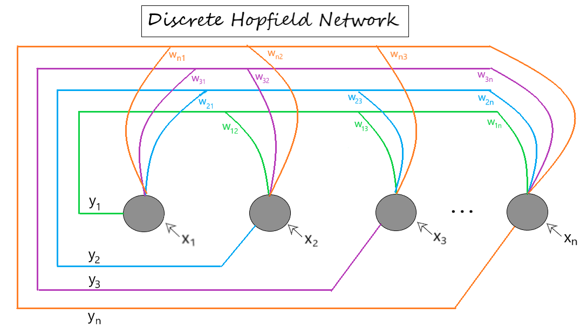
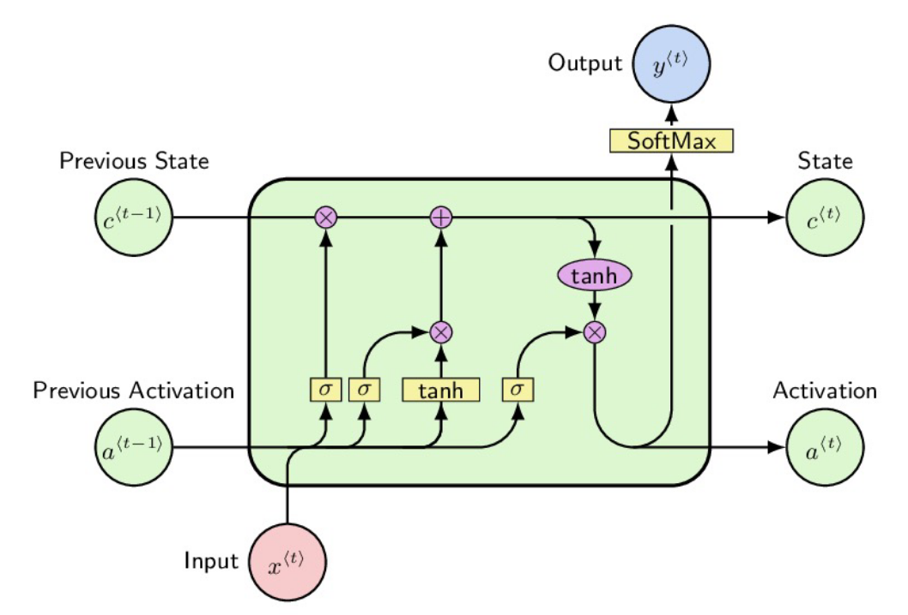
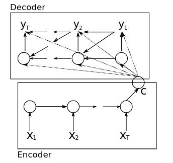
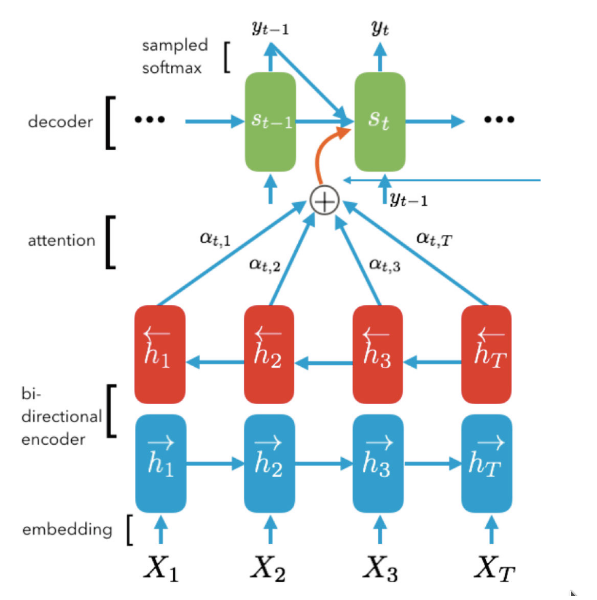
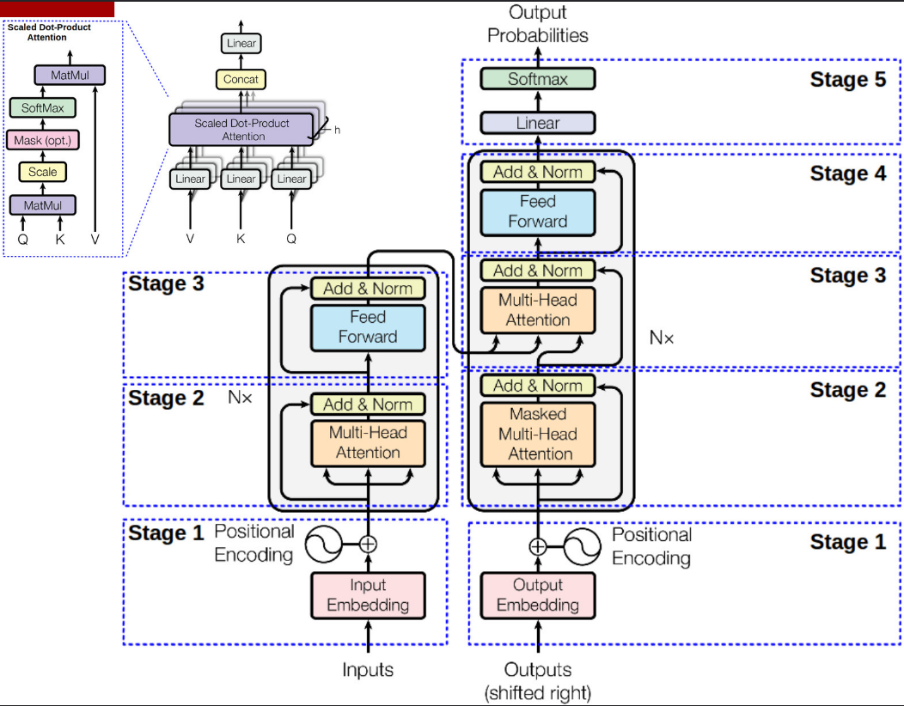
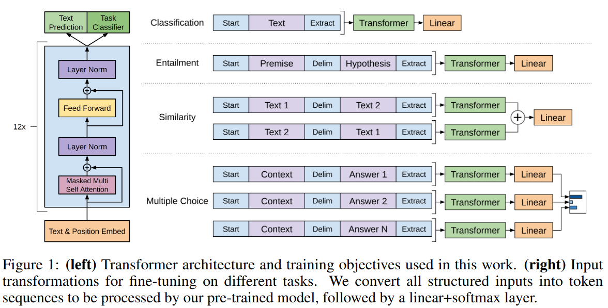
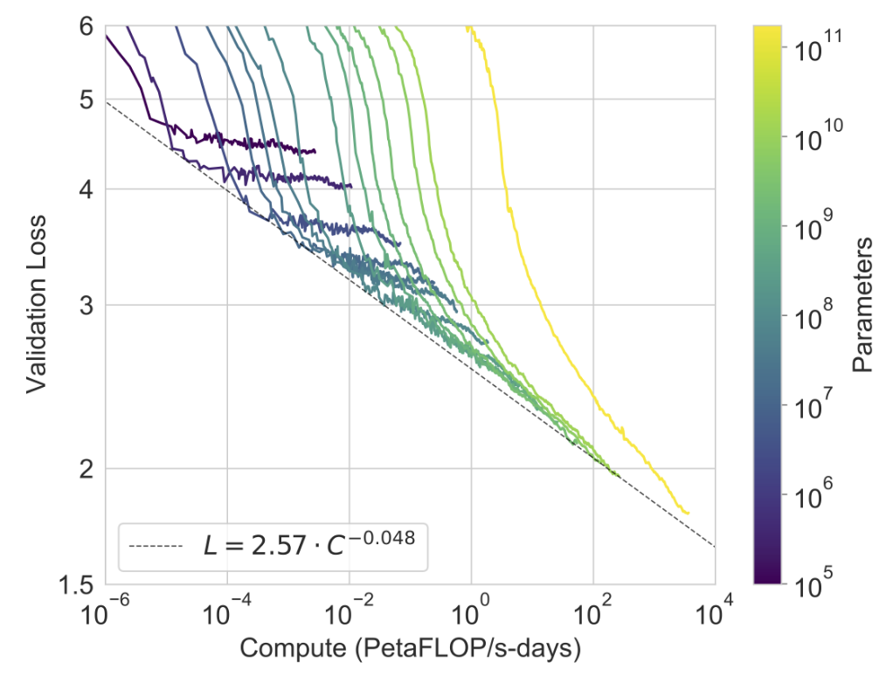
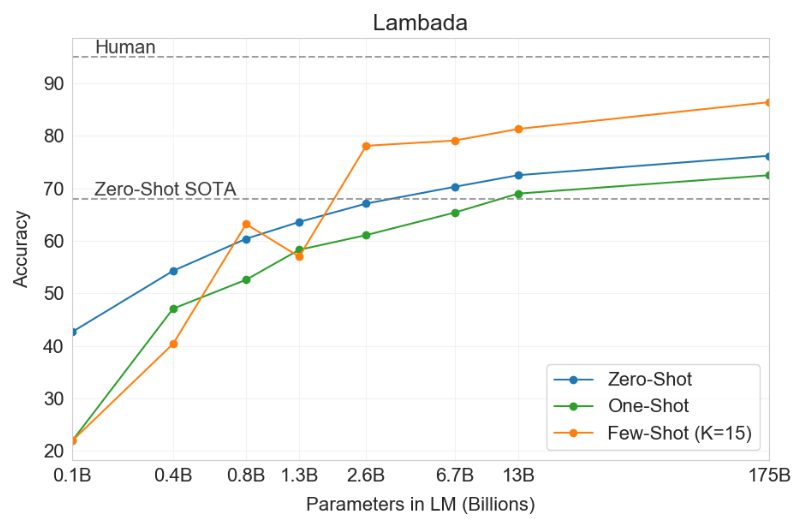
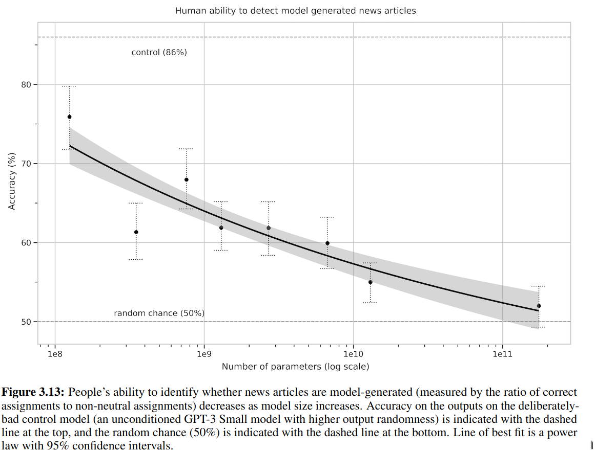
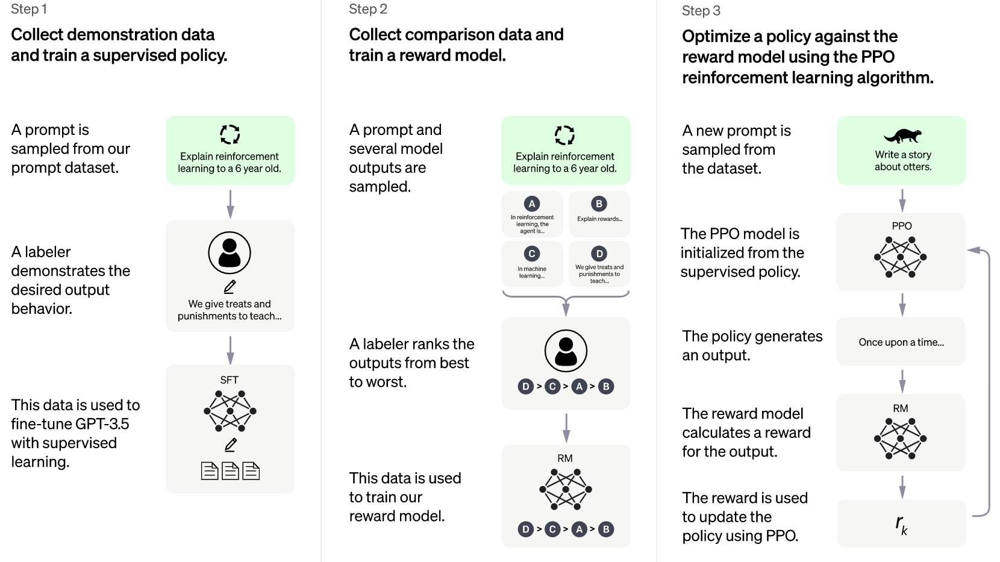

# From RNN to ChatGPT

## RNN and Sequential Data

**RNN(Recurrent Neural Network)** is thought to be originally invented by Hopfield in 1982  ([Hopfield 1982][1]). It was inspired by Ising model in physics and was designed to simulate the memory of human beings. 

Hopfield treated the memory as the ability of fuzzy processing (searching, auto-completing, ...)
> Suppose that an item stored in memory is"H.A.Kramers &G.H.Wannier Phys.Rev.60,252 (1941)." A general content-addressable memory would be capable of retrieving this entire memory item on the basis of sufficient partial information. The input "& Wannier,(1941)" might suffice. An ideal memory could deal with errors and retrieve this reference even from the input "Vannier,(1941)"...

In the paper, Hopfield pointed out the property of evolving states to stable ones in physical systems could be used to mimic the memory mechanism.
> Consider a physical system described by many coordinates $X_1,\cdots, X_N$, the components of a state vector $X$. Let the system have locally stable limit points $X_a, X_b, \cdots$. Then, if the system is started sufficiently near any $X_a$, as at $X=X_a+\Delta$, it will proceed in time until $X\approx X_a$. ...

Generally, Hopfield proposed a graphic model with any connections (interactions) allowed, even the `backward coupling`. Given the update rule (dynamics), the system works like a multilayered perceptron but the output could be used as input during computing. Such structure inspires the design of modern RNN.



In another hand, RNN is an application of parameter sharing like CNN (Note that CNN was actually invented later than Hopfield networks). An RNN generally implements the dynamics of

$$
(x_{t+1}, h_{t+1}) = f((x_t, h_t), \theta).
$$

Parameter $\theta$ are shared along the "time" $t$. Note that any feed-forward neural network could be simulated by an RNN, while an RNN can also be expanded like a feed-forward neural network ([Goodfellow 2016][2]):

For example, one use RNN for binary classfication of series like $(x_1, x_2,\cdots,x_N)$, an RNN model reads

$$
(x_1, x_2,\cdots,x_N) \xrightarrow{h_{t+1} = f((x_t, h_t), \theta)} \textrm{Readout}(h_1,\cdots,h_{N+1}) \in \{0, 1\}.
$$

Some comparisons are listed below

||Connection|Dynamics|Parameter|
|:---:|:---:|:---:|:---:|:---:|:---:|
|Hopfield Network|Any pair|Greedily minimize Energy $H$|Ising $(w_{ij}, \theta_i)$|
|Boltzmann Machine|Any pair (no intralayer in restricted version)|Sampling $e^{-\beta H}$|Ising $(w_{ij}, \theta_i)$|
|Feed-forward NN|Layer by layer|$y^{i+1} = f(W_iy^i + b_i)$|Weight & bias $(W_i, b_i)$|
|Convolutional NN|Layer by Layer|$y^{i+1} = f(W(K_i)y^i)$|Convolution kernel $(K_i)$|
|Recurrent NN|Any pair|$(x_{t+1}, h_{t+1}) = f((x_t, h_t), \theta)$|Shared along time $(\theta)$|

## Language Model

Note that the task of deep learning is to approximate the distribution of data. Human language is usually treated as the sequence of characters or words. Since the power to handle sequential data, RNN is usually used in the natural language processing.

The most simple (generative) language model is to simulate the distribution of sentence as

$$
p(x_1, x_2, \cdots, x_T).
$$

Here we find a special property of language: the length is not deterministic. One can also simply truncate and pad the sequence to the same length, but it would harm the capability of model. A naive simplification to the task is assuming the next character or word is only dependent of the past (so it is hard to handle the full context). Then the distribution can be treated as the conditional probability by Bayesian rule

$$
\begin{aligned}
p(x_1, x_2, \cdots, x_T) &= p(x_T | x_1,\cdots, x_{T-1})p(x_1,\cdots, x_{T-1}) \\
&= p(x_T | x_1,\cdots, x_{T-1})p(x_{T-1}|x_1,\cdots, x_{T-2}) \\
&\cdots \\
&= p(x_1)\prod_{t=2}^T p(x_t| x_1,\cdots, x_{t-1}) 
\end{aligned}.
$$

The (vanilla) RNN is proper to approximate the transition probability of $p(x_t| x_1,\cdots, x_{t-1})$. 

## Long Short-Term Memory

As proposed by S. Hochreiter and J. Schmidhuber in 1997 ([Hochreiter 1997][3]), **Long short-term memory(LSTM)** was designed to overcome the "vanishing gradient over time issue" in ordinary (or "vanilla") RNN:

> With conventional backpropagation through time (BPTT; Williams & Zipser, 1992; Werbos, 1988) or real-time recurrent learning (RTRL; Robinson & Fallside, 1987), error signals flowing backward in time tend to (1) blow up or (2) vanish; the temporal evolution of the backpropagated error exponentially depends on the size of the weights (Hochreiter, 1991). Case 1 may lead to oscillating weights; in case 2, learning to bridge long time lags takes a prohibitive amount of time or does not work at all (see section 3)

To see this, consider we have a vanilla RNN with output $x_t$ (including hidden states) at time $t$ reads

$$
x_t = f(W x_{t-1}).
$$

Here $W$ is the linear weights, $f$ is the non-linear activation function. The backpropagation through time following the inductive rule requires the derivative (with $x_t' = f((W+\td W) x_{t-1}'), \cdots$)

$$
\begin{aligned}
\td L &= L(\cdots, x_{T-1}', x_{T}') - L(\cdots, x_{T-1}, x_{T})\\
&= L(\cdots, x_{T-1}', x_{T}') - L(\cdots, x_{T-1}', f(Wx_{T-1}')) \\
&\indent + L(\cdots, x_{T-1}', f(Wx_{T-1}')) - L(\cdots, f(W x_{T-2}'), f(W f(W x_{T-2}'))) \\
&\indent + \cdots \\
&= \frac {\partial }{\partial x_T} \Big(L(\cdots, x_T)\Big) \frac {\partial' x_T} {\partial W} \td W + \frac {\partial }{\partial x_{T-1}} \Big(L(\cdots, x_{T-1}, f(Wx_{T-1}))\Big) \frac {\partial' x_{T-1}} {\partial W} \td W + \cdots
\end{aligned}
$$

The partial with prime $\partial'$ means the derivative holding all $x_t$ at past, e.g.

$$
\frac {\partial' x_t} {\partial W} \td W = f((W+\td W) x_{t-1}) - f(W x_{t-1}) = f'(W x_{t-1}) \td W \cdot x_{t-1}.
$$

The coefficients can be determined with

$$
\begin{aligned}
\Delta_t &=\frac {\partial} {\partial x_t} L(\cdots, x_t, f(W x_t), \cdots) \\
&= \frac {\partial L} {\partial x_t} + \frac {\partial} {\partial x_{t+1}} \Big(L(\cdots, x_t, x_{t+1}, f(Wx_{t+1}),\cdots)\Big) \frac {\partial x_{t+1}} {\partial x_t} \\
&= \frac {\partial L} {\partial x_t} + \Delta_{t+1} f'(Wx_t) W
\end{aligned}
$$

Iteratively, the susceptibility of updates over time (approximately $\|\Delta_t\|$) is controlled by

$$
\frac {\delta \|\Delta_t\|} {\delta \|\Delta_{t+k}\|} = \prod_{i=0}^{k-1} \|f'(Wx_i) W\|.
$$

Such exponential exploding or vanishing is the reason why it is hard to train a vanilla RNN learned long-term dependencies (only capable for $10\sim 20$ temporal intervals)

A commonly used LSTM has the form described by the following image:



The state $c^{t-1}$ evolves to $c^t$ with only linear transformation and addition. This makes $\partial c^{t+1} / \partial c^t \sim \sigma([x^t, a^{t-1}])$ have sufficiently large eigenvalues and slows down the gradient vanishing (Note here is no $W$ matrix). Note that LSTM is not the only approach and obviously not the simplest one. 

## Attention Mechanism

### Sequence to Sequence Task and Encoder-Decoder Model

The **sequence to sequence (seq2seq)** tasks widely appear in our daily life: machine translation, conservation models, text summarizing, etc. Formally, a seq2seq task is to simulate the conditional probability of 

$$
p(y_1,\cdots,y_m| x_1,\cdots,x_n) \equiv p(y_{1:m} | x_{1:n}).
$$

An attempt to approximate such distribution this with RNN is the **encoder-decoder** model ([K. Cho 2014][4]), which can be illustrate as follows



The encoder RNN maps the input sequence $x$ into tensor $c$ (is the hidden states of RNN, called summary), then with decoder RNN to generate the output sequence $y$ conditionally with $c$.

### Roadmap to Attention

In seq2seq task, the elements in input sequence usually should be treated differently. The attention mechanism is to making neural network could automatically find which part is more important. 

In Ref. ([D. Bahdanau 2014][5]), the authors proposed an Encoder-decoder model with attention for translation task. 



The core is to compute the context vector $c$ as the weighted sum of the hidden states along input. The weights are dependent of time position $t$ and trained jointly with the model. Formally, denoting the weight $\alpha_{ij}$ as the weight for $j$-th input hidden state to the context used for $i$-th output, the context vector at $i$ is

$$
c_i = \sum_j \alpha_{ij} h_j.
$$

Intuitively, $\alpha_{ij}$ should be computed based on both $h_j$ and $s_{i-1}$ (just before emitting $y_i$), In the original paper the model reads

$$
e_{ij} = \textrm{AlignmentNN} (s_{i-1}, h_j), \alpha_{ij} = \textrm{softmax}(e_{ij}).
$$

Later in 2017, the famous paper of ([A. Vaswani 2017][6]) from google proposed the Transformer architecture. This was announced to be based solely on attention mechanism instead of RNN or CNN has been currently the most powerful model in natural language processing and computer vision.



Formally, there are three important tensors in the attention mechanism of Transformer: query $Q$, key $K$, and value $V$. Revisit the old attention mechanism by

$$
c_i = \sum_j \textrm{softmax}\Big(\textrm{AlignmentNN}(s_{i-1}, h_j)\Big) h_j,
$$

`AlignmentNN` is the measure of correlation or similarity between vectors in $s$ and $h$. Sequence $s$ is the information of inputs while $h$ is of potentially outputs. A matrix with each rows are $s_i$-like data forms the query $Q$, while $K$, $V$ are pairs of $h_j$-like (in AlignmentNN) and $h_j$-like (at outside) tensors. By simplify `AlignmentNN` as matrix inner product, such attention mechanism is called **Scaled dot-product attention**, which reads

$$
\textrm{Attention}(Q, K, V) = \textrm{softmax}\Big(\frac {QK^T} {\sqrt{d_K}}\Big)V.
$$

$d_K$ is the size of $Q, K$'s second dimension (number of terms in matrix multiplication). The Transformer used the tech known as **Self-attention**, which means $Q, K, V$ are computed from the same sequence. In practice, given input tensor $x \in \mathbb{R}^{L\times f}$ ($L$ for sequence length while $f$ for the number of features), these three tensors can be computed with full-connected layers (Linear) as $Q = xW_Q$, $K = xW_K$, and $V= xW_V$ with $W_Q, W_K \in \mathbb{R}^{f\times d_K}, W_V\in \mathbb{R}^{f\times d_V}$. Thus $\textrm{Attention}(Q, K, V)$ has the shape of $L\times d_V$. The multi-head attention is concating the single attention multiple times with a linear layer:

$$
\textrm{MultiHead}(Q,K,V) = \textrm{concat}([\textrm{Attention}(QW_i^Q, KW_i^K, VW_i^V),\cdots])W^O.
$$

Some interesting facts about Transformer

1.  Residual connection and LayerNorm are used to make training easier.
2.  Feed-forward NN is to serve the nonlinearity. Note Attention does nothing but linear transformation to $V$.
3.  The masked attention is used in decoder to ensure we cannot peak at the future.
4.  Though Transformer's attention is optimized (no need for serial generating), it still cost $\mathcal{O}(T^2)$ time to handle the sequence.

## Techs behind ChatGPT

### Generative Pretrained Transformers(GPT)

ChatGPT is fine-tuned from a model in the GPT-3.5 series([openai.com/blog/chatgpt][8]), which was trained with data from before Q4 2021. Currently, the paper about GPT-3.5 has not been published. The following contents are referred to GPT-3 ([OpenAI, 2020][9])

#### Theory

GPT series train a standard language model with `Transformer decoder`, formally, the model maximize the log-likelihood (unsupervised)

$$
L = \sum_i \log P(u_i|u_{i-k}, \cdots, u_{i-1}; \Theta).
$$

Thus, the pretrained model is able to predict the next word (called `token`) based on the previous information ([OpenAI, 2018][10]). 

> GPT-1 and GPT-2 use transformer decoder with different sizes. GPT-3 used "alternating dense and locally banded sparse attention patterns in the layers of the transformer"  ([OpenAI, 2020][9])

As suggested in ([OpenAI, 2018][10]), a task-dependent **supervised fine-tuning protocol** was proposed. Generally, one extracts the final Transformer block's activation $h$ and express the conditional probability of labelled pair $(x, y)$ 

$$
P(y|x) = \textrm{softmax}(h(x) W).
$$

Then maximize the log-likelihood of 

$$
L_{fine-tuning} = \sum_{(x, y)} P(y|x) + \lambda L.
$$

One of the novelty of GPT in ([OpenAI, 2018][10]) is the generally designed supervised fine-tuning for multi-task:



#### Some data

From GPT to GPT-3, the model size gets larger and larger:

|Model Name|$n_{\textrm{params}}$|Training set|
|:--:|:--:|:--:|
|GPT|117M|BooksCorpus: over 7,000 unique unpublished books|
|GPT-2|1542M|WebText(Reddit ,>3karma), over 40GB |
|GPT-3|175B|filtered Common Crawl (570GB) and WebText2, Books, Wikipedia|

Important conclusions as scaling up:

1.  Power law between loss and compute

    

    > (cross-entropy) validation loss to compute power measured by PetaFLOP/s-days:
    > A petaflop/s-day (pfs-day) consists of performing $10^{15}$ neural net operations per second for one day.

2.  Distance to Human on LAMBADA (some other datasets in Ref. ([OpenAI, 2020][9]))

    

    > LAMBADA proposes a word prediction task where the target item is difficult to guess (for English speakers) when only the sentence in which it appears is available, but becomes easy when a broader context is presented. ([D. Paperno, 2016][12])

3.  Difficulty to distinguish by human

    

#### Limitations and impacts

1.  GPT-3 samples still sometimes repeat themselves semantically at the document level, start to lose coherence over sufficiently long passages, contradict themselves, and occasionally contain non-sequitur sentences or paragraphs

2.  GPT-3 has special difficulty with "common sense physics". Maybe it is caused by GPT-3 learn from text but human learn from multiple channels like vision, touching, sensing...

3.  Misusage of language model. Prejudice in gender, race, and religion. Energy cost.

### Prompt Engineering 

In GPT-2 and GPT-3, the OpenAI team tried to train a large language model (LLM) that could handle multiple tasks. Since the model gets larger and larger, the weights updating even fine-tuning gets to be quite expensive. Teaching model to learn generic task manipulate is one of the goals of LLM. 

**Prompt Engineering**, which also referred as zero/one/few-shot learning or in-context learning in GPT series' papers, is to embed the description of task into the input and query the answer of LLM. 

> In GPT-2's original paper ([OpenAI, 2019][11]), the authors showed an example for how prompt works like past task-dependent fine-tuning:
> For example, a translation training example can be written as the sequence (translate to french, english text, french text). Likewise, a reading comprehension training example can be written as (answer the question, document, question, answer).

In Ref. ([P. Liu, 2021][13]), the authors offered a systematically review to recent development of prompt technologies. 

### Reinforcement Learning from Human Feedback

The application of **RLHF(Reinforcement learning from Human Feedback)** supports ChatGPT model for the high quality performance (aligning to human intent). The technology was introduced in Ref. ([OpenAI, 2022][14]). Roughly speaking, RLHF is to fine-tuning the LLM with the participant of human labelling. 



This figure comes from ([openai.com/blog/chatgpt][8]) but is the same as Fig. 2 in the Ref. ([OpenAI, 2022][14]) for InstructGPT (with GPT-3). Here, we explain each steps.

1.  Labelers write down the demonstration(answer) for prompts(questions). This dataset is used to fine-tune a GPT-3(GPT-3.5 for ChatGPT) model with supervised learning (SFT).
    -  The prompt distribution consists primarily user-submit and labeler written (initialization and bootstrap).
    -  For InstructGPT, 40 labelers and 13k dataset.
2.  Labelers score the sampled outputs. This data is used to train a Reward Model(RM) with supervised learning: (input+output -> scalar). 
    -  The model is based on SFT (final unembedding layer removed)
    -  InstructGPT use 6B model, larger would be unstable
    -  For InstructGPT, 33k dataset (api-users and labelers)
3.  The further fine-tuning based on RM model instead of human. The fine-tuning procedure is of RL manner.
    -  The environment is static as prompt provider and reward calculator by RM. Generally, the RM can be updated during RL.
    -  Why RL: the final model (policy) is updated at each episode.
    -  For InstructGPT, 31k dataset (only from api-users)

To evaluate the alignment, the authors asked the labelers to subjectively judge the output. The main results of InstructGPT is that it is human preferred while objective performance gets little harmed.

## References

1.  J. J. Hopfield, Neural networks and physical systems with emergent collective computational abilities, Proc.Natl.Acad.Sci.USA, 1982
2.  Goodfellow et al, Deep Learning, MIT Press, 2016, https://www.deeplearningbook.org/
3.  Sepp Hochreiter, Jürgen Schmidhuber; Long Short-Term Memory. Neural Comput 1997; 9 (8): 1735–1780. doi: https://doi.org/10.1162/neco.1997.9.8.1735
4.  Kyunghyun Cho, Bart van Merrienboer, Caglar Gulcehre, Dzmitry Bahdanau, Fethi Bougares, Holger Schwenk, Yoshua Bengio, Learning Phrase Representations using RNN Encoder-Decoder for Statistical Machine Translation, EMNLP 2014,  	arXiv:1406.1078
5.  Dzmitry Bahdanau, Kyunghyun Cho, Yoshua Bengio, Neural Machine Translation by Jointly Learning to Align and Translate, ICLR 2015 as oral presentation, arXiv:1409.0473
6.  Ashish Vaswani, Noam Shazeer, Niki Parmar, Jakob Uszkoreit, Llion Jones, Aidan N. Gomez, Lukasz Kaiser, Illia Polosukhin, Attention Is All You Need, arXiv:1706.03762
7.  John Hewitt, Natural Language Processing with Deep Learning, cs224n course
8.  https://openai.com/blog/chatgpt/
9.  Tom B. Brown et al, Language Models are Few-Shot Learners, arXiv:2005.14165
10.  Alec Radford et al, Improving Language Understanding by Generative Pre-Training, 2018
11.  Alec Radford et al, Language Models are Unsupervised Multitask Learners, 2019
12.  Denis Paperno et al, The LAMBADA dataset: Word prediction requiring a broad discourse context, arXiv:1606.06031
13.  Pengfei Liu, Weizhe Yuan, Jinlan Fu, Zhengbao Jiang, Hiroaki Hayashi, Graham Neubig, Pre-train, Prompt, and Predict: A Systematic Survey of Prompting Methods in Natural Language Processing, arXiv:2107.13586
14.  Long Ouyang et al, Training language models to follow instructions with human feedback, arXiv:2203.02155

[1]: https://www.pnas.org/doi/epdf/10.1073/pnas.79.8.2554
[2]: https://www.deeplearningbook.org/
[3]: https://direct.mit.edu/neco/article-abstract/9/8/1735/6109/Long-Short-Term-Memory?redirectedFrom=fulltext
[4]: https://arxiv.org/abs/1406.1078
[5]: https://arxiv.org/abs/1409.0473
[6]: https://arxiv.org/abs/1706.03762
[7]: http://web.stanford.edu/class/cs224n/slides/cs224n-2021-lecture09-transformers.pdf
[8]: https://openai.com/blog/chatgpt/
[9]: https://arxiv.org/abs/2005.14165
[10]: https://s3-us-west-2.amazonaws.com/openai-assets/research-covers/language-unsupervised/language_understanding_paper.pdf
[11]: https://d4mucfpksywv.cloudfront.net/better-language-models/language_models_are_unsupervised_multitask_learners.pdf
[12]: https://arxiv.org/pdf/1606.06031.pdf
[13]: https://arxiv.org/pdf/2107.13586.pdf
[14]: https://arxiv.org/pdf/2203.02155.pdf