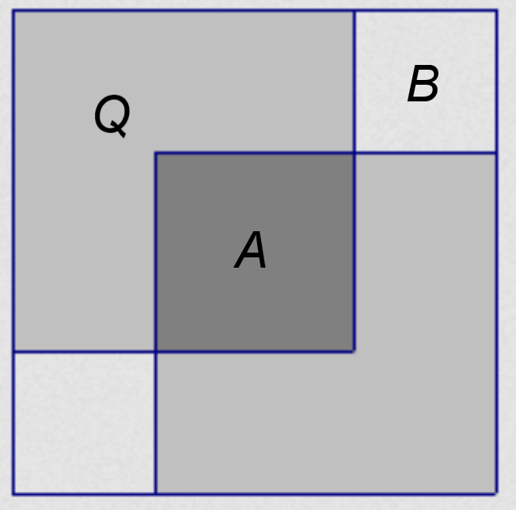
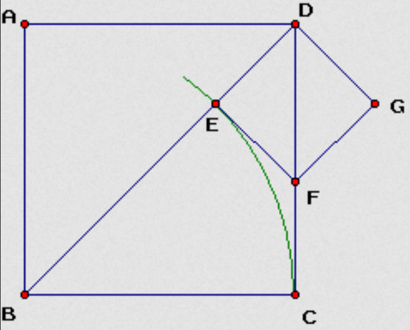

# Introduction

The problem comes from the discussion about the proof of irrationality of $\sqrt{2}$ in the text books are usually by contradiction. In this essay, we discuss various methods for proving this problem. These proofs are mainly collected from the Internet. The origins would be specified as detailed as possible.

# Proof by Contradiction

This is the most popular method to prove such irrationality. 

## Classical way

To prove the irrationality of $\sqrt{2}$, we assume it is a rational number. Then one should have $\sqrt{2} = p / q$ in which two integers $p, q$ are relative prime. Then by the definition of $\sqrt{2}$ one has

$$
p^2 = 2 q^2.
$$

This means $p^2$ should be even. This means $p$ should also be even. And one can denote $p = 2k \ ; \ k \in \mathbb{N}$. Substitute this into the relation between $p, q$, one has $q^2 = 2k^2$. This means $q$ should also be even. This makes contradiction to our assumption: $p, q$ are relative prime.

Such contradiction proves the irrationality of $\sqrt{2}$

Other proofs by contradiction are mainly the variation of the procedure to construct contradiction by $p^2 = 2q^2$. We list some of the beautiful proofs below.

## The number of even factors

This is another way to make a contradiction by $p^2 = 2q^2$ by [zhihu@BAJIN][1]. Consider the factorization of $p, q$, there should be integer even factors in both of them. Thus the numbers of even factors in $p^2, q^2$ are both even. However, there are odd number of even factor in $2q^2$ since the extra factor $2$. Thus the number of even factors in the two sides of equality $p^2 = 2q^2$ would be ``even = odd''. That makes a contradiction.

## With the area of squares

This is another simple and elegant way to make contradiction for $p^2 = 2q^2$. This method is found in ([zhihu@楚若儿][1], [CSDN@matrix67][4]). 

{}

{}

Let $p, q$ are the smallest integers with $p^2 = 2q^2$, then make three squares with edge length $p, q, q$. Their size can be shown in the scratch. We have the areas satisfies

$$
\begin{cases}
S_A + S_Q = q^2 & \\
2S_Q + S_A + 2S_B = p^2 = 2q^2
\end{cases} \Rightarrow 2S_B = S_A.
$$

Then the edge length of two smaller squares $A, B$ would also satisfies $p'^2 = 2q'^2$ and they are smaller than $p, q$. This is contradict to our assumption that $p, q$ are smallest instance. This proves that $p^2 = 2q^2$ cannot be true for integer $p, q$.

# Directive Method

## By infinite continued fraction

A **continued fraction(无穷连分数)** is an expression as([wikipedia/Continued_fraction][2]) 

$$
a_0 + \frac {b_1} {a_1 + \frac {b_2} {a_2 + \cdots}}.
$$

$(a_i, b_i)$ are integers.

This proof is based on the lemma:

> Any finite continued fraction is rational, while any infinite continued fraction is irrational

{}

This lemma is based on that there are only two types of numbers: rational and irrational. It is true for real numbers. To prove this lemma, we need only to prove that finite continued fraction and rational number are equivalent. From finite to rational is trivial. Now we consider the inverse one.

Now we consider the **simple form**, which means $b_1 =\cdots = 1$. Note that convert to simple form would not change the finiteness of continued fraction. Note that such representation is unique for real numbers since the generation is

```python
# Input: number `x`
# Output: simple continued fraction `[a_0, a_1, ...]`
def GenerateSimpleContinuedFraction(x):
    a = int(x)
    return [a].extend(GenerateSimpleContinuedFraction(1 / (x-a)))
```

Then we can immediately find that this iteration would terminate if $x$ is a rational number as $p/q$. Because the procedure is actually the **Euclidean algorithm(辗转相除法)** to find the greatest common divisor. 

The detailed proof of uniqueness of simple continued fraction can be seen in ([proofwiki/Irrational_Number_is_Limit_of_Unique_Simple_Infinite_Continued_Fraction][3])

{}

Then for $\sqrt{2}$, one can find an infinite continued fraction by

$$
\begin{aligned}
&(\sqrt{2}+1) (\sqrt{2}-1) = 1\\
\Rightarrow& \sqrt{2} = 1 + \frac 1 {1 + \sqrt{2}} \\
\Rightarrow& \sqrt{2} = 1 + \frac 1 {1+ 1 + \frac 1 {1+ \sqrt{2}}} \\
\Rightarrow& \sqrt{2} = 1 + \frac 1 {2 + \frac 1 {2+\cdots}} = (1, 2, 2,\cdots)
\end{aligned}
$$

Thus $\sqrt{2}$ should be an irrational number.

## By geometric way

Another direct way is also based on the Euclidean algorithm. The proof can be well described by the scratch ([CSDN@matrix67][4])

{}

{}

Unit square $ABCD$ ($AB=BC=CD=DA=1$, so $BD =\sqrt{2}$). The arc $CE$ makes that $BE= BC=1, EF=FC$. The Euclidean algorithm for $(1, \sqrt{2})$ could be represented by such geometric way as

1.  $(BC, BD) \rightarrow (BC, BD - BC) = (BC, DE)$
2.  $(DE, BC) \rightarrow (DE, BC - DE) = (DE, DF)$
3.  ...

One can see that such procedure repeats itself with a scaling from square $ABCD$ to square $DEFG$. This means that such procedure would not terminate. That means $\sqrt{2}$ and $1$ are not **commensurable(可公度)**, i.e., $\sqrt{2}$ is irrational.

# Reference

[1]: https://www.zhihu.com/question/61798983
[2]: https://en.wikipedia.org/wiki/Continued_fraction
[3]: https://proofwiki.org/wiki/Irrational_Number_is_Limit_of_Unique_Simple_Infinite_Continued_Fraction
[4]: https://blog.csdn.net/matrix67/article/details/4780419?utm_medium=distribute.pc_relevant.none-task-blog-2~default~baidujs_baidulandingword~default-0.pc_relevant_paycolumn_v3&spm=1001.2101.3001.4242.1&utm_relevant_index=3

1. [知乎: 如何证明根号 2 是无理数？][1]
2. [wikipedia/Continued_fraction][2]
3. [proofwiki/Irrational_Number_is_Limit_of_Unique_Simple_Infinite_Continued_Fraction][3]
4. [CSDN@matrix67/令人称奇的简单证明：五种方法证明根号2是无理数][4]