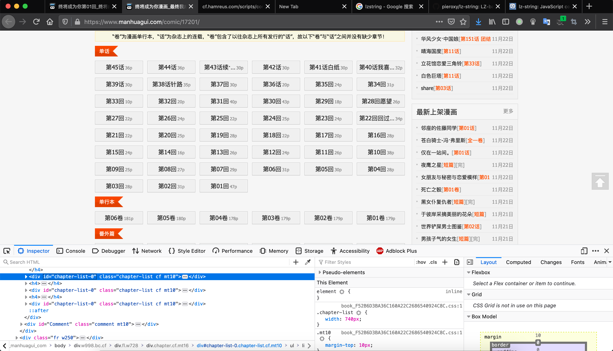
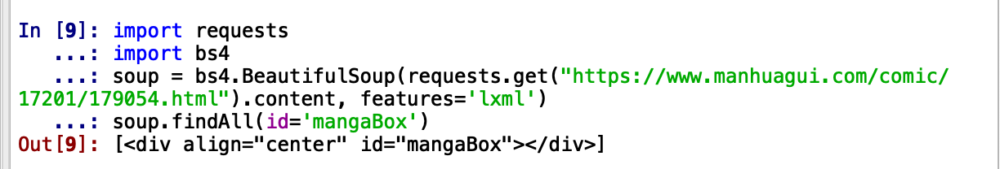
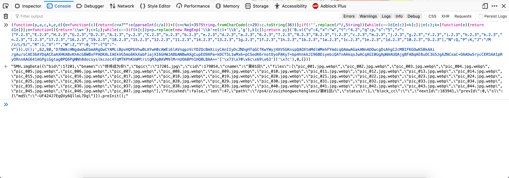

# 获取漫画柜上一本漫画的内容索引

[漫画柜](https://www.manhuagui.com/) 上的每本漫画都有一个属于自己的 `mangaID` , 我们选择一部漫画点进去从链接名称上就能看出来: 像[终将成为你](https://www.manhuagui.com/comic/17201) 的链接就是 `"https://www.manhuagui.com/comic/17201"` . 而点进去之后我们可以看到章节列表. 使用浏览器的 `Develop tools` (一般来说热键是 `f12` ), 我们可以看看它的页面布局:



这些章节都被存放在有着 `id=chapter-list-0` 的 `<div>` 中, 来用 `python` 获取一下看看:

```python
import requests
import bs4
soup = bs4.BeautifulSoup(requests.get("https://www.manhuagui.com/comic/17201/").content, features='lxml')
soup.findAll(id='chapter-list-0')

Output: [<div class="chapter-list cf mt10" id="chapter-list-0"><ul style="display:block"><li><a class="status0" href="/comic/17201/455630.html" target="_blank" title="第45话"><span>第45话<i>36p</i></span></a></li>...]
```

看起来包括链接, 话数, 图片数在内的都拿到了. 那么我们就该去看看每个章节的图片怎么下过来了.

# 漫画柜的漫画呈现方式分析

## 从页面布局上观察

同刚才不同, 漫画柜并不是静态地将漫画图片呈现给用户的. 如果点进去一部漫画的某个章节, 使用浏览器的 `Develop tools` 我们会看到如下的界面:



立即看到它有一个用 `id=mangaBox` 标记的 `<div>` 节点来放置图片, 并且 `` 标签上就是我们要的图片链接. 看起来如果我们直接下载这个链接就可以了. 事不宜迟, 我们上 `requests.get` 来看看:

```python
import requests
import bs4
soup = bs4.BeautifulSoup(requests.get("https://www.manhuagui.com/comic/17201/179054.html").content, features='lxml')
soup.findAll(id='mangaBox')
```

这段代码会帮助我们找到刚才看到的页面里的所有 `id=mangaBox` 的标签, 那么结果是什么呢?



标签找到了, 但里边没有东西. 这说明页面里边这个图片是动态呈现的. 而 `requests.get` 并不能帮助我们完成这个工作. 一些人可能会选择 `selenium` 通过调用一个无头浏览器来绕过去这一部分, 就像真实地使用浏览器打开一样, 获取到图片的信息. 但这里并不打算这么做.

## 发现页面里的 Javascript 存在问题

既然是靠 js 来加载的, 那要么是使用 `load` 事件完成的, 要么这段代码就在放漫画的 `div` 后边. 看了一眼 `html` 的事件列表, 并没有发现和呈现漫画有关的代码. 而 `div` 之后的 `script` 标签只有两个, 其中一个还是 `jQuery` 的压缩代码. 但另一个就有的瞧了:



这么长一段太值得怀疑了, 还使用了 `\x` 的 `utf-8` 编码来掩饰自己, 用 python 来解码一下:

```python
In  := b'\x65\x76\x61\x6c'.decode("utf-8")
Out := 'eval'
```

不是别的, 这段代码开头的正是 `window.eval` 方法! 那答案已经很明显了, 把它执行的部分放进 `console` 里跑跑看, 注意加上括号告诉这个匿名函数是要被执行的:



终于找到你了!

## 分析获取图片的代码的其他问题

接下来的问题是, 这段代码有没有调用别的函数, 检查起来很容易, 新开一个标签页用 `console` 跑一下就可以了. 如果能成功运行的话就意味着这个代码是独立的片段, 我们要的所有信息都可以通过运行它来得到.



看来并没有那么简单啊. 不过很奇怪, 提示的错误的这个 `splic` 是什么东西, 代码里好像没出现啊. 不要着急, 看看它前面调用这个方法的对象, 不就是那串乱七八糟的字符么. 它后边有个同样用 `utf-8` 编码做了掩饰, 老规矩, 解码看看

```python
In  := b'\x73\x70\x6c\x69\x63'.decode("utf-8")
Out := 'splic'
```

找到了. 怪不得无法运行, 这个东西不是 js 字符串的标准方法, 应该是来自于之前页面的代码定义的. 这里就没有什么好办法了, 只能打开刚才页面里的 js 来搜索这个函数. 除了 `splic` 同样也要用 `'\x73\x70\x6c\x69\x63'` 来找.



还真被找着了!. 又是大段大段的 `utf-8` 编码, 但问题不大, 我们只要看看这个含有这串字符的段落是什么东西就够了. 一个简单的方案就是把它复制进浏览器的 `Console` 运行一下就够了, 但一定要完整地复制. 比如这里, 我们就需要从 `(function(i,k,a,n,m,an){...` 复制到最后一个分号. 当然也可以先复制进文件里再用 python 解码. 最终我们得到了这个:



一切都明了了, 原来 `splic` 正是:

```js
String.prototype.splic=function(f){return LZString.decompressFromBase64(this).split(f)};
```

那么刚才的那段代码也就清楚了, 注意到 `\x7c` 其实是字符 `'|'` . 而里边的 `LZString` , google一下发现是一种压缩算法, 甚至找到了它的 [github页面](https://github.com/pieroxy/lz-string) , 发现有python的移植. 赶紧解码看看:

```python
import lzstring
lzstring.LZString.decompressFromBase64("D7BWAcHNgdwUwEbmARgOwCYAMLiBpvHQPbVhwBLAYwH0cAWEi6lAVnqpzVcYDZOcBmXiiyCAnIIyDcZNhgHTqGCfKwYWyjHXVSGKnspQAOXtmMdlWMehFYmdcqQAmwAGakANnADOwcgDsAhgC2cMBIFKGOwKSBkAAi/gAu/sCAE36AYDqACEaAXHKABvKhAcG8WBxFPADKALIAEkVG5mo6KkXabFiajXI6GHWJABbANBwAXgCupEO9APa+kDCT5L1wMx6+pCSedK6rnotOyoPAKy7+bp4hnkkJI96BDiyebiQATnAAkqsJwACqAGI0GgApNAAUQAjgBFABqAE8uOC3G5JgAZNCxaC+OAADwSrycCER5AA1pRyORnnAAG641AGPgiGgtag0PQ6PgNNh8docsyslkczoc4TqMTKPhKVmMtritgM3g0AVM9lMrnUOm8Ph1HQ0LBAA==")

Output: '||jpg|webp|17201|第01回|pic_014|pic_015|pic_017|pic_016|pic_013|pic_010|pic_019|pic_012|pic_011|pic_023|pic_022|pic_025|pic_024|pic_021|pic_026|pic_018|pic_020|pic_027|pic_009|179054|cid|files|cname|bpic|bid|imgData|终将成为你|bname|pic_007||pic_006|SMH|pic_008|pic_005|pic_002|pic_001|pic_004|pic_003|pic_028|path|47|zuizhongwochengleni|ps4|finished|pic_047|len|false|status|md5|sl|preInit|UF424J7EqQVy6QlloL7Dg|nextId|block_cc|prevId|183941|pic_046|pic_035|pic_034|pic_037|pic_036|pic_033|pic_030|pic_029|pic_032|pic_031|pic_042|pic_041|pic_043|pic_045|pic_044|pic_039|pic_038|pic_040'
```

再把这串解码后的字符串放回到原来的位置, 当然要把 `.split('|')` 加上, 再在空白的标签页里跑跑看:



完美.

# Python 程序实现

## 流程总结

到目前为止, 漫画柜是怎么呈现漫画获取图片链接这个问题已经被很好地解决了. 而我们该如何爬取下载漫画也变得相当清晰. 可以总结如下:

1.  给定一本漫画的主页的链接, 对于漫画柜来说一般是这个格式: `"https://www.manhuagui.com/comic/"+str(mangID)` , 如 `"https://www.manhuagui.com/comic/17201"`
2.  从页面上获取章节信息, 这一步由于页面元素是静态呈现的, 因此只需要使用 `bs4` 的选择器就可以了
3.  根据章节信息进入每一个章节开始批量下载漫画, 这一步的核心就是根据页面中的 `script` 节点获得信息, 需要在 `python` 中执行 `javascript` 代码来完成. 得到的结果将组成图片链接并下载.
4.  根据章节信息设置文件夹并把下载到的图片进行保存

整个代码分为两个文件, 其中一个放置针对漫画柜的分析器. 它应当完成给定一个漫画的url后, 返回各个章节的名称和url. 并且能够根据url获得各个漫画分页的图片链接以及 `requests` 的其他参数来方便下载. 另一个文件则在这个基础上完成漫画的下载和分类存放过程. 这样今后遇到其他的漫画站只需要修改解析器的机制就可以了, 分类存放的代码可以复用.

## 漫画柜的分析器

这部分代码使用了如下的全局变量和模块:

```python
import dukpy
import lzstring
import re
import requests
import bs4
import json

baseURL = "https://www.manhuagui.com"
imgURL = "https://i.hamreus.com"
```

### 章节信息的获取

章节信息的获取十分简单, 就是我们上面做的操作循环执行就可以了. 为了方便后边的使用, 我们把章节按照名字和url的规则存放为字典:

```python
def getChapterList(url):
    with open("./Figs/config.json",'r') as f:
        conf = json.load(f)
    baseSite = requests.get(url, headers = {"User-Agent": conf["User-Agent"]})
    formatedSite = bs4.BeautifulSoup(baseSite.content, features="lxml")
    allChapLis = formatedSite.findAll(id="chapter-list-0")
    res = []
    for div in allChapLis:
        allLinks = div.findAll('a')
        for aTags in allLinks:
            det = aTags.attrs
            res.append({"Text": aTags.getText(), "URL":baseURL+det['href']})
    return res
```

### 根据章节url获得分页图片链接

这一步的核心事实上只是在python中执行 javascript 代码, 我们这里使用了 [amol-/dukpy](https://github.com/amol-/dukpy) 库, 十分感谢作者的贡献.

```python
def getCoreInfo(url):
    with open("./Figs/config.json", "r") as f:
        conf = json.load(f)
    getSite = bs4.BeautifulSoup(requests.get(url, headers = {"User-Agent": conf["User-Agent"]}).content, features="lxml")
    jsSlic = re.search(r">window.*(\(function\(p.*?)</script>", str(getSite)).group(1)
    coreStr = re.search(r"[0-9],'([A-Za-z0-9+/=]+?)'", jsSlic).group(1)
    decStr = lzstring.LZString.decompressFromBase64(coreStr)
    jsNew = re.sub(r"'[A-Za-z0-9+/=]*'\[.*\]\('\\x7c'\)", "'"+decStr+"'.split('|')", jsSlic)
    sol = dukpy.evaljs(jsNew)
    return json.loads(re.search(r"(\{.*\})",sol).group(1))

def getDlSetting(url):
    data = getCoreInfo(url)
    pathURLs = []
    picid = 0
    for pic in data['files']:
        mangaurl = imgURL+data['path']+re.match(r".*?\.[a-z]*", pic).group(0)
        fullurl = mangaurl+"?cid="+str(data['cid'])+"&md5="+data['sl']['md5']
        pathURLs.append({"Name": "%05d"%picid, "URL": fullurl})
        picid += 1
    refURL = baseURL+"/comic/"+str(data['bid'])+"/"+str(data['cid'])+".html"
    return pathURLs, {"Referer": refURL}
```

这个部分有一个坑是试图获取图片的时候, 发现直接使用 `requests.get` 会报 `403` 错误, 研究发现是没有加入 `requests headers` 信息. 对于漫画柜来说, 这部分只要加入 `User-Agent` 和 `Referer` 信息就可以了. 这似乎是最基本的反爬机制, 但这里显然还是十分简单的. 这部分信息可以在浏览器的 `Develop tools` 中找到, 注意它在 `Network` 标签下:



## 分章节存放漫画分页图片

由于这个代码运行的时间很长, 所以我们使用了 `multiprocessing` 库来并行处理, 同时使用 `progressbar2` 库来展示一个进度条:

```python
# -*- coding: utf-8 -*-

import mhgParser as ps
import os
import multiprocessing as mp
import json
import requests as rq
import time
import random
import progressbar

url = "https://www.manhuagui.com/comic/17201/"
foldpref = "./Figs/test/"

class dlManga(object):
    def __init__(self, fold, opt):
        self.session = rq.session()
        self.fold = fold
        self.opt = opt
    def __call__(self, dic):
        getFile = rq.get(dic['URL'], headers=self.opt).content
        with open(self.fold+dic["Name"]+".jpg","wb") as f:
            f.write(getFile)

with open("./Figs/config.json","r") as f:
    conf = json.load(f)

chapList = ps.getChapterList(url)
totNum = len(chapList)
for ind in progressbar.progressbar(range(totNum)):
    chap = chapList[ind]
    chapPath = foldpref+chap["Text"]+"/"
    try:
        os.mkdir(foldpref+chap["Text"])
    except FileExistsError:
        pass
    dlDic, addOption = ps.getDlSetting(chap["URL"])
    headerOption = {"User-Agent": conf["User-Agent"]}
    headerOption.update(addOption)
    with mp.Pool(processes=4) as pool:
        pool.map(dlManga(chapPath, headerOption), dlDic)
    time.sleep(0.5+random.random() * 0.5)

if __name__=="__main__":
    pass
```

当然也可以将上面的代码块放在 `if __name__=="__main__":` 下来运行. 不过这里一般不会出现在其他文件导入这个文件的情形, 因此没有做这样的处理.

代码放置在 [wzdlc1996/mangaSpider](https://github.com/wzdlc1996/mangaSpider) 下.
