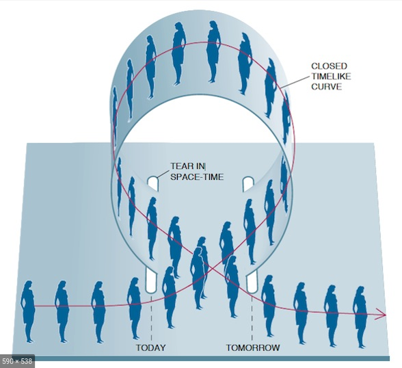
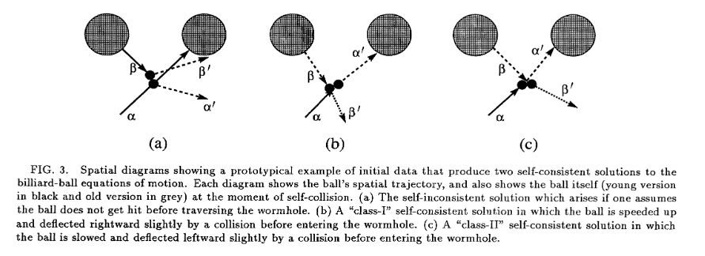
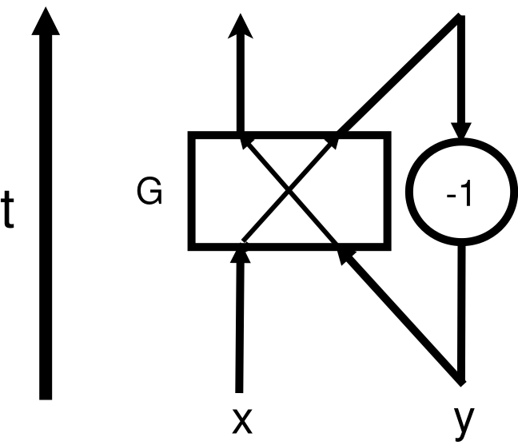

# Time Travel and Quantum Computation

Time travel, as a famous concept in science fiction, fascinates people for a long time. However for physicists, this is not only a beautiful dream, but also a interesting problem to discuss mathematically. In the community, there are generally two directions about time travel: (1) does it exist and (2) if it indeed exists, what can we do. People usually use classical general relativity to study these questions, but in recent years, some works within quantum mechanics have been also made to help us understand the nature of time and the potential application of time travel.

In this report, we will discuss the aspect (2): application of time travel, mainly in the field of quantum computation. The content is arranged as following: first we will introduce the time travel in relativity as a simple warm up on some philosophical problem, then we will give them explanation in quantum framework, which is firstly came up with by David Deutsch in 1991. At last we will discuss its influence on quantum computation.

## Time Travel in Relativity

Even in Special Relativity, the "time travel" can be done based on the twin-paradox. One leaves by a high speed and another stay on earth, when the left one comes back, he will find him younger than the other. Consequently, the left one is a time traveler to the future from the past. But this manner can never make time travel to the past.

A much general framework for time travel is made in the General Relativity(GR), where physicists called **Closed Timelike Curve(CTC)**: closed curve whose tangent vector are always timelike. Along the CTC, two events of different **proper time** could appear at the same spacetime point in the view of exterior observer. Such process is what we want of time travel, and can not be reject in the framework of classical GR yet.



### About grandfather paradox

According to Thorne and Novikov, possible time travel should not lead to any casual-loop paradox. They introduced a simple process: a billiard ball goes to the time machine, if the CTC exists, it can return to the past and avoid the younger ball to enter the time machine, see [Thorne1991](https://authors.library.caltech.edu/6469/1/ECHprd91.pdf). In this paper, they showed that there are always some self-consistent solutions. And the [Novikov self-consistency Principle](https://en.wikipedia.org/wiki/Novikov_self-consistency_principle) claims that real world should run along such paths:



A potential issue is the free will, but it seems it is more attractive to Sci-Fi instead of physicists, like the famous anime: [Steins;Gate](https://en.wikipedia.org/wiki/Steins;Gate_(TV_series)), in which the effect of self-consistency principle on intelligent time traveler is described by the phenomena named "世界線の収束", see [STEINS;GATEの用語一覧](https://ja.wikipedia.org/wiki/STEINS;GATE%E3%81%AE%E7%94%A8%E8%AA%9E%E4%B8%80%E8%A6%A7#%E4%B8%96%E7%95%8C%E7%B7%9A%E9%96%A2%E9%80%A3):



Another issue is such self-consistent solution usually is not unique. One possible resolution of this is quantum mechanics especially the path integral, in which one needs never ask which way does the partical run.

## CTC in Quantum Mechanics

The first work about CTC and its influence on quantum mechanics was made by David Deutsch: [Quantum Mechanics Near Closed Timelike Lines](https://journals.aps.org/prd/abstract/10.1103/PhysRevD.44.3197), in which he showed his theory of CTC in quantum mechanics, and some discussion about classical temporal-loop paradox and the experimental test of Everett's [many worlds interpretation](https://en.wikipedia.org/wiki/Many-worlds_interpretation).

### Paradoxes in computational form

To illustrate his quantum framework for time travel, Deutsch introduced some paradoxes and analyzed them in classical and quantum ways. Here, we focus on two of them, others definitly have the similar structure with these.

1.  Computational Grandfather Paradox

    This procedure can be represented with a simple network model:

    

    Where variables $x,y$ are binary valued, and circle "-1" means the time machine. From the bottum to the top is the time arrow in "laboratory", while along the arrow crossing gate $G$ is the **proper** time of the bit. The classical property is that our bits can only varies in the set of computational basis instead of the wavefunction on it. Our **computational grandfather paradox** happens when the gate $G$ operates "plus", i.e., $a+b \mod 2$, then we need that(Note time machine will not change the bit, it only transports the bit to the past):

    
    $$x+y \equiv y\mod 2$$
    
    When we set $x=1$, then this equation has no solution, or there is no self-consistent path. But we can also set $x=0$, then no matter $y$'s value is, this procedure is self-consistent.

    Now we consider the quantum case, it is also the framework of Deutsch. Assume the state of $x$-channel is $\ket{\psi}$, a pure state and the state of $y$-channel, the older version of $\ket{\psi}$, is the density matrix $\hat \rho$ generally. So as they entering $G$, the state at that moment is:

    
    $$\ket{\psi}\bra{\psi}\otimes \hat \rho$$
    
    The gate $G$, defined by a reversible computation procedure, can be write as a unitary operator $\hat U$ and has the simple form on the computational basis:

    
    $$\hat U = \sum_{x,y\in\mathbb{Z}_2}\ket{x+y}\bra{x}\otimes \ket{y}\bra{y}$$
    

    Now the question is what is the time machine. Deutsch camp up with an equation for it based on the **kinematical consistency** : the output of the gate, partially traced out on channel, should be the same as $y$'s input:

    
    $$\hat \rho = \text{Tr}_y \Big(\hat U (\ket{\psi}\bra{\psi}\otimes \hat \rho)\hat U^\dagger\Big)$$
    

    Where $\text{Tr}_y$ means the partial trace on the section of $y$-channel, i.e., the second ket in the direct product form of quantum states. For the generic $\hat \rho$:

    
    $$\hat \rho = \sum_{u,v\in\mathbb{Z}_2} c_{uv}\ket{u}\bra{v}$$
    

    the self-consistent equation reads:

    
    $$\begin{aligned}
    \hat \rho &= \ket{0}\bra{0}\Big(c_{00}|\bra{0}\psi\rangle|^2 + c_{11}|\bra{1}\psi\rangle|^2\Big) \\
    &\indent + \ket{1}\bra{1} \Big(c_{00}|\bra{1}\psi\rangle|^2 + c_{11}|\bra{0}\psi\rangle|^2\Big) \\
    &\indent + \ket{0}\bra{1}\Big(c_{00}\bra{0}\psi\rangle\bra{\psi}1\rangle + c_{11}\bra{1}\psi\rangle\bra{\psi}0\rangle\Big) \\
    &\indent + \ket{1}\bra{0}\Big(c_{00}\bra{1}\psi\rangle \bra{\psi}0\rangle + c_{11}\bra{0}\psi\rangle\bra{\psi}1\rangle\Big)
    \end{aligned}$$
    

    So there is at least one solution for the self-consistency equation:

    
    $$\hat \rho= \frac 1 2 + \text{Re}(\bra{0}\psi\rangle\bra{\psi}1\rangle)\Big(\ket{0}\bra{1}+\ket{1}\bra{0}\Big)$$
    

    Meanwhile, the final state of the bit should be:

    
    $$\begin{aligned}
    \hat \rho_{\text{fin}} &= \text{Tr}_x \Big(\hat U (\ket{\psi}\bra{\psi}\otimes \hat \rho)\hat U^\dagger\Big) \\
    &= \frac 1 2 + 2(\text{Re}\bra{0}\psi\rangle\bra{\psi}1\rangle)^2 \Big(\ket{0}\bra{1}+\ket{1}\bra{0}\Big)
    \end{aligned}$$
    

2.  Time Travel and NP-Problem

    In the second case, we show how could a time machine help us solve an NP problem.

    The model is similar to that in 1, but now we use $n$ such carriers so that we can handle the problem of $n$ bits and let the effect of $G$ be:

    
    $$(x,y) \overset{G}\rightarrow (x+f(y), y) \ ; \ \forall x,y\in \mathbb{Z}_{2^n}$$
    

    So the self-consistency requires that:

    
    $$y = x+f(y)$$
    

    If our initial setup (**can only made for $x$**) is $x=0$, then this network will tell us the fixed point of function $f$, as the final output, which is in the class of $NP$, but our network seems a overwhelmingly powerful algorithm for it. We call this procedure paradoxical because there exists functions who has no fixed point, in this case it would be another version of grandfather paradox like we discussed in 1.

    Now what could happen in quantum region? similar to what we did before, quantum state in $y$-channel should satisfies that:

    
    $$\hat \rho = \text{Tr}_y\Big(\hat U (\ket{0}\bra{0}\otimes \hat \rho)\hat U^\dagger\Big)$$
    

    where the gate $G$ is $\hat U=\sum_{x,y} \ket{x+f(y)}\bra{x}\otimes \ket{y}\bra{y}$. With simple algebra we can rewrite the self-consistent equation as:

    
    $$\begin{aligned}
    \hat \rho &= \sum_{x,x';z} \ket{x+f(z)}\bra{x}0\rangle\bra{0}x'\rangle \bra{x'+f(z)} \bra{z}\hat \rho \ket{z} \\
    &=\sum_{z \in \mathbb{Z}_{2^n}} \ket{f(z)}\bra{z} \hat \rho \ket{z}\bra{f(z)}
    \end{aligned}$$
    

    Obviously if $f$ has non-empty fixed points set $F$, then any of form: $\sum_{x\in F}p_x \ket{x}\bra{x}$ will be a solution once $p_x$ is a probability distribution on $F$. But we can still find some other solutions just like in computational grandfather paradox, note that this equation requires that $\hat \rho$ be diagonal in computational basis:

    
    $$\hat \rho = \sum_{x\in \mathbb{Z}_{2^n}} p_x \ket{x}\bra{x}$$
    

    then we have the equation for $p_x$, apart from the probability property $\sum_x p_x = 1$ and $0\leq p_x\leq 1$:

    
    $$p_x = \sum_{y\in \{y: x = f(y)\}} p_y$$
    

    This condition is much weaker than the fixed point condition. If $f$ is invertible (which is not necessary for the evolution $\hat U$ to be unitary), there is always a solution of $\hat \rho = 1/2^n$.

### Deutsch's theory for CTC in QM

Generally speaking, Deutsch's theory has the following form:

Self-consistency requires that the state entering the CTC: $\hat \rho$ should be the same as it in the past even after the interaction with a "chronology-respecting" system in state $\hat \rho_A$:

$$\hat \rho = \text{Tr}_A \Big(\hat U (\hat \rho \otimes \hat \rho_A)\hat U^\dagger\Big) \equiv \Phi(\hat \rho)$$

Such fixed point of $\Phi$ can be proved to exist, because map $\Phi$ is a [completely positive map](https://en.wikipedia.org/wiki/Completely_positive_map)

As for which fixed point should happen in real world, Deutsch suggested the **maximum entropy rule**:

> The state of the supplementary data (i.e., data required elsewhere than at the past boundary of spacetime for fixing a global solution of the dynamical equations) is the state of greatest entropy compatible with the initial data

in the above paradoxes, such supplementary data is nothing but the $y$ channel coming from the future. For inctance of the second case, when $f$ is invertible, Deutsch thought that the final solution should be the maximum mixed state: $1/2^n$, so we cannot solve extremely hard problems by such network in a fast way.

So in Deutsch's theory, the dynamics with CTC will have a intrinsic time asymmetry: the above network drives a pure state into a mixed state, so the entropy of the system gets larger and generally time-reversal invariance is failed in this case, which is fundamentally related to the quantum measurement theory: physically separated systems get into entangled quantum states only **AFTER** interacting with each other.

## CTC for Computation

The evolution in Deutsch's framework of CTC is nonlinear, such evolution has overwhelming computational power: see [Lloyd1998](https://journals.aps.org/prl/pdf/10.1103/PhysRevLett.81.3992) for details about nonlinear quantum mechanics leads to P=NP.

Here, we show one application of CTC on NP-complete problem, refered [Bacon2004](https://journals.aps.org/pra/pdf/10.1103/PhysRevA.70.032309).

The self-consistent equation:

$$\hat \rho_{CTC} = \text{Tr}_{CR}(\hat U(\hat \rho_{CR}\otimes \hat \rho_{CTC})\hat U^\dagger)$$

defined a non-linear evolution when we set:

$$\hat U = \ket{00}\bra{00}+\ket{10}\bra{01}+\ket{11}\bra{10}+\ket{01}\bra{11}$$

and the generic $2\times 2$ density matrix:

$$\hat \rho_{CR}\otimes \hat \rho_{CTC} = \frac 1 2 (1+\bm{n}\cdot \bm{\sigma})\otimes \frac 1 2 (1+\bm{m}\cdot \bm{\sigma})$$

Thus, the self-consistent equation reads:

$$\frac 1 2 (1+\bm{m}\cdot \bm{\sigma}) = \begin{bmatrix}
\frac {1+n_z} 2 & \frac 1 2 m_x(n_x-\ti n_y) \\
\frac 1 2 m_x(n_x+\ti n_y) & \frac {1-n_z} 2
\end{bmatrix}$$

That is:

1.  when $n_x\neq 1$, there is only one solution of $m_x=m_y=0, m_z=n_z$
2.  when $n_x = 1$, there are solutions (infinity) of $m_z=n_z, m_y = m_x n_y$

So if we fix that $n_x\neq 1$, we do not need to worry about the maximum entropy rule because there is only one possible path, and the entire evolution is:

$$\begin{aligned}
R[\hat \rho_{CR}=\frac 1 2 (1+\bm{n}\cdot \bm{\sigma})] &= \text{Tr}_{CTC}(\hat U (\hat \rho_{CR}\otimes \hat \rho_{CTC,\text{self-consistent}})\hat U^\dagger) \\
&= \begin{cases}
\frac 1 2 (1 + n_z^2 \sigma_z) & n_x \neq 1\\
\text{ambiguous} & n_x=1
\end{cases}
\end{aligned}$$

Now we apply this evolution $R$ on a NP-complete problem: [SAT](https://en.wikipedia.org/wiki/Boolean_satisfiability_problem):

> Given a boolean function $f:\{0,1\}^n\rightarrow \{0,1\}$, specified in conjunctive normal form, the goal is to answer whether there is solution of $f(x)=1$ or not.

The algorithm reads:

1.  Prepare the state of $\sum_{i\in \{0,1\}^n} \ket{i}\ket{f(i)}$ on $n+1$-spin, by oracle: $\sum_{i\in\{0,1\}^n} \ket{i}\bra{i}\otimes \sigma_x^{f(i)}$
2.  traced out the first $n$ spins and get
    
    $$
    \hat \rho_0 = \frac 1 {2^n}\sum_{i\in \{0,1\}^n} \ket{f(i)}\bra{f(i)} = \frac 1 2 \Big(1-(1-\frac s {2^{n-1}})\sigma_z\Big)
    $$
    
    where $s$ is the number of solutions of $f(x)=1$
3.  Map $R$ on $\hat \rho_0$ $p$ times:
    
    $$
    R^n[\hat \rho_0] = \frac 1 2 \Big(1+(-1+\frac s {2^{n-1}})^{2^p}\sigma_z\Big)
    $$
    
And then:

1.  if $s=2^n$, i.e., $f=1$, is a trivial case
2.  if $0\leq s < 2^n$, measure the state on $\sigma_z$ basis. When one get $\ket{0}\bra{0}$, it means $s=0$, otherwise $s> 0$. When $s> 0$, the probability of find $\ket{0}\bra{0}$ is exponentially small. i.e., after polynomial times map, we can claim whether $f(x)=1$ has solution or not with exponential probability statement: P=NP.