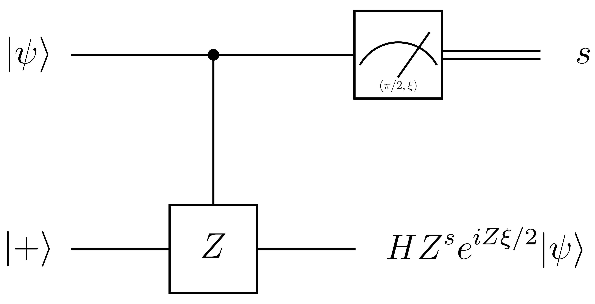

# Introduction

**Measurement Based Quantum Computing (MBQC)**, or **One-way quantum computing** ( **QCc** in short with `c` denoting the term cluster state) is a
1.  Universal, all circuit can be simulated by it
2.  Operation-friendly, only single-qubit measurement.

quantum computation model. As firstly introduced by Robert Raussendorf and Hans J. Briegel in 2001 ([Raussendorf 2001][4]), MBQC has attracted much attentions of community. The main reason is MBQC has no direct classical concept and the isolation between entanglement unit (as multi-qubit gates) and single qubit operations. This framework helps us to understand the unique role of entanglement on the power of quantum computing. It also offers a efficient way to design the quantum computer on some modern platforms like optics system. 

In this note, we focus on answer the following two questions:
1.  What is MBQC and how does it work?
2.  Is MBQC more powerful than circuit model?

Some other developments on MBQC are also discussed here like whether more entanglement leads us more power or not. As an introduction, we will not fully cover the optimization techs but those references are still offered.

# Main Model

The most generic formalism for MBQC has the following procedure:

1.  **Platform** $\mathcal{C}$ has multiple qubits.
    -  I/O qubits can be parts of the platform. 
    -  Redundant qubits in principle is not necessary.
2.  **Clusterize** the platform means a standard unitary evolution to prepare the initial state:

    $$
    \ket{\psi_{\mathcal{C}}} = \hat U_{\mathcal{C}} \ket{\psi}_{I} \otimes\ket{+}^{\otimes |\mathcal{C} - I|}.
    $$

    The evolution generates the entanglement but can be independent of the algorithm. 
3.  **Measurement** for single qubit is applied on the platform. This outputs a set of classical data for the result of measurements $x$:

    $$
    \ket{\psi} \rightarrow \prod_j \hat P_j(x)  \ket{\psi_\mathcal{C}}.
    $$

4.  **Post-process** applies some (usually single-qubit) unitary gates on the platform according to measurement results $x$. 

    $$
    \ket{\psi} \rightarrow \hat U(x)\prod_j \hat P_j(x)  \ket{\psi_\mathcal{C}}.
    $$

There are some notes on the above procedure:

-  Step 3, 4 can be repeated adaptively in the practice. One can even introduce additional entanglement unit in the mid way (not recommended in original version). This actually enlarges the ability of MBQC by deepen it.
-  To readout the final state of I/O qubits safely, we can measure all redundant qubits making them to product state. This leads various post-processing in MBQC.
-  The clusterization allows $\hat U_{\mathcal{C}}$ independent to the problem. This makes it can be efficiently prepared statically and friendly to some near-term system like ion-trap, cold atom, and optical array.

   In Ref. ([Briegel 2009][2]), the authors suggests **graph states** as the platform: given graph $G(V,E)$, the $n=|V|$-qubit graph states reads

   $$
   \ket{\psi_{\mathcal{C}}} = \ket{G} = \prod_{(i, j) \in E} \textrm{CZ}_{i, j} \ket{+}^{\otimes |V|}.
   $$

   The entanglement is prepared by controlled-Z gates: $\textrm{CZ}_{i,j}\sim \textrm{diag}\{1,1,1,-1\}$. Such graph states can be efficiently simulated on classical computers (see ([wikipedia/Gottesman-Knill_theorem][3]), note that $\textrm{CZ}=(1\otimes H)\textrm{CNOT}(1\otimes H)$. In practice to support any-direction measurement, we need $\mathcal{O}(2^n)$ time to simulate MBQC (generic circuit model might require $\mathcal{O}(n2^n)$.)).

-  In step 3, we can implement compatible measurements parallelly. This accelerates the MBQC procedure and make it shallow. The post-processing in step 4 could only contains the single-qubit $X,Y,Z$ gates.

However, the cons of MBQC is obvious:
-  It is hard to design a MBQC algorithm. First, to design a deterministic MBQC algorithm, we need the policy $\hat U(x)$ covers all possible measurement results, which exponentially depends on the number of measured qubit.
-  MBQC consume much more qubits than the circuit model. This is caused by the monotonous of entanglment (decrease) during measurement. In Ref. ([Raussendorf 2003][1]), the authors demonstrates that the scaling of resource is at worst polynomial as compared to the circuit model.

# Relation to Circuit Model

The **universality** of original MBQC is proved in Ref. ([Raussendorf 2003][1]). Here, we make a weaker proof about it as the comparison between MBQC and circuit model.

_[Theorem]_: Any unitary operator $\hat U$ on I/O qubits can be simulated by MBQC with the procedure of:

$$
\hat U \ket{\psi}\otimes \ket{+}^{\otimes n_r} \sim \hat M_{L-1}\cdots \hat M_1\hat M_0\ket{\psi}\otimes \ket{+}^{\otimes n_r},
$$

in which $\hat M_i$ is a unit of MBQC subroutine: $\hat M_i = \hat U(x) \hat P_x \hat U_G$, with $\hat U_G = \prod_{(i,j)\in E} \textrm{CZ}_{i,j}$ being the subroutine of clusterization, $\hat P_x$ being the projector for measurement and $\hat U(x)$ the post-process of measurement outcome $x$.

With this language, the original MBQC claims that with sufficent $n_r$, one has $L=1$.

By the universality of circuit model with single-qubit rotation and CNOT gate, we need only to prove that we can simulate them on MBQC platform.

{}

To simulate arbitrary single-qubit rotation, we need only simulate the X-rotation and Z-rotation, then make the decomposition of $\hat U = \hat R_x(\gamma) \hat R_z(\beta) \hat R_x(\alpha)$. 

Let us firstly introduce the single-qubit rotation unit:

$$
\begin{aligned}
\ket{\psi} &\rightarrow \ket{ini} &&=\textrm{CZ}_{0,1}(\ket{\psi}_0\otimes \ket{+}_1) \\
&\rightarrow \ket{fin:s} &&= \hat P_{(\theta, \phi) = (\pi/2, \xi)}^{(\textrm{on qubit-0})}(s)\ket{ini} \\
& && = H Z^s e^{\ti Z \xi/2} \ket{\psi}
\end{aligned}
$$

(neglect global phase.) State $\ket{+}$ is the eigenstate of $X$ with $1$ eigenvalue. The probabilities to find $s = 0, 1$ are both $1/2$. By circuit model we illustrate this unit as





Such single-qubit rotation unit together with single-qubit Hadamard gate and Pauli gates would offer us any single qubit rotation, by the fact that $HZH=X$ (even Hadamard gate can be implemented with $\xi =0$). Such unit can be viewed as the MBQC operation with graph state by $G(\{0, 1\}, \{(0,1)\})$ as the resource. We note that MBQC strategy could be different for different resource setup. 

Cascading the unit, we can implement any rotation for single qubit with $5$-qubit graph state with only single-qubit measurement. By

$$
\begin{aligned}
\ket{G} = \prod_{i=3}^0\textrm{CZ}_{i,i+1}(\ket{\psi}\ket{+}^{\otimes 4}) \sim & G(\{0,1,2,3,4\}, \{ \\
    & \indent (0, 1), (1, 2), (2, 3), (3, 4) \\
& \}),
\end{aligned}
$$

by GZ gates with $0$ as input qubit, we have ([Raussendorf 2003][1])

$$
\begin{aligned}
& \prod_{i=4}^1 \hat P_{(\theta, \phi) = (\pi/2, \xi_i)}(s_i)\ket{G} = \prod_{i=4}^1 HZ^{s_i} e^{\ti Z\xi_i / 2} \ket{\psi} \\
=& R_x(-\xi_4) X^{s_4}R_z(-\xi_3)Z^{s_3}R_x(-\xi_2)X^{s_2}Z^{s_1}R_z(-\xi_1) \ket{\psi} \\
=& X^{s_4}Z^{s_3}X^{s_2}Z^{s_1}R_x\Big((-1)^{1+s_3+s_1}\xi_4\Big)R_z\Big((-1)^{1+s_2}\xi_3\Big)R_x\Big((-1)^{1+s_1} \xi_2\Big)R_z(-\xi_1)\ket{\psi}
\end{aligned}
$$

By adaptively choosing $\xi_1=0, \xi_2 = (-1)^{1+s_1}\alpha, \xi_3=(-1)^{1+s_2} \beta, \xi_4=(-1)^{1+s_1+s_3} \gamma$, we have any single-qubit rotation as (neglecting global phase factor)

$$
R_x(\gamma)R_z(\beta)R_x(\alpha)\ket{\psi} = X^{s_4+s_2}Z^{s_1+s_3}\prod_{i=4}^1 \hat P_{(\theta, \phi) = (\pi/2, \xi_i)}(s_i)\ket{G}.
$$

The proof is as follows. The initial state reads

$$
\begin{aligned}
\ket{ini} &= \textrm{CZ}_{0,1} \Big((u_0\ket{0}+u_1\ket{1})\otimes \ket{+}\Big) \\
&= \frac 1 {\sqrt{2}}\Big(u_0 \ket{0,0} + u_0\ket{0,1} + u_1\ket{1,0} - u_1\ket{1,1}\Big)\\
&= \frac 1 {\sqrt{2}} \Big(u_0 \ket{0}\ket{+} + u_1 \ket{1} \ket{-}\Big). 
\end{aligned}
$$

We measure this state along the direction $(\pi/2, \xi)\sim (\cos \xi, \sin\xi, 0)$ on the first qubit(input), with the basis

$$
\begin{aligned}
\ket{0: (\pi/2, \xi)} &= \frac 1 {\sqrt 2}\ket{0} +\frac 1 {\sqrt{2}} e^{\ti \xi} \ket{1}\\
\ket{1: (\pi/2, \xi)} &= \frac 1 {\sqrt 2}\ket{0} -\frac 1 {\sqrt{2}} e^{\ti \xi} \ket{1}
\end{aligned}
$$

or $\ket{s: (\pi/2, \xi)} = \frac 1 {\sqrt{2}} (\ket{0} + (-1)^s e^{\ti \xi}\ket{1})$ in short ($s \in \{0, 1\}$). Then the possible outcome reads

$$
\begin{aligned}
\ket{fin:s} &= \braket{s:(\pi/2,\xi)| ini} \\
&= \frac 1 2 \Big(u_0 \ket{+} + u_1(-1)^s e^{-\ti \xi}\ket{-}\Big) \\
&=\frac {e^{-\ti \xi/2}} {\sqrt{2}} H Z^s e^{\ti Z\xi /2}(u_0\ket{0}+ u_1\ket{1}).
\end{aligned}
$$

It is not normalized with the length as the probability to find result $s$. Obviously the probability of $0/1$ is the same. 

{}

{}

The minimal implement of CNOT gate requires $4$ qubit in total([Raussendorf 2001][4]). The graph state reads

$$
G(\{0, 1, 2, 3\}, \{(0, 2), (1, 2), (2, 3)\}).
$$

The qubit $0, 1$ are input qubit, while $1, 3$ is the output qubit. Actually, we note $1$ as the controlling qubit.

Formally, the CNOT unit reads

$$
\begin{aligned}
\ket{c}\otimes\ket{\psi} & \rightarrow \ket{ini} &&= \textrm{CZ}_{0,2}\textrm{CZ}_{1,2}\textrm{CZ}_{2,3} \Big(\ket{\psi}_0 \ket{c}_1 \ket{+}_2 \ket{+}_3  \Big) \\
& \rightarrow \ket{fin: s_0, s_2} && = \hat P_{(\theta,\phi) = (\pi/2, 0)}^{(\textrm{on qubit-2})}(s_2) \hat P_{(\theta,\phi) = (\pi/2, 0)}^{(\textrm{on qubit-1})}(s_0)\ket{ini} \\
& && = \Big(Z^{s_0}\otimes (X^{s_2}Z^{s_0})\Big) \textrm{CNOT} (\ket{c}\otimes \ket{\psi})
\end{aligned}
$$

with $\ket{c}$ being the controlling qubit. 

The proof is as follows.

Note the basis along $(\theta,\phi) = (\pi/2, 0)$ is the eigenstates of $X$, i.e.,

$$
\ket{s: (\pi/2, 0)} = \frac 1 {\sqrt{2}}(\ket{0} + (-1)^s \ket{1}).
$$

Thus, we have

$$
\begin{aligned}
\ket{fin: s_0, s_2} &= \bra{s_0, s_2:(\pi/2,0)}\textrm{CZ}_{0,2}\textrm{CZ}_{1,2}\textrm{CZ}_{2,3} \ket{\psi}_0 \ket{c}_1 \ket{+}_2 \ket{+}_3 \\
&=\bra{s_2:(\pi/2,0)} \textrm{CZ}_{1,2}\textrm{CZ}_{2,3} \ket{c}_1 (H Z^{s_0}\ket{\psi})_2 \ket{+}_3 \\
&= \sum_{s\in \{0, 1\}}\braket{s|c}\bra{s_2:(\pi/2,0)}  \textrm{CZ}_{23}\ket{s}_1 (Z^s H Z^{s_0}\ket{\psi}_2)\ket{+}_3 \\
&= \sum_{s\in \{0, 1\}} \braket{s|c} \ket{s}_1 \Big(H Z^{s_2} Z^s H Z^{s_0}\ket{\psi}_3\Big) \\
&= (1\otimes HZ^{s_2}) (\textrm{CZ}_{1,3}) (1\otimes HZ^{s_0}) \ket{c}_1 \ket{\psi}_3 \\
&= (1\otimes X^{s_2}) (1\otimes H) (Z\otimes X)^{s_0} \textrm{CZ}_{1,3} (1\otimes H) \ket{c}_1 \ket{\psi}_3 \\
&=\Big(Z^{s_0}\otimes X^{s_2}Z^{s_0}\Big) \textrm{CNOT}_{1,3}(\ket{c}_1\ket{\psi}_3)
\end{aligned}
$$

We used the following property of (Clifford algebra):

$$
\begin{aligned}
Z^s H &= H X^s \\
H Z^s &= X^s H \\
\textrm{CNOT} &= (1\otimes H)\textrm{CZ} (1\otimes H) \\
X^s Z &= (-1)^s Z X^s \\
\textrm{CZ}(1\otimes X^s) &= \begin{bmatrix}
X^s & 0 \\
0 & Z  X^s
\end{bmatrix} = (1\otimes X^s)\begin{bmatrix}
1 & 0 \\
0 & (-1)^s
\end{bmatrix}\begin{bmatrix}
1 & 0 \\
0 & Z
\end{bmatrix} = (Z^s \otimes X^s)\textrm{CZ}
\end{aligned}
$$

{}

We note that this is a weaker version of the universality of MBQC. However, we can still make some helpful conclusion from this proof:

1.  The exact implementation of the same unitary evolution by MBQC is deeply related to the form of **clusterization** : the preparation of graph state.
2.  Once a measurement is done, the corresponding qubit is projected out. It cannot be used again until another entangle layer is applied.
3.  The I/O qubit during the computation procedure is not necessary to be static. Actually, this is also the originality of MBQC: the information flow exists in the computing model.
4.  In CNOT proof, we notice that independent measurement can be applied by arbitrary order. The parallelization of MBQC is relied on this property.

# Applications

## Limited MBQC: Measurement Calculus

Note that there are only measurement along $\theta = \pi/2$ are needed to build single-qubit rotation and CNOT gate. A limited version of MBQC(**L-MBQC**) is

1.  **Platform** is a set of qubits $\mathcal{C} = I + O + \textrm{Red} = V$
2.  **Clusterization** generates entanglement by controlled-Z gate. Note that $\textrm{CZ}_{i,j} = \textrm{CZ}_{j,i} = E_{ij}$
3.  **Measurement** are a set of single-parameter measurement: $M_i(\alpha, s) = \hat P_{(\theta,\phi) = (\pi/2,\alpha)}^{(\textrm{on qubit-i})}(s)$
4.  **Post-process** applies single qubit gates $X_i^s, Z_i^s$ according to the **signal**(measurement results) $s$

The above operations $\{E_{ij}\}\cup \{M_i(\alpha,s): \alpha\in [0,2\pi), s=0, 1\}\cup \{X_i^s, Z_i^s\}$ forms the **syntax** of **L-MBQC**. The **Standardization** rule helps to rewrite all single qubit syntax at the left of entanglement syntax

$$
\begin{cases}
X_i^s Z_i^t &= (-1)^t Z_i^t X_i^s \\
E_{ij} X_i^s &= X_i^s Z_j^s E_{ij} \\
E_{ij} Z_i^s &= Z_i^s E_{ij} \\
M_i(\alpha, *) X_i^s Z_i^t &= M_i\Big((-1)^s\alpha + t \pi, *\Big) \\
M_i(\alpha, s) Z_i^t &= M_i(\alpha, s + t\mod 2)
\end{cases}
$$

The universality of **L-MBQC** reads

_[Theorem]_: Any unitary operator on $O$ can be implement with single qubit syntax on entangled resource:

$$
\hat U \ket{\psi}_O = (XZ...)_{O}^s (M(\alpha..., s))_{V -O} \prod_{(i,j) \in \textrm{Edge}} E_{ij} \ket{\psi}_I \otimes \ket{+}_{V - I}. 
$$

{}

We need only to prove the cascading of L-MBQC unit preserve the format. Then by cascading the single-qubit rotation and CNOT any unitary can be simulated. 

For this, we denote single qubit syntax $X, Z$ as $C$, a general L-MBQC unit reads

$$
\hat U \ket{\psi}_O = C_O M_{V-O} E \ket{\psi}_I \otimes \ket{+}_{V-I}.
$$

Then the cascading

$$
\begin{aligned}
\hat U_2 \hat U_1\ket{\psi}_O &= C_{O_2} M_{V_2 - O_2} E_{V_2} \Big((\hat U_1 \ket{\psi})_{I_2} \otimes \ket{+}_{V_2 - I_2}\Big) \\
&= C_{O_2} M_{V_2-O_2}E_{V_2} \Big(C_{O_1} M_{V_1-O_1} E_{V_1} (\ket{\psi}_{I_1} \otimes \ket{+}_{V_1-I_1}) \otimes \ket{+}_{V_2-I_2} \Big) \\
&= C_{O_2}C'_{O_1} M'_{V_2-O_2} M_{V_1-O_1} E_{V_2}E_{V_1} \ket{\psi}_{I_1} \otimes \ket{+}_{V_1-I_1 + V_2-I_2}.
\end{aligned}
$$

We note that $V_1 \cap V_2 = O_1$ thus $(V_1-O_1) \cap V_2 = \varnothing$. That is why we have

$$
E_{V_2} M_{V_1-O_1} = M_{V_1-O_1} E_{V_2}.
$$

By standardization we can always move $C$ to the left side. q.e.d.

{}

In Ref. ([Broadbent 2009][5]), the authors proved with the standardization and proper reduction, quantum circuit can be transpiled to MBQC unit with polynomial more auxiliary qubits and depth. By the parallelization nature of MBQC, the exact depth could usually be decreased. 

## Universality and Entanglement

In Ref. ([Gross 2009][6]), the authors shows that more entanglement of resource may not helpful. They further proved that for MBQC, the universal resource is rare in the sense of Haar measure in the Hilbert space. This also offers us new perspective on the relation between quantum advantage and quantum entanglement.

_[Theorem]_: Let $\ket{\Psi}$ as a many-body wavefunction of $n$ qubits with geometric measure of entanglement

$$
E_g(\Psi) = -\log_2 \sup_{\alpha \in \mathcal{P}} |\braket{\alpha|\Psi}|^2 \gt n - \delta.
$$

where $\mathcal{P}$ is the set of all product states and $\delta$ is a small positive number. Then a classical computer augmented by the power of perform local measurements on $\ket{\Psi}$. If this adjoint system is capable to solve a NP problem with probability greater than $1/2$, then there exists a pure classical algorithm could solve it within polynomial time.

{}

Without loss of generality, let the classical part of adjoint system is deterministic (classical non-deterministic part could be absorbed in quantum measurement). Then the procedure reads:
1.  Perform proper measurement on $\Psi$. This could be done adaptively.
2.  Input the result of measurement of $\Psi$ as a bit-string into the classical part.
3.  Get the classical output within polynomial time and solve the problem.

The ability of performing measurement on $\Psi$ is to efficiently sampling the bit-string with the distribution $p_z$. The adaptive measurement is actually the autoregressive random process based on $\Psi$. All bitstrings by such distribution could used to solve the NP problem via the classical part.

The requirement of bounded success probability means

$$
\frac 1 2 \lt \sum_{z \sim p_z} |\braket{z|\Psi}|^2 \leq n_p 2^{-E_g(\Psi)} \lt n_z 2^{-n + \delta},
$$

where $\ket{z}$ is the product state generated by the given bitstring, and $n_z$ is the number of ``good'' bitstrings, formally the size of support of $p_z$: $n_z = |\{z: p_z(z) \gt 0\}|$. Then we have

$$
n_z \gt 2^{n-\delta - 1} \Rightarrow \frac {n_z} {2^n} \gt 2^{-\delta - 1}.
$$

This means that by the assumption that local-measurement augmented classical computer could solve NP problem with bounded probability, the probability of finding a ``good'' bitstring pure randomly is also bounded. 

Then we solve the problem on a pure classical machine. We still need to call the classical part of the adjoint system. By purely randomly generating bitstrings, the probability of hitting a ``good'' one is greater than $2^{-1-\delta}$. Then we repeatedly call such generating and the classical part subroutine, the probability of failed is

$$
\mathbb{P}(\textrm{failed } k ) \lt \Big(1 - 2^{-1-\delta}\Big)^k \leq e^{-k 2 ^{-1-\delta}}.
$$

It could be exponentially small. Thus, given the success probability bound $p_f$, one need only call such process $k \sim 2^{1+\delta} \log 1/p_f$. Note that certify an answer of NP problem needs only polynomial time, such pure classical system could solve this NP problem with bounded success probability and polynomial time cost.

{}

This theorem shows too much entanglement would makes the output of local measurement so random that could be efficiently simulated by classical random number generator. This implies the MBQC relies on the entanglement structure instead of amount. 

{}

In MBQC, we introduce adaptive measurement and post-processing to avoid the probabilistic nature of quantum measurement. This helps us specify the distribution $p_z$. But generally, the ability to handle all possible output of measurement on $n-k$ qubits and obtain the same state on the remaining $k$ qubits is non-trivial. In Ref. ([Nest 2007][7]), the authors introduced CQ-universality to describe such property. In Ref. ([Haddadi 2019][8]), the authors shows the geometric measure for graph states up to $7$ qubits.

{}

However, since the concentration of measure, such too entangled to be useful states are majority among all many-body states.

_[Theorem]_: The fraction of states on $n\geq 11$ qubits with geometric measure of entanglement less than $n-2\log_2 n -3$ is smaller than $e^{-n^2}$. 

## Simulate Evolution

The simulation of quantum evolution based on MBQC and accelerating QAOA is based on the following subroutine ([qml.baidu/mbqc][9]):

_[Theorem]_: Time evolution of $k$ qubits can be simulated via

$$
\hat P_{(\theta, \phi) = (2\tau, \pi/2)}^{\textrm{on qubit 0}}(s)\Big(\prod_{l=1}^k \textrm{CZ}_{0,l} \Big)\Big(\ket{+}_0\otimes \ket{\psi}\Big) = \Big(\prod_{l=1}^k Z_l\Big)^s e^{-\ti \tau Z_1\cdots Z_k} \ket{\psi}.
$$

{}

Consider the input state reads

$$
\ket{\psi} = \sum_{\sigma} x_\sigma \ket{\sigma},
$$

where $\sigma$ is $k$-length bitstrings. Then the graph state reads

$$
\prod_{l=1}^k \textrm{CZ}_{0, l} \Big(\ket{+}_0 \otimes \ket{\psi} \Big) = \frac 1 {\sqrt{2}}\sum_{\sigma} x_\sigma \ket{0, \sigma} + x_\sigma (-1)^{\sum_{l=1}^j \sigma_l}\ket{1, \sigma}.
$$

The basis of measurement reads

$$
\begin{aligned}
\ket{0: (2\tau, \pi/2)} &= \cos \tau \ket{0} + \ti \sin \tau \ket{1} \\
\ket{1: (2\tau, \pi/2)} &= \sin\tau \ket{0} - \ti \cos \tau \ket{1}
\end{aligned}
$$

Then the projection on each branch

$$
\begin{aligned}
s = 0 &\Rightarrow \frac 1 {\sqrt{2}} \sum_\sigma x_\sigma \big(\cos \tau - \ti \sin \tau (-1)^{\sum \sigma_l}\big) \ket{\sigma} \\
& = \frac 1 {\sqrt{2}} \sum_\sigma x_\sigma e^{-\ti \tau \sum \sigma_l} \ket{\sigma} \\
&= \frac 1 {\sqrt{2}} e^{-\ti \tau Z_1\cdots Z_k} \ket{\psi} \\
s = 1 &\Rightarrow \frac 1 {\sqrt{2}} \sum_\sigma x_\sigma \big(\sin \tau + \ti \cos \tau (-1)^{\sum \sigma_l}\big) \ket{\sigma} \\
&= \frac {\ti} {\sqrt{2}} \sum_\sigma x_\sigma  (-1)^{\sum \sigma_l} e^{-\ti \tau \sum \sigma_l} \ket{\sigma} \\
&= \frac {\ti} {\sqrt{2}} \Big(\prod_{l=1}^k Z_l \Big)e^{-\ti \tau Z_1\cdots Z_k} \ket{\psi}
\end{aligned}
$$

q.e.d.

{}

# Reference

[1]: https://doi.org/10.1103/PhysRevA.68.022312
[2]: https://www.nature.com/articles/nphys1157
[3]: https://en.wikipedia.org/wiki/Gottesman%E2%80%93Knill_theorem
[4]: https://journals.aps.org/prl/abstract/10.1103/PhysRevLett.86.5188
[5]: https://doi.org/10.1016/j.tcs.2008.12.046
[6]: https://journals.aps.org/prl/abstract/10.1103/PhysRevLett.102.190501
[7]: https://iopscience.iop.org/article/10.1088/1367-2630/9/6/204
[8]: https://arxiv.org/abs/1809.02019
[9]: https://qml.baidu.com/tutorials/measurement-based-quantum-computation/measurement-based-quantum-approximate-optimization-algorithm.html

1.  [Robert Raussendorf, Daniel E. Browne, and Hans J. Briegel, Measurement-based quantum computation on cluster states, Phys. Rev. A 68, 022312](https://doi.org/10.1103/PhysRevA.68.022312)
1.  [Gottesman, D., Chuang, I. Demonstrating the viability of universal quantum computation using teleportation and single-qubit operations. Nature 402, 390–393 (1999). https://doi.org/10.1038/46503](https://www.nature.com/articles/46503?__hstc=13887208.d9c6f9c40e1956d463f0af8da73a29a7.1475020800048.1475020800050.1475020800051.2&__hssc=13887208.1.1475020800051&__hsfp=1773666937)
2.  [Robert Raussendorf and Hans J. Briegel, A One-Way Quantum Computer, Phys. Rev. Lett. 86, 5188](https://journals.aps.org/prl/abstract/10.1103/PhysRevLett.86.5188)
3.  [Michael A.Nielsen, Quantum computation by measurement and quantum memory, Physics Letters A, Volume 308, Issues 2–3, 24 February 2003, Pages 96-100](https://www.sciencedirect.com/science/article/pii/S0375960102018030)
4.  [Raussendorf, Robert, and Hans J. Briegel. "Computational model underlying the one-way quantum computer." Quantum Information & Computation 2.6 (2002): 443-486.](https://dl.acm.org/doi/abs/10.5555/2011492.2011495)
5.  [Briegel, H., Browne, D., Duer, W. et al. Measurement-based quantum computation. Nature Phys 5, 19–26 (2009). https://doi.org/10.1038/nphys1157](https://www.nature.com/articles/nphys1157)
6.  [Panos Aliferis and Debbie W. Leung, Computation by measurements: A unifying picture, Phys. Rev. A 70, 062314](https://journals.aps.org/pra/abstract/10.1103/PhysRevA.70.062314)
7.  [Dan E. Browne, Hans J. Briegel, One-way Quantum Computation - a tutorial introduction, arXiv:quant-ph/0603226](https://arxiv.org/abs/quant-ph/0603226)
8.  [qml.baidu: MBQC-tutorial](https://qml.baidu.com/tutorials/measurement-based-quantum-computation/mbqc-quick-start-guide.html)
9.  [Tzu-Chieh Wei, Measurement-Based Quantum Computation, arXiv:2109.10111](https://arxiv.org/abs/2109.10111)
10.  [wikipedia/Gottesman-Knill_theorem](https://en.wikipedia.org/wiki/Gottesman%E2%80%93Knill_theorem)
11.  [Prof. Dr. Hans J. Briegel's qic group website](https://www.uibk.ac.at/th-physik/qic-group/research/topics/measurement-based-quantum-computation/)
12.  [Robert Raussendorf and Tzu-Chieh Wei, Quantum Computation by Local Measurement, Annual Review of Condensed Matter Physics, Vol. 3:239-261 (Volume publication date March 2012) ](https://www.annualreviews.org/doi/10.1146/annurev-conmatphys-020911-125041)
13.  [Broadbent, A., & Kashefi, E. (2009). Parallelizing quantum circuits. Theoretical Computer Science, 410(26), 2489–2510.](https://doi.org/10.1016/j.tcs.2008.12.046)
14.  [D. Gross, S. T. Flammia, and J. Eisert, Most Quantum States Are Too Entangled To Be Useful As Computational Resources Phys. Rev. Lett. 102, 190501](https://journals.aps.org/prl/abstract/10.1103/PhysRevLett.102.190501)
15.  [M Van den Nest, W Duer, A Miyake and H. J. Briegel, Fundamentals of universality in one-way quantum computation, New Journal of Physics, Volume 9, June 2007](https://iopscience.iop.org/article/10.1088/1367-2630/9/6/204)