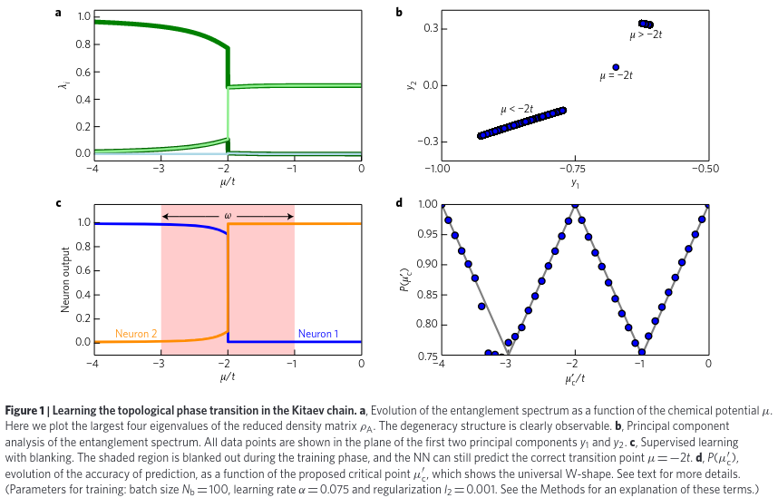
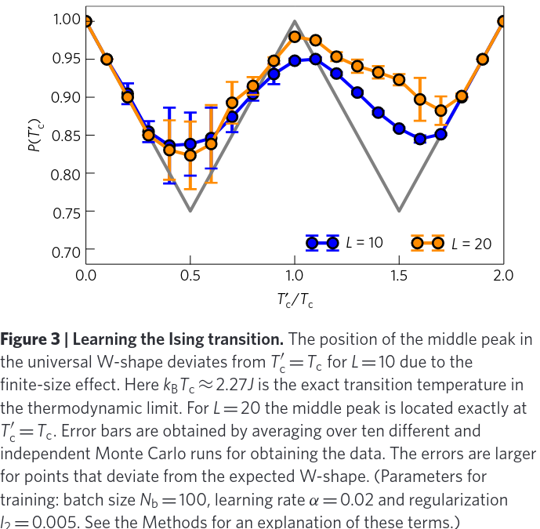
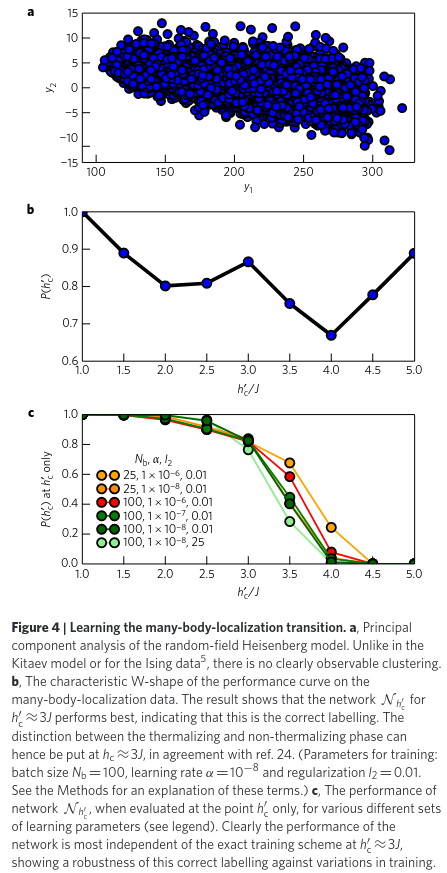
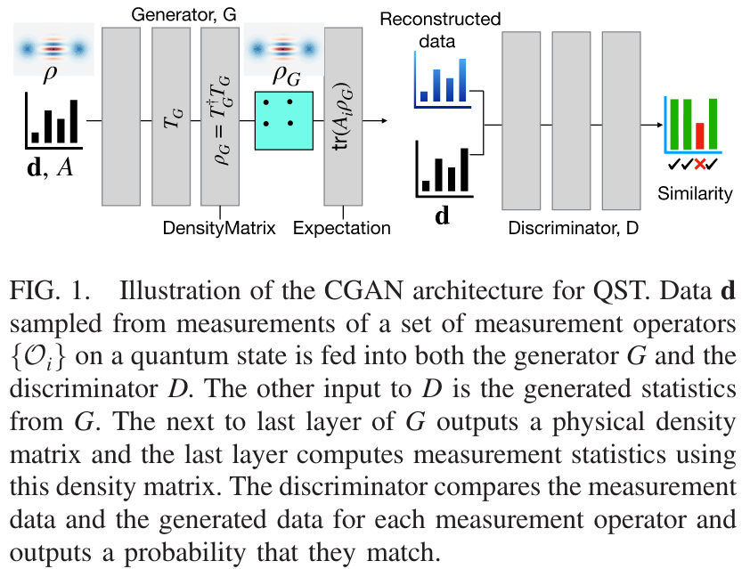
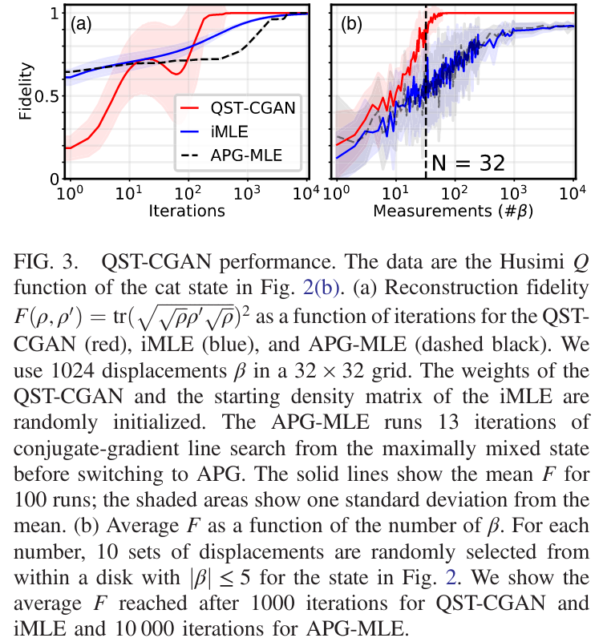
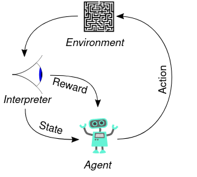
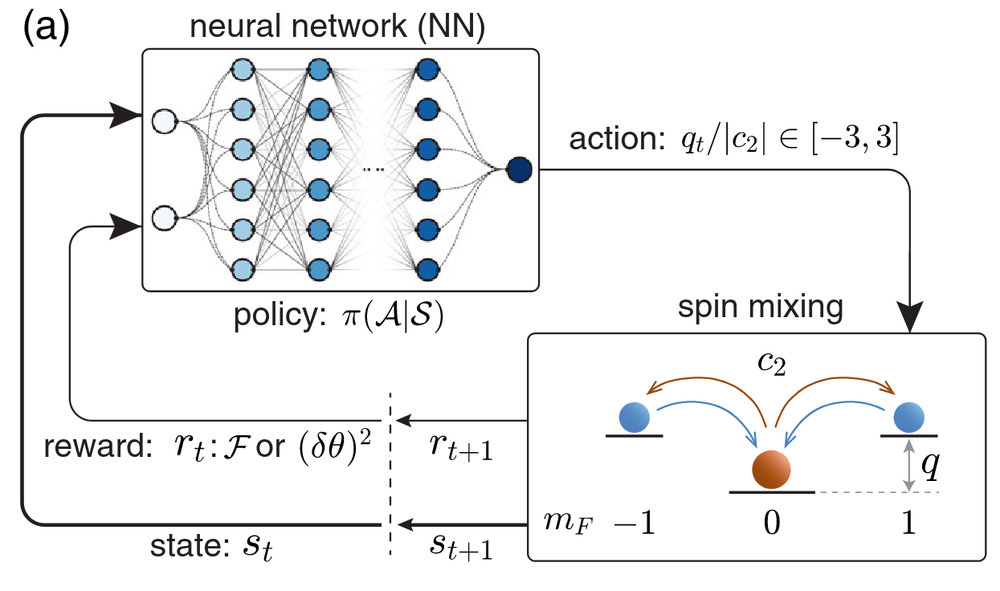
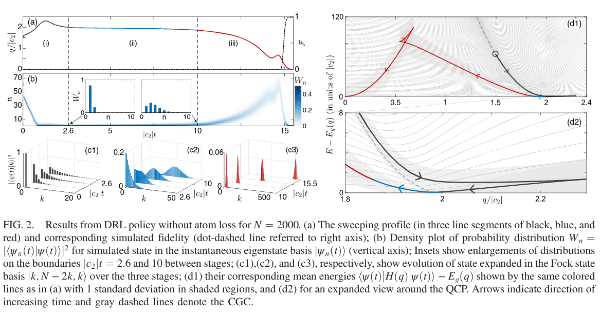
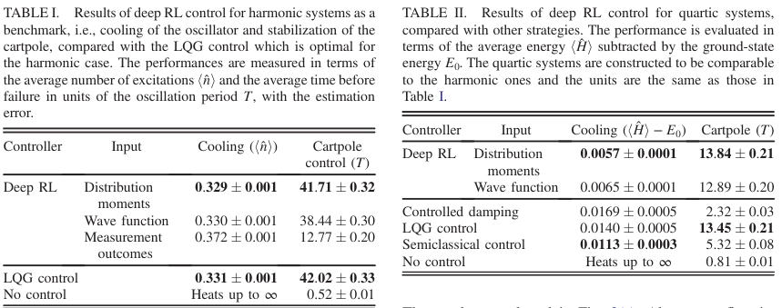

# Supervised Learning: Extend Our Knowledge

**Supervised Learning** has the task of learning a function mapping inputs to outputs while preserve the latent pattern of dataset. The main workflow of it is
1.  Select a proper model $f(x;\theta)$ by the requirement of task
2.  Optimize the loss function to fit the model on training set
3.  Check the trained model on test set

One of the most popular model is **Artificial Neural Network(ANN)** and its variants like **Convolution Neural Network(CNN)** for vision tasks and **Recurrent Neural Network(RNN)** for time series.

## Learning Phase Transition

### Main Results

In ([Evert. 2017][1]), the authors proposed a method to detect phase transition with the combination of supervised learning and unsupervised learning. Generally, the algorithm reads
1.  Given the physical model, extract the features with various method as the function of control parameter $x(\xi)$, where $\xi\in (0,\Xi)$.
2.  Training the classifier $F$ by labeling the dataset $\{([x(\xi)]_i, C_i)\}$ by $C_i = \Theta(\xi - \xi')$. The trial critical point $\xi'$ is assigned without any knowledge about critical point $\xi_c$.
3.  Testing the classifier (on entire dataset in this paper), obtain the performance as the function $P(\xi')$

The function $P(\xi')$ has a universal W-shape with the middle peak at the exact critical value $\xi_c$.

This W-shape is explained by the following arguments. 

-  Assumption
   1.  The features $x(\xi)$ have two different structures with different range of control parameter.
   2.  The NN (classifier) can find and distinguish these two structures.

-  Reasoning
   1.  At the boundary, i.e., $\xi' = 0 \textrm{ or } \Xi$, there are only one class in the training set. Thus the performance of NN could reach $100\%$ by predicting them as the same.
   2.  If $\xi'=\xi_c$, since NN can distinguish the hidden structure of dataset, the performance should be also perfect.
   3.  If $\xi'\in(0, \xi_c)$, the dataset has the confusion in those data in $(\xi',\xi_c)$ by incorrect labeling. The NN will choose to learn the label of the majority data.
       Assuming the size of dataset is only depend on the length of parameter range:
       -  If $|\xi_c-\xi'| \gt |\xi'-0|$, then the error labeling data dominant. This makes NN choose learn wrong classification, i.e., predict $|\xi'-0|$ as class $1$. The data in $(0, \xi')$ would be incorrectly classified.
       -  If $|\xi_c-\xi'| \lt |\xi'-0|$, then the correct labeling data dominant, and NN could learn the correct classification. Then the performance get loss by error labeling range $(\xi', \xi_c)$

       Thus, the performance has the behavior of

       $$
       \begin{aligned}
       P(\xi') &= 
       \begin{cases}
       1 - \frac {|\xi' - 0|} {\Xi} & |\xi_c-\xi'| \gt |\xi'-0| \\
       1 - \frac {|\xi_c - \xi'|} {\Xi} & |\xi_c-\xi'| \lt |\xi'-0|
       \end{cases}\\
       &= 1 - \frac {\min(\xi_c - \xi', \xi')} {\Xi}.
       \end{aligned}
       $$

       This function has the V-shape on $\xi' \in (0, \xi_c)$
   4.  Similar analysis applies to $\xi' \in (\xi_c, \Xi)$. Another V-shape will be on this interval. Then on the entire range, the performance function $P(\xi')$ has a W-shape.

### Details

There are three models and three different phase transition are studied in this paper.

1.  **The Kitaev Chain**
    There is a quantum phase transition in the ground state of
    
    $$
    \hat H = - \sum_{l=1}^L \Big(\hat c_{l+1}^\dagger\hat c_l + \textrm{h.c.}\Big) - \frac {\mu} t \sum_{l=1}^L \hat c_l^\dagger \hat c_l.
    $$

    With $t\gt 0$, the controlling parameter is $|\mu/t|$ and the critical point is: $|\mu/t| \gt 2$ as topological trivial state and $|\mu/t|\lt 2$ to topological non-trivial.

    The feature is the PCA componants of entanglement spectrum of $\{-\log \lambda: \lambda \in \textrm{eig} \textrm{ Tr}_{L/2}\ket{g.s.}\bra{g.s.}\}$. Authors just consider the range of $\mu/t \in (-4,0)$ such that there are only one critical point.

    The performance is

    
    
    

    Note that the dataset can be easily classified in the feature space. This problem is simple to NN.

2.  **Classical 2D Ising Model**
    The feature is the classical spin configuration by $L\times L$ matrix. The dataset is obtained by sampling from Monte-Carlo simulation.

    The performance is 

    
    
    

3.  **Manybody Localization**
    The XXX-model with disorder local field has the Hamiltonian of

    $$
    \hat H = J \sum_{i=1}^L \hat S_i\cdot \hat S_{i+1} + \sum_{\alpha=x,y,z} \sum_{i=1}^L h_i^\alpha \hat S_i^\alpha.
    $$

    $\hat S$ are spin-1/2 operators and $h_i^\alpha$ are stochastic field of uniform distribution with zero mean and width $h_{\textrm{max}}^x = h_{\textrm{max}}^z = h_{\textrm{max}}, h_{\textrm{max}}^y = 0$. In the supplementary of paper ([N. Regnault 2016][2]), the transition of spectrum shape from GOE to Poisson is clarified at $h_{\textrm{max}}/J \sim 3$.

    The feature is the full entanglement spectrum of the ground state. The performance is

    
    
    

### Comments

As a pioneering work in classification for many-body phases, this work gives us a basic view of how to apply machine learning technology on a fundamental and particularly popular physical problem. The scheme, though has been a little old fashion, can still teach us much on the issue in this field. 
1.  The capability is deeply dependent of the preengineering.
    -  The core feature of deep learning is to put feature extraction for data to the deep neural networks. Here to efficiently train a classifier one must feed it with the entanglement spectra, which is actually rely on out knowledge about the physics in the phase transition
    -  In the recent works about classifying many-body localization and topological phase transition, this preengineering is still necessary. ([G. Carleo 2019][3])
2.  The requirement of dataset.
    -  In practice, one may not find a balance dataset to use. The argument of how the algorithm works requires the training set is unbiased and covers only one critical point
    -  In practice, the sufficient size of dataset to train a classifier could be hard to obtain. The numerical simulation for synthetic data could be quite expensive, while the experiment data is limited by the platform.
3.  The interpretability of NN result.
    -  Deeper neural network could be hard to interpret and hard to refertilize our understanding about the many-body physics, while shallow one could lose the universality and performance.
    -  The classifier with SVM tech is proposed for spin model with MBL and thermal transition. However the issue 1. is still suffered ([W. Zhang 2018][4])

## Quantum Constraint for Ground State

In ([P. Zheng][13]), a novel method to estimate the energy and other expectation values on the ground state of many body system was proposed. 

The algorithm reads
1.  Start with a large ensemble of quantum many-body ground states $\mathcal{E}=\{\ket{\Psi}\}$
2.  Select a set of operators $\{\hat O_j\}$ or as a vector $\hat{\bm{O}}$. Then build the dataset as its expectation value among all states in the ensemble: $\mathcal{S}=\{\braket{\Psi|\hat{\bm{O}}|\Psi}: \ket{\Psi} \in \mathcal{E}\}$.
3.  Via supervised learning on the training set to fit the indicator function
    $$
    F(\braket{\Psi|\hat{\bm{O}}|\Psi};\theta) \rightarrow \textrm{Phys}(\braket{\Psi|\hat{\bm{O}}|\Psi}) = \begin{cases}
    1 & \ket{\Psi} \textrm{ is a physical many-body ground state} \\
    0 & \textrm{otherwise}
    \end{cases}.
    $$
4.  For the Hamiltonian $\hat H = \sum_j a_j \hat O_j$, the ground state energy can be obtained by the following constrained optimization problem:
    $$
    \begin{aligned}
    E_{g.s.} &= \arg \min_{O_j} \sum_j a_j O_j \\
    \textrm{s.t. } & F(\bm{O};\theta) = 1.
    \end{aligned}
    $$

This approach based on the following assumption

1.  The ground state of many-body systems has some properties in common. Thus function $\textrm{Phys}$ could be fitted by ANN and generalized to systems not appearing in dataset.
2.  The database, no matter get $\mathcal{E}$ numerically or $\mathcal{S}$ by experiment, should be accessible. The dataset of non-physical states should be balanced to the physical states.
3.  The supervised learning is reliable such that the constrained optimization does be equivalent to the ground state seeking.

Though this approach has many unique advantages comparing to various modern methods for the same problem, like
1.  The space of operators are not too much as the Hilbert space for quantum states. (One needs only consider those operators involved in Hamiltonian, which usually be polynomial even independent to the system size.)
2.  The approach is only depend on the structure of Hamiltonian instead of the parameters like system size and interaction strength. Thus the case of statistical limit can also be reached, and the trained constraint is efficiently reusable for other systems.

There are still many problems in this method:
1.  To train an ANN fitting the indicator well, one needs a balanced ensemble of physical states and the non-physical states. The former would be easy by experiment and many numerical method for physical systems. The latter is quite hard to obtain. What's worse is the physical states probably is a small subset of the whole Hilbert space. To make the approximated indicator function efficient, we need deep understanding about the problems itself. This is violate the spirit of deep learning: make AI discover the unknown knowledge instead of being taught by us.
2.  Whether the output is correct is based on the performance of ANN. If ANN cannot encode the ground state property well, the optimization would be not equivalent to the ground state problem. This would leads to some better energy estimation(even lower than the state-of-the-art result), but no one can confirm it is correct since the ground state wavefunction is not provided. 

# Unsupervised Learning: Encoding and Defeat Ignorance

Different from the supervised learning, **Unsupervised Learning** handles the task within which the data are not labeled. The learner needs to understand the hidden structure of the dataset and give us the distribution information of it. 

In statistical learning, unsupervised task includes clustering and dimensionality reduction for data. In recent years the generative adversarial network(GAN) and autoencoder are successful application of ANN in this field. 

For quantum mechanics, one of the must impressive applications of unsupervised learning is to discover the phase transition ([Lei Wang 2016][15], [Li-Wei Yu 2021][14]). Here, instead of digging deeper in this topic, we focus on the application of GAN in state tomography and the quantum autoencoder in quantum machine learning. Apart from these, we also discuss the Quantum Neural Network state. Mathematically, it is an ansartz for various tasks in quantum physics with the understanding of machine learning.

## Generative Adversarial Network for Quantum State Tomography

### Introduction to GAN

As a recent development in machine learning, we make a simple introduction to **Generative Adversarial Network(GAN)** here. This will only cover the main idea and implementation of GAN without further discussion like convergence and fancy applications. We focus on the application of GAN on **quantum state tomography(QST)** in paper ([Shahnawaz Ahmed 2021][16]) in this section.

A GAN system has two parts (usually nonlinear functions by neural networks) called **generator** $G(\cdot, \theta_G)$ and a discriminator $D(\cdot, \theta_D)$. The generator takes an input $\bm{z}$ from some noise distribution $p_{rnd}$ and generates an output $G(\bm{z},\theta_G)$. The discriminator tries to predict whether an input $\bm{y}$ comes from the dataset or is generated by $G$ (this means $G(\bm{z},\theta_G)$ has the same shape as $\bm{y}$). Formally:

$$
\begin{cases}
G(\cdot, \theta_G)&: \mathbb{R}^l \ni \bm{z}\mapsto G(\bm{z},\theta_G) \in \mathbb{R}^d \\
D(\cdot, \theta_D)&: \mathbb{R}^d \ni \bm{y} \mapsto D(\bm{y},\theta_D) \in (0, 1)
\end{cases}.
$$

The training process is to optimize the performance of discriminator to detecting the fake instances (generated by $G$), while the generator is trained to be fool $D$ better. Thus the training for $D$ is to minimize the cross entropy risk:

$$
\mathcal{R}_D = -\mathbb{E}_{y\sim p_{data}} \log D(y,\theta_D) - \mathbb{E}_{z\sim p_{rnd}} \log\Big(1 - D(G(z,\theta_G), \theta_D)\Big).
$$

The training for $G$ is to minimize the value of

$$
\mathcal{R}_G = - \mathbb{E}_{z\sim p_{rnd}} \log\Big(1 - D(G(z,\theta_G), \theta_D)\Big),
$$

such that the discriminator is successfully fooled. Note that in practice, $G$ and $D$ are optimized alternatively. When the training is complete, we will obtain a generator to mimic real data as a by-product apart from a classifier.

An important extension for GAN is the **conditional generative adversarial network(cGAN)**. cGAN introduces some extra information to both the generator and the discriminator. Formally, the generator $G$ now maps the random vector $\bm{z}$ together with some observed vector (condition) to the fake instance $G(\bm{z}, \bm{x}, \theta_G)$, while $\bm{x}$ is also visible to the discriminator by $D(\bm{x}, \bm{y}, \theta_D)$. See ([Phillip Isola, 2017][17]) for the importance of conditioning the discriminator and the detailed architecture of cGAN.

### Main Problem

The main task of QST is to estimate the quantum state (as a state vector or a density matrix) from the measurements of a set of Hermitian operators(usually by [positive-operator-valued measures(POVMs)][18]). Formally, given a sample of output by measurement $\mathcal{M} = \{x_n: n=1,\cdots,N\}$, find the estimator $\hat \rho$ for exact state $\rho$ such that the sample can be generated by the quantum theory:

$$
\hat \rho \sim \rho \Leftrightarrow \mathcal{M} \sim \mathbb{P}(x) = \textrm{Tr} \hat \rho \ket{x}\bra{x}.
$$

Obviously for finite $\mathcal{M}$, the answer of $\hat \rho$ does not be unique. If we describe the output $\mathcal{M}$ as the value-frequency pair by $\{(x_\alpha, d_\alpha):\sum_\alpha d_\alpha = |\mathcal{M}|\}$, the solution to directly solve the linear system of $\bm{d} \approx \mathbb{P}(\bm{x}; \hat \rho)$ will usually fail. An alternative way is to obtain the maximum likelihood estimator by 

$$
\hat \rho = \argmax_{\rho} \prod_\alpha \Big(\textrm{Tr}\rho \ket{x_\alpha}\bra{x_\alpha}\Big)^{d_\alpha}.
$$

In this paper, the authors show their practice on reconstructing the state of "cat-state" in quantum optics. Formally, it is

$$
\ket{\psi} = \frac 1 {\mathcal{A}}(\ket{\alpha} + \ket{-\alpha}),
$$

in which $\mathcal{A}$ is the normalization factor. The coherent state is truncated by the given size of Hilbert space $N$. The definition they exactly used is (see [qutip.coherent(N, alpha, method="operator")][19]):

$$
\ket{\alpha}_N = \exp(\alpha \hat a^\dagger_N - \alpha^* \hat a_N) \ket{0}_N,
$$

where the Hilbert space is spanned by $\{\ket{i}_N\}_{i=0}^{N-1}$, and the truncated destroyer $\hat a =\sum_{n=1}^{N-1} \sqrt{n} \ket{n-1}_N \bra{n}_N$. In the main text, the setup is $\alpha = 2, N=32$

The simulated data for measurement are obtained by the $Q$-distribution, formally, they are

$$
Q(\beta) = \frac 1 \pi \textrm{Tr} \rho(\alpha) \ket{\beta}\bra{\beta},
$$

where $\beta$ is sampled within a finite region in $\mathbb{C}^2$. For experiment data, they also tested cGAN on the state with negative Wigner function with the measurement is the sample of Wigner function like an image.

### Learning Task Setup

The learning task of cGAN is shown in the Fig. 1 of the paper:




    
1.  **Generator**:
    -  The generator input:
       1.  The measurement operators $\{O_i\}$ by POVM.
       1.  The frequency data measured from exact state $\bm{d}$ as condition.
    -  The generator outputs the density matrix $\rho_G$
    -  According to the authors, there is no need of the input noise.

2.  **Discriminator**
    -  The discriminator input:
       1.  The statistics of states by $\textrm{Tr}(O_i \rho_G)$ (see POVM) from generated states.
       2.  The frequency data measured from exact state $\bm{d}$ as condition.
    -  The discriminator outputs how well the generated measurement match the data.

There are some additional physical tricks in the learning task:

1.  The density matrix is generated by the following algorithm: (their DensityMatrix layer):
    1.  Generate a proper shape matrix $T_G$
    2.  The density matrix reads $\rho_G = T_G^\dagger T_G / \textrm{Tr}(T_G^\dagger T_G)$. 
2.  The input fed in the discriminator is exactly the value of $\textrm{Tr}(O_i \rho_G)$, i.e., there is no need of re-sampling for $\rho_G$. (their Expectation layer)

If the generator has managed to learn the correct matrix, the discriminator will not be able to distinguish the generated statistics from the true data.

### Result

The main result of the paper is summarized in Fig. 3 of the main text:





The cGAN on simulated situation (no noise) shows a better performance than the state-of-the-art maximally likelihood estimation methods, which means cGAN could be either faster than them or requiring fewer measurements than them to reach the same fidelity. On experiment situation they showed cGAN is capable but no comparison between other methods.

### Comment

The story of the work is direct and interesting. Using the frontier AI technology to reconstruct the quantum state is actually a well-defined data-driven task. The authors also chose a proper situation to study: the image-like measurement and the GAN which is popular in image processing/generating in recent years.

There are still some issues in this work. 

1.  The current framework is hard to scale up.
    Their QST-cGAN requires the measurement operators as the input and output the density matrix itself. This works for their small system (actually it is a single body state) within size $32$. This is far smaller than the practice and the demand of experiments and industries, since the dimension of Hilbert space exponentially grows with the system size. The large size could be harmful to the optimization, even make the GAN hard to converge.

2.  The current numerical support is still weak.
    The authors only argued that their framework is universal but the numerical evidence is lack. By their code, QST-cGAN is quite relevant to the image-like data by measurement (like $Q$ distribution and Wigner function). For the actual Fermion system and spin system these measurement could be hard to implement and even no experience can be referred like computer vision.

## Quantum Neural Network State

# Reinforcement Learning: Can AI Understand the Nature?

**Reinforcement Learning(RL)** handles a large class of tasks in which one needs to collect data via interaction to the environment and build a optimal strategy. Different from other branches in machine learning, RL is not fed with structured data but use an intelligent agents to collect data. This property makes it popular in solving some real-world tasks with the information lacking.

A typical framework of Reinforcement learning:





The agent would be trained to obtain as much reward as possible during the exploring of environment.

## Quantum State Preparation

### Main Problem

In ([Shuai-Feng Guo 2021][6]), the authors proposed a faster ground state preparation for a quantum many-body system by reinforcement learning.

The system they studied is a spinor BEC in the $^{87}\textrm{Rb}$ system. The effective Hamiltonian reads

$$
\hat H(q) = \frac {\lambda} {2N} (\hat {\bm{S}})^2 - q \hat a_0^\dagger \hat a_0,
$$

where $\hat{\bm{S}}_\alpha = \sum_{\mu,\nu\in\{-1,0,1\}}\hat a_\mu^\dagger (\bm{S}_\alpha)_{\mu\nu} \hat a_\nu \ , \alpha=x,y,z$ is the pseudo spin-1 operator. The matrix $\bm{S}$ are matrix form of components of spin-1 in $\hat S_z$ eigenbasis (See ([Z. Zhang 2013][7]) and its supplementary information). For $^{87}\textrm{Rb}$, the interaction term is ferromagnetic with $\lambda \lt 0$ ($c_2$ in the paper). 

There is a quantum phase transition in this system by the competition of Zeeman term and spin interaction. When $q\gg |\lambda|$, the ground state is the configuration of all atoms at $0$-mode. For $q = 0$, the ground states spans a $(2N+1)$-dimensional subspace for $(\hat{\bm{S}})^2 = N(N+1)$, i.e., $\{\ket{S, S_z}: S_z = -N,\cdots,N\}$. The massive entangled state (Dicke state) is $\ket{\psi_{\textrm{Dicke}}} = \ket{S, S_z=0}$. One approach to prepare it is by the adiabatic sweeping from large $q$ to $q=0$. The level spacing near the critical point scales as $N^{-1/3}$. 

To prepare the Dicke state, one can start from the ground state of large q and adiabatically sweep down $q$ to $q=0$. By the protection of symmetry: $[\hat S_z, \hat H(q)] = 0$ for any $q$, the state could reach the Dicke state.

### Learning Task Setup

The (deep) reinforcement learning protocol has two components. 
1.  The **environment** offers the state transition from action and readable state data. 
    -  In this problem, the environment is a quantum simulator to implement the time-dependent Schrodinger equation by $\hat H$. This simulator is implement by numerical tech and experiment.
    -  Given the max evolution time $T$ and the uniform discretization, the quantum evolution process is separated into multiple stages denoting by time $t$.
    -  From time $t$ to $t+1$, the environment implement the quantum time evolution by Schrodinger equation driven by fixed $q$ value
    -  The readable state data are some expectation value on $\ket{\psi(t)}$: 
    $$
    s_t = \Big\{\rho_0=\frac {\braket{N_0}} N, \delta\rho_0=\frac {\braket{\delta N_0^2}} {N^2}, \frac {|\braket{\hat a_{+1}^\dagger \hat a_{-1}^\dagger \hat a_0^2}|} {N^2}, \theta=\arg \braket{\hat a_{+1}^\dagger \hat a_{-1}^\dagger \hat a_0^2}\Big\}.
    $$

2.  The **agent** computing the action by the given state. 
    -  In this problem, the action is tunable parameter $q_t$
    -  The initial state is the ground state of $q\gg |\lambda|$
    -  The state transition under action reads
       $$
       \ket{\psi_{t+1}} = \exp{(-\ti \hat H(q=q_t) \delta)} \ket{\psi_t} \ ; \ \ket{\psi_0} \propto \hat a_0^{\dagger, N}\ket{0}.
       $$

The training loop is





Authors choose two type of reward as fidelity to target state $\mathcal{F} = |\braket{\psi(t)|\psi_{\textrm{Dicke}}}|^2$ and (entanglement enhanced three-mode $SU(2)$) interferometric sensitivity. The training has a multistep scheme. The agent is trained on $N=10$ instance and increase $N$ gradually to get the ceiling of computational power at $N=2000$.

### Result

The optimal policy achieves with $\mathcal{F} \sim 0.99$ at $|\lambda|\tau = 15.5$ on numerical simulator, while the linear (nonlinear) adiabatic routine requires $|\lambda|\tau\gt 600(350)$ at the same fidelity level. On experiment platform, the time cost is half of the previously reported time.

The path learned by agent is discussed in the paper. 





The path is partitioned into three stages.

1.  $|\lambda|t \in[0, 2.6]$. This stage drives the state to mix the ground state and the low lying excited states. The initial point $q_{t=0}$ is chosen to be lower than the critical point such that spin-interaction starts early.
2.  $|\lambda| t \in [2.6,10]$. This stage cross the critical point. At the end of this stage, the state becomes a Gaussian-like wave packet (inset in Fig.2(b)) wrt Fock state basis. It is also the instance ground state at near $q$ case. The speed in this stage is limited by adiabatic energy gap.
3.  $|\lambda|t \in [10, 15.5]$. This stage provides the acceleration of RL protocol. The agent find a shortcut to adiabatic and performs the ``rise and fall'' shape of the average energy (Fig.2(d1))

### Comments

Use reinforcement learning to accelerate the state preparation suffers vary issues.

1.  **The cost of quantum simulation**
    Without the efficient quantum simulator platform, the interaction between environment and agent has to be numerically simulated by classical computer, which suffers the curse of dimensionality of quantum mechanics. In Reinforcement Learning, to converge the agent, one needs a large number of game loops to get in touch with the low-level mechanism of environment, which leads to a heavy cost for the protocol.

    In this work, the dimension of Hilbert space is proportional to particle number and the numerical simulation is easy. For those generic many-body quantum system, the exponential growing dimensional would greatly harm the protocol. 

    In another recent work ([J. Yao 2021][8]), the authors studied the ground-state preparation of a non-integrable spin system. But their model is a generalization of QAOA, which also reduces the complexity to simulate quantum evolution. However, the price is the limitation of model.

2.  **Universality of agent**
    It is hard to prove that universality of agent trained in one quantum system to others. In this work, authors escape from this problem by study a system possessing self-similarity in the model: by different particle number $N$. Such generality of learning algorithm is questionable. 

## Quantum CartPole

### Main Problem

In ([Z. T. Wang 2020][9]), the authors consider the ability of classical Reinforcement learning agent on a ``quantum game'', the cartpole stabilization. Formally, they study the following system

$$
\hat H(F) = \frac {\hat p^2} {2m} + V(\hat x) -F \hat x.
$$

The potential $V$ is symmetry about $x=0$. In this work, authors consider cartpole stabilization task with $V(x) \propto - x^2, -x^4$ and the cooling task $V(x) \propto x^2, x^4$. The former requires the agent adjust $F$ such that the wavefunction is localized near its center, while the latter does the same but has a physical interpretation that hold the system with low energy. To simulate the influence of extracting information from the quantum system, the authors apply the continuous position measurement on the system and use the stochastic equation of motion formalism

$$
\td \hat \rho = -\frac {\ti} {\hbar} [\hat H ,\hat \rho] \td t - \frac {\gamma} 4 [\hat x, [\hat x,\hat \rho]]\td t + Z \{\hat x - \braket{\hat x}, \hat \rho\} \td W,
$$

where $\gamma, Z$ are constants related to measurement and $\td W$ is the Wiener increment (see ([L. Diosi 1988][10]) for detail. This formalism is not violate the quantum Zeno effect since the precision of measurement and period are gets to zero with finite ratio, as the function of $Z$ and $\gamma$). 

### Learning Task Setup

1.  **environment**
    -  The environment is a classical computer to simulate the stochastic differential equation
    -  The state transition is
       $$
       \ket{\psi_t} \rightarrow \hat \rho_{t+1} \xrightarrow{\textrm{measurment and project to pure state}} \ket{\psi_{t+1}}
       $$
    -  There are three choices to encoding the state:
       1.  _Distribution moments_: various order moments of position, i.e., $\braket{\psi_t|\hat x^n|\psi_t}$, $\braket{\psi_t|\hat p^n|\psi_t}$. For harmonic $n\leq 2$ and quartic $n\leq 5$
       2.  _wavefunction_: the wavefunction itself of $\braket{x|\psi}$
       3.  _measurement outcomes_: is the sequence of measurements on position, i.e., a slice of $[\textrm{Tr}\hat \rho_t \hat x]_{t=...}$
2.  **agent**
    -  The agent has the action of $F$, by bounded with $[-F_{\textrm{max}}, F_{\textrm{max}}]$ and discretization.

The reward for cooling is the minus system energy, while for cartpole is the time of agent holding the wavepacket.

### Result

The performance of RL on these problems are





Its performance is (slightly) greater than classical control theory (LQG). The videos of the AI on these problems are shown in their [supplemental materials](https://journals.aps.org/prl/supplemental/10.1103/PhysRevLett.125.100401).

### Comment

Using RL to play ``quantum games'' has the following problems

1.  The capability is not clear yet.
    In this work, the authors actually simulated a stochastic quantum process for a single body system. The dynamics is quite similar to some classical PDE and lose a lot of quantum properties. The capability of classical RL on quantum problem is still questionable.

2.  Is it worthy?
    To teach AI play quantum games requires us simulating quantum dynamics a lot times. This could be even harder than training the AI itself. When the quantum computer got built, the quantum AI would also enter our sight. Actually, in some recent works, people have been studied some quantum enhanced reinforcement learning protocols and their application on classical games. (([Neukart Florian 2018][12], use quantum algorithm enhance the optimization sub-problem in training), ([Sofiene Jerbi 2021][11], use a deep energy-based RL which could get speed-up with quantum computer))

# References

[1]: https://www.nature.com/articles/nphys4037
[2]: https://journals.aps.org/prb/supplemental/10.1103/PhysRevB.93.104203/supplmat.pdf
[3]: https://journals.aps.org/rmp/pdf/10.1103/RevModPhys.91.045002
[4]: https://journals.aps.org/prb/abstract/10.1103/PhysRevB.99.054208
[5]: https://www.nature.com/articles/s41534-018-0077-z
[6]: https://journals.aps.org/prl/abstract/10.1103/PhysRevLett.126.060401
[7]: https://journals.aps.org/prl/abstract/10.1103/PhysRevLett.111.180401
[8]: https://journals.aps.org/prx/abstract/10.1103/PhysRevX.11.031070
[9]: https://journals.aps.org/prl/abstract/10.1103/PhysRevLett.125.100401
[10]: https://www.sciencedirect.com/science/article/abs/pii/037596018890309X?via%3Dihub
[11]: https://www.frontiersin.org/articles/10.3389/fphy.2017.00071/full
[12]: https://journals.aps.org/prxquantum/abstract/10.1103/PRXQuantum.2.010328
[13]: https://arxiv.org/pdf/2105.09947.pdf
[14]: https://journals.aps.org/prl/abstract/10.1103/PhysRevLett.126.240402
[15]: https://journals.aps.org/prb/abstract/10.1103/PhysRevB.94.195105

[16]: https://journals.aps.org/prl/pdf/10.1103/PhysRevLett.127.140502
[17]: https://arxiv.org/abs/1611.07004
[18]: https://en.wikipedia.org/wiki/POVM
[19]: https://qutip.org/docs/latest/modules/qutip/states.html#coherent

1.  van Nieuwenburg, E., Liu, YH. & Huber, S. Learning phase transitions by confusion. Nature Phys 13, 435–439 (2017)
2.  Nicolas Regnault and Rahul Nandkishore Floquet thermalization: Symmetries and random matrix ensembles. Phys. Rev. B 93, 104203
3.  Giuseppe Carleo, Ignacio Cirac, Kyle Cranmer, Laurent Daudet, Maria Schuld, Naftali Tishby, Leslie Vogt-Maranto, and Lenka Zdeborová. Machine learning and the physical sciences. Rev. Mod. Phys. 91, 045002
4.  Wei Zhang, Lei Wang, and Ziqiang Wang. Interpretable machine learning study of the many-body localization transition in disordered quantum Ising spin chains. Phys. Rev. B 99, 054208
5.  Rocchetto, A., Grant, E., Strelchuk, S. et al. Learning hard quantum distributions with variational autoencoders. npj Quantum Inf 4, 28 (2018). https://doi.org/10.1038/s41534-018-0077-z
6.  Shuai-Feng Guo, Feng Chen, Qi Liu, Ming Xue, Jun-Jie Chen, Jia-Hao Cao, Tian-Wei Mao, Meng Khoon Tey, and Li You, Faster State Preparation across Quantum Phase Transition Assisted by Reinforcement Learning, Phys. Rev. Lett. 126, 060401
7.  Z. Zhang and L.-M. Duan, Generation of Massive Entanglement through an Adiabatic Quantum Phase Transition in a Spinor Condensate, Phys. Rev. Lett. 111, 180401
8.  Jiahao Yao, Lin Lin, and Marin Bukov, Reinforcement Learning for Many-Body Ground-State Preparation Inspired by Counterdiabatic Driving, Phys. Rev. X 11, 031070.
9.  Zhikang T. Wang, Yuto Ashida, and Masahito Ueda. Deep Reinforcement Learning Control of Quantum Cartpoles. Phys. Rev. Lett. 125, 100401
10.  Sofiene Jerbi, Lea M. Trenkwalder, Hendrik Poulsen Nautrup, Hans J. Briegel, and Vedran Dunjko. Quantum Enhancements for Deep Reinforcement Learning in Large Spaces. PRX Quantum 2, 010328
11.  Neukart Florian, Von Dollen David, Seidel Christian, Compostella Gabriele. Quantum-Enhanced Reinforcement Learning for Finite-Episode Games with Discrete State Spaces. Frontiers in Physics. 5.71.2018
12.  Pei-Lin Zheng, Si-Jing Du, Yi Zhang, Ground-state properties via machine learning quantum constraints. arXiv:2105.09947