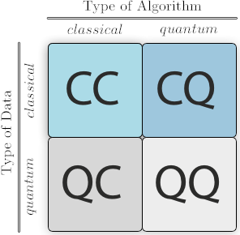
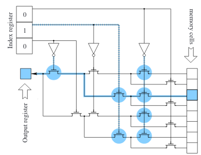
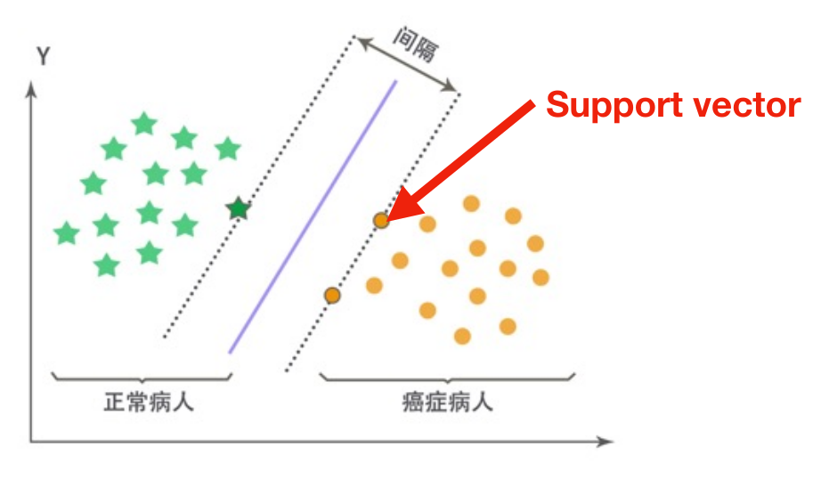

# Data Science and Machine Learning

Formally, **Data science** is an **inter-disciplinary** field that uses scientific methods, processes, algorithms and systems to extract **knowledge** and insights from many structural and unstructured data[Wikipedia/Data_science][1]. The core object of research in this field is data for the goal of knowledge. This approach is different from research of theoretical study like geometry by deductive reasoning. A nice example is [Kepler's Law][2], here we list two approaches to it in the following to show the difference between two paradigm.

1.  **Kepler type**
    -  Analyze the data from Tycho
    -  Summarize the pattern of data in simple way(the first and second law, Occam's razor)
    -  Fit the data and generalize the quantitative rule(the third law)
2.  **Newton type**(also used in the modern textbook)
    -  Admit some axioms of the system(Newton's law)
    -  With mathematical approach write the equation and solve it
    -  Discuss the properties of the solution

We call the Kepler type **data-driven**, and this paradigm is the core of data science.

Roughly speaking, there are three parts for data science: data collection, data storage, and learn from data. Though the other two are also important, our main goal here is the last one. The algorithm for this purpose is **Machine Learning**. Most machine learning tasks can be classified into the following three frameworks.

1.  **Supervised learning**
    
    -  Data: a set of input $x$ and its label $y$ $\{x_i, y_i\}_{i=1}^N$
    -  Goal: find a model for the map from $x$ to $y$ of $y = f(x;\theta)$

    There are two main applications to supervised learning: regression (continuous $y$) and classification (discretized $y$)

2.  **Unsupervised learning**

    -  Data: a set of input $x$, without labels. $\{x_i\}_{i=1}^N$
    -  Goal: find the hidden patterns or grouping data.

    Dimensionality reduction, clustering, generative modeling. 

3.  **Reinforcement learning**

    -  Data: delayed feedback signal(reward) after action. Like the win/lose in a chess game
    -  Goal: learning an optimal policy(i.e. how to act). Like learn how to play a chess game

Though we list these classes of machine learning, the modern development are not distinct in this level. To solve the complex problems in the real-world we need the cooperation of different technologies for their own parts. To classify such the mixed projects are difficult and meaningless. As a popular and growing technology, there will be many new contents enter the field of machine learning. Just open your mind and be prepared.

# Quantum Tech to Data Science

Quantum technology has been one of the most important concepts in the world now. Some people call the control and application of the quantum systems [the Second Quantum Revolution][3], to distinguish against the establishment of quantum mechanics in the early 20th century. To data science, the impact of quantum tech is well described by the following figure from [wiki/Quantum-machine-learning][4].



As quantum tech comes into our sight, a new type of data now is needed to be considering. Classical data is encoded by classical physical systems and its values are deterministic at each stage of processing. The information we touch in the daily life are all classical data, like this report, logical variables by whether voltage in the wire of computer is greater than a threshold or not, and much other analog data. Quantum data is encoded by quantum systems. Like the entities in the Hilbert space(the state of qubit), such data is quiet different from the classical one especially in the read/write rule. By the high representability of digits, we can still simulate the quantum data on classical computer. But since the dimension of Hilbert space (amounts of quantum variables) are exponential to the number of classical variables, this approach is incapably expensive. 

Another aspect of the figure above is the type of algorithm. It is not only means the software we handle the data, but also the hardware we used to implement the program. This part contains the storage and processing. The former is qubits and quantum gates, which has been proved to be universal to simulate any quantum system and their evolution, just like the classical bits and classical gates. However, the quantum nature of qubits makes it possible to handle quantum data with polynomial scaling cost(if we can prepare and hold the qubits as easy as we do for classical bits in the sense of scaling). The latter concept (processing), i.e. algorithm or software, is the analog of the classical algorithm and programs running on the classical computer. There are two paradigms for quantum algorithm, one can be represented as the combination of a set of quantum gates,  while the other way is based on the adiabatic theorem ([wiki/Adiabatic-quantum-computation][5]). These two approaches has been proved to be equivalent ([D.Aharonov 2005][6], [H.Yu 2018][7]). 

# Quantum Speedup for Classical Machine Learning

Quantum computing has been proven significantly more powerful than classical machine on certain problems. In the past decades, the theory about hardware (architecture) of quantum processor and software (algorithm) on quantum computer have been rapidly developed. Though currently, there are still experimental issues as barriers between us and large scale quantum computer, the theoretical preparation for applying quantum technology on machine learning has been sort of made. In this section, we focus on the quantum speedup for classical machine learning, i.e., the outperformance of quantum algorithm in the field of classical machine learning.

## Essential Techs for Applied Quantum Computing

There are two essential technologies required in quantum machine learning. One is the **quantum Random Accessible Memory**, which is usually mentioned as the hardware, and the other is the **quantum linear algebra algorithms** in software level. The former might be suspected to be essential, since there are actually many quantum machine learning algorithms being free from qRAM. Recently, some new approaches have been studied for handling classical data in a quantum machine like quantum embedding ([S. Lloyd 2020][8]) and quantum feature map ([V. Havlicek 2018][9]). However, as a generic data loader for quantum machine learning on classical data, it is still valuable to discuss it mathematically here.

### Data Loader: qRAM

The **Random-Access Memory(RAM)** on classical computers provides essentially a tree structure for addressing. Such addressing with conventionally implementation would cost exponentially large energy. 

{}

Basically, a classical RAM is composed of a memory array of size $N$  serving $N$ bits to read and write, an input register(addressing register) and an output register. A normal memory call can be described as ([R. C. Jaeger, "Microelectronic Circuit Design"][17])

1.  An $n$-bit string is read into input register. These $n\sim\log N$ bits store the address of the memory cell to be called, as the path along the tree. For bifurcation case, it is a series of $\{0,1\}$ with $n=\log_2 N$, and at $k$-th level of the tree, the $0, 1$ value at $k$-th bit denotes the left and right edge.
2.  Along the addressing path, the output register stores the content of memory cell, or a write circuit would modify its value for the write operation.

Within this procedure, the first addressing bit should control one gate at that node. However, the $k$-th bit must control all $2^{k-1}$ gates at the $k$-th level of the tree for all possible paths. Like: 





from the paper ([V. Giovannetti 2008][18]). 

Thus, though classical RAM serves the $\mathcal{O}(1)$ time complexity (or $\mathcal{O}(\log N)$ for generic random addressing) for a memory call, it actually **activates** $\mathcal{O}(2^n)$ gates to implement it. 

However, as they said in the introduction of the paper ([V. Giovannetti 2008][18]):

> A classical RAM that uses the bucket-brigade (ps. introduced in this paper.) addressing schemes need only activate $\mathcal{O}(n= \log N)$ transistors in the course of a memory call, in contrast with a conventional RAM that activates $\mathcal{O}(2^n = N)$ transistors. As a result, a RAM that uses our design might operate with less dissipation and power consumption than a conventional RAM. **Note, however, that energy costs in the memory addressing are not sufficiently high in current RAM chips to justify an immediate adoption of the bucket brigade. Other source of inefficiencies and dissipations are currently predominant (mostly in the memory cells themselves).** However, new promising memory cell technologies are being developed (e.g., the "memristor" cells), which would drastically cut back cell dissipation, so that cutting back dissipation in the addressing may become important in the future.

Their architecture can also offer advantages for classical RAM, but it cannot resolve the dominant problem of classical RAM. According to this ([stackexchange answer][19]):

>I think that it would indeed work in classical RAM, but the hardware constraints didn't supply the 'evolutionary pressure' required for it to be develiped and implemented.

currently bucket-brigade architecture is still focused on resolving the quantum issue, like resource efficiency and fault tolerance. ([A. Paler 2020][20])

{}

The **bucket-brigade** architecture is proposed to resolve the issue that in conventional one, there are always few addressing bits related to exponentially many transistors to control the path. Like the bits controlling the last level of the tree, which needs to control $2^{n-1}$ transistors. This property makes it hard to work in a quantal way, in which decoherence led by many body interaction should be forbidden. 

**Bucket-Brigade** architecture modifies every nodes in the bifurcation tree into a (qu)trit, which could have three possible states. 





(The figure is cited from [github.com/qsharp-community/qram](https://github.com/qsharp-community/qram))The $\ket{0},\ket{1}$ state of qutrits shares the same operation of original switches: they indicate which next step to choose at this node (referred as $\ket{\textrm{left}}, \ket{\textrm{right}}$). While the other state, denoting as $\ket{\textrm{wait}}$, means a waiting node. When a $0,1$-valued bit encounters it, it "absorb" the information and switch itself into the same value, including the case that incoming bit is at a superposition state. In a memory call, the bits in input register is popped sequentially into a initialized tree (with all nodes at $\ket{\textrm{wait}}$ state). When the bit encounters a $\ket{0}, \ket{1}$ node it propagates into the next level. Thus, when the input register becomes empty, a path towards memory cells is constructed. When input register is in a superposition state, it is further a superposition state among many paths with the same amplitude. After the bus qubit has loaded the data, the nodes along addressing path would be recovered to $\ket{\textrm{wait}}$ for further usage.

This architecture allows a memory call with $\mathcal{O}(n)$ gates activated, and **the superposition addressing is potentially supported.** Now we show how to use qRAM implement the state-preparation, or classical data loader for quantum computing. Mathematically, we want to achieve the map ([C. Ciliberto 2017][10], [A. Prakash 2014][21])

$$
\{x_i\}_ {i=1}^N \mapsto \ket{x} = \frac 1 {\mathcal{A}}\sum_{i,d} x_i^d \ket{i, d}.
$$

where $\mathcal{A}^{-1}$ is the normalization factor. This map encoded classical dataset onto the amplitudes instead of basis. 

We begin with the vector $\{x_i\}_{i=0}^{N-1}$, with qRAM we can prepare the state (with uniform superposition addressing) with ancilla qubits (with the size of $\log N$)

$$
\ket{\psi} \otimes \ket{0} = \frac 1 {\sqrt{N}}\sum_{i=0}^{N-1} \ket{i}\ket{x_i} \otimes \ket{0}
$$

Now we apply a rotation conditioned by the content in memory cells

$$
\begin{aligned}
\ket{\tilde{x}} &=\exp\Big(-\ti t \sum_{i=0}^{N-1} (-x_i)\ket{i,x_i}\bra{i,x_i} \otimes \sigma_x\Big) \ket{\psi}\otimes \ket{0} \\
&= \frac 1 {\sqrt{N}}\sum_{i=0}^{N-1} \ket{i}\ket{x_i} \Big(\ket{0} + \ti t x_i \ket{1} + \mathcal{O}(t^2)\Big)
\end{aligned}
$$

Thus, with proper post-selection, we can prepare the state of $\sum_{i=0}^{N-1} x_i\ket{i}$. Similar procedure can also applied for general datasets.

Though this fast amplitude encoding is very exciting, however, unfortunately, there is still no one has actually done this. As for do we need a qRAM, the following comment from [github.com/qsharp-community/qram](https://github.com/qsharp-community/qram) gives a nice answer

> **Sometimes.** You'll need a qRAM, or some more general means of _quantum state preparation_ in quantum machine learning (QML) algorithms that require you to load in classical data, or query an oracle that returns classical data. I've heard a number of stories of people working on QML being actively discouraged from doing so because "QML won't work without a qRAM". That's just not true, because _many QML algorithms do not need a qRAM._ Now, whether or not they yield any quantum advantage is a separate question, and won't be discussed here. The key point is that _some_ QML algorithms need a qRAM, and they will potentially run into trouble as per the next question.

{}

> **Can we design an efficient qRAM?**
>
> **Maybe**. In the primer we'll take a look at proposals that will in principle run in polynomial depth, and others that scale far worse. There are some very interesting qubit-time tradeoffs one can explore, in particular if the data being stored has some sort of underlying structure. Regardless, even if we can design an efficient circuit, we'd also like something that is efficient in a fault-tolerant setting, and this is potentially very expensive.

{}

Another discussion can be found at the paper ([C. Ciliberto 2017][10]), in which the author list three issues for the current qRAM research:

1.  Do all components of the qRAM require to be error-corrected. If the answer is yes, such exponential physical resources would not be built in an experimental setting.
2.  The comparison is thought as unfair ([D. Steiger's talk in 2016](http://pirsa.org/displayFlash.php?id=16080019)). The argument states that the benchmark should be done with the same hardware resources scaling, which might decrease the quantum-speedup. The qRAM-based algorithms should be carefully considered.
3.  As pointed out in ([S. Aaronson 2015][22]), the fast state preparation based on qRAM requires the classical data distributed relatively uniform. However, in this case, classical random algorithm can be quite fast and reliable, which also makes the exponential-speedup disappeared. 

### Quantum Linear Algebra

Though the idea about using quantum resources to enhance the learning algorithms had attracted much attention since 1990s, the rapid growth of quantum machine learning actually began in 2009, by the help of quantum algorithm for linear system. In this section we discuss the algorithm, named as HHL algorithm, after its inventor Harrow, Hassidim, and Lloyd. ([HHL 2009][23]). 

HHL algorithm try to solve the linear system reads

$$
\bm{A} \bm{x} = \bm{b} \Leftrightarrow \begin{bmatrix} \bm{0} & \bm{A} \\ \bm{A}^\dagger & \bm{0} \end{bmatrix} \begin{bmatrix}
\bm{0}\\ \bm{x} 
\end{bmatrix} = \begin{bmatrix} \bm{b} \\ \bm{0}\end{bmatrix}
$$

by the map, we can just consider the case of coefficients matrix to be **Hermitian.** The pseudo-code for HHL algorithm reads

-  **Input**: $\ket{b} = \sum_{i=0}^{N-1} b_i \ket{i}$, unitary matrix $\hat U(t) = \exp(\ti t\sum_{i,j=0}^{N-1} A_{ij}\ket{i}\bra{j})\equiv \exp(\ti \hat A t)$
-  **Output**: The amplitude-encoded solution $\ket{x} = \sum_{i=0}^{N-1} x_i \ket{i}$, in which $\|\bm{A} \bm{x} - \bm{b}\| \lt \epsilon$
-  **Notation**: 
-  **Start**:
   1.  Prepare initial state $\ket{\psi_0}=\ket{0}_a\ket{0}_c\ket{b}$ with the subscript $a, c$ denoting ancilla and controlled

   2.  Apply $\log T$ Hadamard gates to make a uniform superposition control register

       $$
       \ket{\psi_0} \rightarrow \ket{\psi_1}=\ket{0}_ a\otimes \frac 1 {\sqrt{T}} \sum_{\tau = 0}^{T-1} \ket{\tau}_c \otimes \ket{b}
       $$

   3.  Apply a `controlled evolution` of $\hat U_c = \sum_{\tau=0}^{T-1} \hat I_a\otimes (\ket{\tau}\bra{\tau})_c \otimes \hat U(\tau z/T)$.

       $$
       \ket{\psi_1}\rightarrow \ket{\psi_2}= \hat U_c \ket{\psi_1} = \frac 1 {\sqrt{T}}\sum_{\tau=0}^{T-1} \ket{0}_a \ket{\tau}_c \sum _{j=0}^{N-1} e^{\ti \lambda_j \tau z/T} \ket{\lambda_j}\braket{\lambda_j|b}
       $$
       in which we assume $\hat A\ket{\lambda_j} = \lambda_j\ket{\lambda_j}$

   4.  Apply the `Fourier transform` on the control register

       $$
       \ket{\psi_2}\rightarrow \ket{\psi_3}= \sum_{j=0}^{N-1} \sum_{\omega=0}^{T-1} \alpha_{\omega|j} \braket{\lambda_j|b} \ket{0}_a\ket{\omega}_c\ket{\lambda_j}
       $$
       
       Note the amplitude $|\alpha_{\omega|j}|$ is significant only when $\lambda_j \approx 2\pi \omega /z = \tilde{\lambda}_\omega$
   5.  Apply a `controlled rotation` on ancilla qubit, controlled by $\omega$.

       $$
       \ket{\psi_3}\rightarrow \ket{\psi_4} = \sum_{j=0}^{N-1}\sum_{\omega=0}^{T-1} \alpha_{\omega|j}\braket{\lambda_j|b} \Big(\sqrt{1-\frac {C^2} {\tilde{\lambda}_\omega^2}}\ket{0}+\frac {C} {\tilde{\lambda}_{\omega}} \ket{1}\Big)_a \ket{\omega}_c\ket{\lambda_j}
       $$
   
   6.  Initialize the control register and make post-selection that ancilla qubit should be $1$. Then the output register
       
       $$
       \ket{x} \approx \sum_{j=0}^{N-1} \frac 1 {\lambda_j} \braket{\lambda_j|b} \ket{\lambda_j} = \ket{\bm{A}^{-1}\bm{b}}
       $$
-  **End**

{}

The `Phase Estimation` algorithm try to find an eigenvalue of given unitary operator $\hat U$ and one of its eigenvector $\ket{\psi}$. i.e., to find the value of $\theta\in [0,1)$ in the equation([Wikipedia/Quantum_phase_estimation_algorithm][24])

$$
\hat U\ket{\psi} = e^{2\pi \ti \theta}\ket{\psi}
$$

The operation $\hat U_{\textrm{PE}}$ can be implemented by the following circuit. Given $n$-qubit register initialized by $n$ Hadamard gates as

$$
\ket{\textrm{ini}} = \Big(\frac 1 {\sqrt{2}} (\ket{0}+\ket{1})\Big)^{\otimes n} \otimes \ket{\psi}
$$

Then with $n$ controlled-$U$ gates operating as

$$
\begin{aligned}
\ket{\textrm{ini}} &\rightarrow \bigotimes_{j=1}^n(\ket{0}\bra{0} \otimes \hat I+\ket{1}\bra{1} \hat U^{2^{n-j}})_{\textrm{on j-th}} \ket{\textrm{ini}} \\
&= \bigotimes_{j=1}^n \frac 1 {\sqrt{2}}\big(\ket{0} + e^{\ti 2\pi \theta\times 2^{n-j}}\ket{1}\big) \otimes \ket{\psi} \\
&= \frac 1 {2^{n/2}}\sum_{b_1 b_2\cdots b_n} \Big(\ket{b_1b_2\cdots b_{n}} \exp\big(\ti 2\pi \theta\times \sum_{l=1}^{n} b_l 2^{n-l}\big)\Big)\otimes \ket{\psi} \\
&= \frac 1 {2^{n/2}} \sum_{k=0}^{2^n-1} e^{\ti 2\pi k \theta }\ket{k} \ket{\psi}
\end{aligned}
$$

Then with quantum Fourier transformation on the $n$-qubit register to find the period of function $e^{\ti 2\pi \theta k}$ versus $k$, one gets the value of $\theta$. For error limit $\epsilon$, phase estimation needs $\mathcal{O}(\log 1/\epsilon)$ qubits and $\mathcal{O}(1/\epsilon)$ controlled-$\hat U$ gates.

Thus, the core of HHL algorithm is to make a parallel version of phase estimation for $e^{\ti \hat A t}$, and by controlled rotation together with post-selection to prepare the inverse operator $\sum_{j} \ket{\lambda_j} (\lambda_j)^{-1} \bra{\lambda_j}$.

{}

The key of HHL algorithm is the quality of phase estimation subroutine. **Ignoring the cost of preparation of $\ket{b}$**, the bottleneck of runtime is simulate the evolution of $e^{\ti \hat A t}$. In their original paper, they suggest the algorithm in ([D. Berry 2006][25]) for sparse matrix and HHL algorithm reaches $\mathcal{O}(\log N (\log^* N)^2)$ ([SuppInfo for HHL][26]). $\log^* N$ (read "log star") is a slow growth function ([Wikipedia/Iterated_logarithm](https://en.wikipedia.org/wiki/Iterated_logarithm)), so usually we thought HHL algorithms has a exponential speedup in this context. 

HHL algorithm does have some caveats which make it not an efficient quantum algorithm for linear solver. As discussed in ([S. Aaronson 2015][22]), there are at least four critical issues in HHL algorithm

1.  The preparation of $\ket{b} = \sum b_j \ket{i}$. 
2.  The simulation for general $\bm{A}$ driving quantum evolution. (in ([L. Wossnig 2018][27]), an algorithm for dense matrix with complexity of $\tilde{\mathcal{O}}(\sqrt{n})$. For soft-O notation see [Wikipedia/Big_O_notation](https://en.wikipedia.org/w/index.php?title=Big_O_notation&section=22#Extensions_to_the_Bachmann.E2.80.93Landau_notations))
3.  The robustness of inverse the matrix $\bm{A}$
4.  How to extract information encoded in $\ket{x}$. (For the application of compute $\bm{x}^T \bm{M} \bm{x}$, the classical computer can make an estimate within $\mathcal{O}(N)$ time.)

Though with these caveats, HHL algorithm works well as an approximately method for preparation of the solution of $\bm{A}\bm{x} = \bm{b}$ in an amplitude encoded manner. It can be good enough for some  applications (for optimization subroutine) like finite element method ([A. Montanaro 2016][28]) and linear fitting ([N. Wiebe][29])

## Quantum Machine Learning Algorithms

### Quantum SVM

**Support Vector Machine(SVM)** is one of the most important classical learning algorithm mainly for data classification. One of its advantages is that we understand how it works better than most black-box algorithms. 

The training set has $N$ data points as $D=\{(x_j; y_j), x_j\in \mathbb{R}^d, y_j =\pm 1\}$. SVM tries to find a maximum-margin hyperplane with normal vector $w\in \mathbb{R}^d$ that divides these points into two classes. Formally, the point $x$ should be separated by the value of $w\cdot x + b$. If $w\cdot x + b \geq 1$, then this point is of class $y = 1$. While $w\cdot x + b \leq -1$ it should be of $y=-1$. Samples on the margin (i.e. $w\cdot x+b=\pm 1$ are usually called **support vectors**) The SVM training is to find parameters $w, b$ such that

$$
\forall (x_j; y_j) \in D : y_j(w\cdot x_j + b) \geq 1 .
$$

and makes the distance between these two classes distant largely enough, i.e., maximize $2/\|w\|$. Thus, the optimization form of SVM training reads

$$
\min_{w, b} \frac 1 2 \|w\|^2 \ \textrm{ s.t. } y_i(w\cdot x_i+b)\geq 1, i=1,\cdots,N 
$$



{}

With $y_i(w\cdot x_i+b) \geq 1$ being linear constraint for $w$ and $b$, the training of SVM is actually a convex optimization problem. The Slater's condition for convex optimization problem reads ([Stephen Boyd's textbook](https://web.stanford.edu/~boyd/cvxbook/bv_cvxbook.pdf))

> Given convex optimization problem:
$$
\begin{aligned}
\textrm{minimize}\indent & f(x)\\
\textrm{subject to }\indent & u_i(x) \leq 0 \ , \ i=1,\cdots,m \\
&v_i(x) = 0 \ , \ i=1,\cdots, p
\end{aligned}
$$
>in which $f, u_i$ are **convex function**, equality constraint functions $v_i(x) = a_i\cdot x + b_i$ are **affine**. 
>**Slater's condition** holds iff there exists an $x$ such that:
$$
u_i(x) \lt 0 \ , \ i=1,\cdots,m \ ; \ v_i(x) = 0 \ , \ i=1,\cdots,p
$$
>**Slater's theorem** states that 
$$
\textrm{Slater's condition holds} \Rightarrow \textrm{Strong duality holds}
$$
>i.e., the minimization of origin problem (primal problem) equals to the maximization of (Lagrangian) dual problem, which reads
$$
\begin{aligned}
\textrm{maximize}\indent & g(\lambda, \nu) = \inf_x L(x,\lambda,\nu)\\
\textrm{subject to} \indent & \lambda_i \leq 0 \ , \ i = 1,\cdots,m\\
\end{aligned}
$$
>(note that the infimum does not constrain $x$) in which
$$
L(x,\lambda,\nu) = f(x) - \sum_{i=1}^m\lambda_i u_i(x) - \sum_{i=1}^p\nu_i v_i(x)
$$
>is the Lagrangian of primal problem. 

An important relation between the optimal of primal problem and dual problem is that: if strong duality holds and a dual optimal solution $(\lambda^*,\nu^ *)$ exists, then $\forall x \in F=\{x:u_i(x) \leq 0, v_i(x)=0\}: \lambda_i u_i(x) \geq 0, \nu_i v_i(x)=0$. Thus

$$
\inf_x L(x,\lambda^ *, \nu^ *) = \min_{x\in F} f(x)\Rightarrow x^ * = \arg\min_ {x\in F} f(x) = \arg\min_ {x} L(x,\lambda^ *,\mu^ *)
$$

That is, solving the dual problem freely gives us the optimal of primal problem. 

Now let us consider the optimization problem of SVM training. The objective function $\|w\|^2/2$ is convex, while the inequality constraints $1-y_i(w\cdot x_i+b)\leq 0$ are all convex. Thus, we can use Slater's theorem to demonstrate the training has strong duality (Only few support vectors are at the boundary of constraints). The Lagrangian:

$$
\begin{aligned}
L(w,b,\lambda) &= \frac 1 2 \|w\|^2 - \sum_{i=1}^N\lambda_i (1-y_i(w\cdot x_i+b)) \\
\Rightarrow g(\lambda) &= \inf_{w\in \mathbb{R}^d, b\in \mathbb{R}}L(w,b,\lambda) = -\sum_{i=1}^N \lambda_i - \frac 1 2 \sum_{i,j=1}^N \lambda_i\lambda_j y_iy_j (x_i\cdot x_j)
\end{aligned}
$$

in which we optimize of quadratic from of $L(w,b,\lambda)$ with respect to $w,b$ by

$$
\begin{aligned}
\frac {\partial L} {\partial w}\Bigg|_{w=w^*} = 0 &\Rightarrow w^ * = -\sum_{i=1}^N \lambda_i y_i x_i \\
\frac {\partial L} {\partial b}\Bigg|_{b=b^*} = 0 &\Rightarrow 0 = \sum_{i=1}^N \lambda_i y_i
\end{aligned}
$$

Then, primal optimization problem now transforms as dual problem:

$$
\begin{aligned}
\textrm{maximize} \indent & -\frac 1 2 \lambda^T \bm{K} \lambda - \bm{1}^T \lambda \\
\textrm{subject to} \indent & \lambda_i \leq 0 \ , \ i=1,\cdots,N \\
& y \cdot \lambda = 0
\end{aligned}
$$

in which, $(\bm{K})_{i,j} = y_i y_j (x_i\cdot x_j)$, $y=(y_1,\cdots,y_N)^T$, and $\bm{1}=(1,\cdots,1)^T$

The time complexity of classical training is made up with the following three steps:

1.  $\mathcal{O}(N^2d)$. Construction of the dual problem: $\mathcal{O}(N^2)$ times inner product for $d$-vectors
2.  $\mathcal{O}(N^3)$. For the convex quadratic programming. 
3.  $\mathcal{O}(Nd)$. For the recovery of $w,b$ from dual optimal.

Thus, the total time complexity is of $\mathcal{O}(N^2(d+ N))$. The reason why use dual form but not primal form is to be capable to kernel tricks: replace $x_i\cdot x_j$ into $k(x_i,x_j)$ for nonlinear support.

{}

In ([P. Rebentrost 2014][14]), the quantum speedup of SVM for big data classification is introduced. They use the **least squares support vector machine** introduced in ([J.A.K. Suykens 1999][15]), in which the model is trained by solving a linear system instead of a convex quadratic programming. The training (together with kernel trick) reads:

$$
\begin{aligned}
\textrm{minimize} \indent & \frac 1 2 \|w\|^2 + \frac 1 2 \gamma\sum_{i=1}^N e_i^2 \\
\textrm{subject to} \indent & w\cdot \phi(x_i)+b= (1 - e_i)y_i \ , \ i=1,\cdots,N 
\end{aligned}
$$

Such optimization problem with equality constraints can be solved by

$$
\begin{aligned}
\begin{cases}
\partial_w L =0 & \Rightarrow w = -\sum_{i=1}^N \lambda_i \phi(x_i)\\
\partial_b L =0 & \Rightarrow 0 = \sum_{i=1}^N \lambda_i \\
\partial_e L = 0 &\Rightarrow \lambda_i y_i = -\gamma e_i \\
\partial_\lambda L = 0 &\Rightarrow w\cdot \phi(x_i) + b = y_i-e_iy_i 
\end{cases}
& \Rightarrow
\begin{bmatrix}
\bm{I} & 0 & 0 & \bm Z \\
0 & 0 & 0 &\bm{1}^T \\
0 & 0 & \gamma \bm I & \textrm{diag}\bm{Y} \\
\bm{Z}^T & \bm{1} & \textrm{diag}\bm{Y} & 0
\end{bmatrix} \begin{bmatrix} w \\ b \\ e \\ \lambda \end{bmatrix} = \begin{bmatrix} 0 \\ 0 \\ 0 \\ y \end{bmatrix} \\
&\Rightarrow 
\begin{bmatrix}
0 & \bm{1}^T \\
\bm{1} & -\gamma^{-1}\bm{I} - \bm{K}
\end{bmatrix} \begin{bmatrix}b \\ \lambda\end{bmatrix} = \begin{bmatrix} 0 \\ y\end{bmatrix} \\
&\Rightarrow
\bm{F} \begin{bmatrix}b \\ \lambda\end{bmatrix} = \begin{bmatrix} 0 \\ y\end{bmatrix}
\end{aligned}
$$

in which $\bm{Z} = [\phi(x_1),\cdots, \phi(x_N)]$, $\textrm{diag}\bm{Y}=\textrm{diag} \{ y_1,\cdots,y_N \}$, and $\bm{K} = \bm{Z}^T \bm{Z}\Rightarrow (\bm{K})_{ij} = \phi(x_i)\cdot \phi(x_j) = k(x_i,x_j)$ is the kernel matrix, when kernel trick is disabled, $k(x_i,x_j)=x_i\cdot x_j$. Solving this linear system has time complexity $\mathcal{O}(N^3)$ (or $\mathcal{O}(N^{2.3})$ for sparse coefficient matrix ([D. Coppersmith 1990][13])).

The quantum SVM use HHL algorithm to find the solution of above linear system in a normalized form as $\hat F \ket{b,\lambda} = \ket{y}$, in which with the encoding $\bra{i}\hat F\ket{j} = (\bm{F}/\textrm{Tr}\bm{F})_{ij}$, $\ket{y}=\sum_{i=1}^N y_i\ket{i}$, and $\ket{b,\lambda} = b\ket{0} + \sum_{i=1}^N \lambda_i \ket{i}$. It would not influence the prediction because the sign of $w \cdot x +b$ is invariant by zooming $w, b$ (or $\lambda, b$) with the same factor. As shown below, the time complexity of training a quantum SVM is $\tilde{\mathcal{O}}(\log N)$.

{}

To implement HHL algorithm, we need simulate the unitary operator $e^{\ti \Delta t \hat F}$  efficiently. The second order approximation reads

$$
\bra{i}e^{\ti \Delta t \hat F}\ket{j} = e^{\ti \Delta t \bm{J}/\textrm{Tr}\bm{F}} \begin{bmatrix} 1 & 0 \\ 0 & e^{-\ti \gamma \Delta t /\textrm{Tr}\bm{F}} \bm{I} \end{bmatrix} \begin{bmatrix} 1 & 0 \\ 0 & e^{-\ti \Delta t \bm{K}/\textrm{Tr}\bm{F}}\end{bmatrix} + \mathcal{O}(\Delta t^2)
$$

in which

$$
\bm{J} = \begin{bmatrix} 0 & \bm{1}^T \\ \bm{1} & \bm{0}\end{bmatrix}
$$

The evolution driven by $\bm{J}$ is straightforward. There are only two nonzero eigenvalues and the corresponding eigenvectors are

$$
\hat J \ket{J_{\pm}} \equiv \Big(\sum_{i=1}^N \ket{0}\bra{i} + \ket{i}\bra{0}\Big)\ket{J_{\pm}} = \pm\sqrt{N} \times \frac 1 {\sqrt{2}}\big(\ket{0} \pm \frac 1 {\sqrt{N}} \sum_{i=1}^N \ket{i}\big)
$$

The basis transformation to diagonalize matrix $\hat J$ can be achieved by the following strategy

$$
[\ket{0}, \ket{1},\cdots,\ket{N}]\rightarrow[\ket{0}, \ket{1},\cdots,\ket{N}]
\left[
\begin{array}{cc|c}
1 & 0 & & \\
\hline
0 & 1/\sqrt{N} & & & \\
\vdots & \vdots & & \bm{R} & \\
0 & 1/\sqrt{N} & & & 
\end{array}
\right]
\begin{bmatrix}
\bm{H} & \\
& \bm{I} 
\end{bmatrix}
$$

in which $\bm{R}$ makes the first transformation unitary, $\bm{H}$ is a Hadamard gate for $\ket{0}, \ket{1}$ subspace. With the transform the evolution driven by $\bm{J}$ can be simulated.

The evolution driven by $\gamma^{-1} \bm{I}$ is trivial, now let us consider how to simulate the evolution driven by $\bm{K}$. With qRAM, one can prepare the state of

$$
\ket{x} = \frac 1 {\sqrt{\sum_{i=1}^N \|x_i\|^2}} \sum_{i=1}^N x_i^r\ket{i}\ket{r} = \frac 1 {\sqrt{N}} \sum_{i=1}^N \ket{i}\ket{x_i}
$$

with $\ket{x_i} =\|x_i\|^{-1}\sum_{r=1}^d x_i^r\ket{r}$. Then with the controlled rotation, we can make it to be (like we did in state preparation by qRAM, but now we encode $\|x_i\|$ instead of $x_i^r$. If the norm of each data is stored in qRAM, this procedure is also efficient.)

$$
\ket{x} = \frac 1 {\sqrt{\sum_{i=1}^N \|x_i\|^2}} \sum_{i=1}^N \|x_i\| \ket{i}\ket{x_i}
$$

Now, if we discard the dataset register, i.e., partially trace out those $d$-dimensional kets, we obtain the kernel matrix as a density matrix

$$
\hat \rho = \textrm{Tr}_2 \ket{x}\bra{x} = \frac 1 {\sum_{i=1}^N \|x_i\|^2} \sum_{i,j=1}^N \braket{x_i|x_j} \|x_i\|\|x_j\| \ket{i}\bra{j}
$$

If the kernel function $k(x_i,x_j)=x_i\cdot x_j$, then it is the value of $\braket{x_i|x_j}\|x_i\|\|x_j\|$. With tensor encoding by $\ket{\phi(x_i)} = \ket{x_i}^{\otimes l}$, the coefficients are $\braket{\phi(x_i)|\phi(x_j)} = (\bra{x_i}x_j\rangle)^l$. Thus with this trick, one can prepare any polynomial kernel matrix. 

Now we have the kernel matrix as $\hat \rho = \hat K / \textrm{Tr}\bm{K}$. Since $\textrm{Tr}\bm{K}/\textrm{Tr}\bm{F} \sim \mathcal{O}(1)$, this time factor would not hurt the efficiency of algorithm. The time evolution driven by $\hat \rho$ can be done with the following procedure

$$
\begin{aligned}
\textrm{Tr}_1 e^{-\ti \Delta t \hat S} (\hat \rho \otimes \hat \mu) e^{\ti \Delta t \hat S}
&= \hat \mu - \ti \Delta t[\hat S, \hat\rho \otimes \hat \mu] + \mathcal{O}(\Delta t^2) \\
&= \hat \mu - \ti \Delta t [\hat \rho, \hat \mu] + \mathcal{O}(\Delta t^2) \\
&\approx e^{-\ti \Delta t \hat \rho} \hat \mu e^{\ti \Delta t\hat \rho} 
\end{aligned}
$$

in which we have $\hat S = \sum_{m,n=1}^N \ket{m}\bra{n}\otimes \ket{n}\bra{m}$. Thus, we can implement the evolution driven by $\hat \rho$ efficiently. As shown in ([D. Berry 2006][25]), the time complexity is of $\tilde{\mathcal{O}}(\log N \Delta t)$. The bottleneck is the preparation of kernel matrix.

{}

After the training process, i.e., we obtain the amplitude encoding vector $\ket{b, \lambda}$, the prediction for a new item $\ket{x}$ can be done by following steps:

1.  query the qRAM of training set with addressing register being $\ket{b, \lambda}$ then prepare the state of

    $$
    \ket{u} \propto b\ket{0}\ket{0} + \sum_{k=1}^N \lambda_k \|x_k\|\ket{k}\ket{x_k}
    $$

2.  Prepare the state of new item:

    $$
    \ket{\tilde{x}} \propto \ket{0}\ket{0} + \sum_{k=1}^N \|x\| y_k\ket{k}\ket{x}
    $$

3.  With an ancilla qubit, prepare the state of (this seems to be a non-trivial process, but it could be efficient on a well-structured qRAM.)

    $$
    \frac 1 {\sqrt{2}} \Big(\ket{0}\ket{u} + \ket{1} \ket{\tilde{x}}\Big)
    $$

4.  Make a measurement on ancilla qubit with the basis of $\ket{\pm} = 2^{1/2}(\ket{0}\pm\ket{1})$, the probability to find $\ket{+}$ is

    $$
    \begin{aligned}
    \mathbb{P}(+) &= \frac {1+\textrm{Re}\braket{u|\tilde{x}}} 2 \\
    \Rightarrow \mathbb{P}(+)-\frac 1 2 &\propto b+\sum_k \lambda_k \|x_k\|\|x\|\braket{x|x_k} \\
    &= b+\sum_k \lambda_k y_k k(x,x_k) \\
    &= b + w \cdot x
    \end{aligned}
    $$

    So, the prediction of SVM is $\textrm{sgn}(\mathbb{P}(+)-1/2)$. 

### Quantum PCA

**Principal Component Analysis(PCA)** is a typical unsupervised learning algorithm in classical machine learning. For the given dataset $\{x_i^r\}_{i=1,\cdots,N; r=1,\cdots,d}$, PCA tries to find the principal axes of the ellipsoid determined by the distribution of dataset in $\mathbb{R}^d$. i.e., it finds the directions along which the variance of dataset projection is maximal ([Wikipedia/Principal_component_analysis](https://en.wikipedia.org/wiki/Principal_component_analysis)). Formally, the output of PCA is the solution of the following optimization problem

$$
\begin{aligned}
\textrm{maximize} \indent & \Big((x_i - \frac 1 N \sum_{i=1}^N x_i) \cdot w\Big)^2 \\
\textrm{subject to} \indent & w \in \mathbb{R}^d \\
& \|w\| = 1
\end{aligned}
$$

It can be reduced into an eigensystem problem, with omitting the principal components whose eigenvalues (variance along them) are below the threshold, PCA can also be applied for dimensionality reduction and low-rank approximation. 

In 2014, S. Lloyd et al proposed the quantum version of PCA ([S. Lloyd 2014][30]). The algorithm is based on the HHL algorithm for matrix inversion, thus authors claim their algorithm is exponentially faster than classical case. (but it still sufferes the caveats of HHL algorithm). 

The algorithm begins with a pure quantum way, different from SVM, qRAM is optional for qPCA. We follow the paper ([S. Lloyd 2014][30]), the relation between qPCA and classical case will be discussed at the end of this part. Given $n$ copies of quantum state $\hat \rho$, with the similar strategy in SVM, we can simulate the time evolution of

$$
\hat \mu(t) = e^{-\ti \hat \rho t} \hat \mu(0) e^{\ti \hat \rho t}
$$

efficiently. Thus, with the controlled time evolution and phase estimation, we can prepare the state of (with spectrum decomposition of $\hat \rho = \sum_{i=1}^{\mathcal{D}} p_i \ket{i}\bra{i}$):

$$
\begin{aligned}
\sum_t \ket{t}\otimes \ket{\psi} &\rightarrow \sum_{\omega} \ket{\omega} \delta_{\omega,p_i}\otimes \sum_{i=1}^{\mathcal{D}} \ket{i}\bra{i}\psi\rangle \\
&\rightarrow \sum_{i=1}^{\mathcal{D}} \ket{p_i}\otimes \ket{i}\bra{i}\psi\rangle
\end{aligned}
$$

Apply this subroutine on initial state of $\hat \rho$, together with the controlled rotation, we actually achieve the state of

$$
\sum_{i=1}^{\mathcal{D}} p_i \ket{p_i}\bra{p_i}\otimes \ket{i}\bra{i} 
$$

The first part is the register storing the eigenvalue of $\hat \rho$. As an encapsulation, qPCA allows us to reach the map

$$
\hat \rho \otimes \ket{0}\bra{0} \xrightarrow{\textrm{qPCA}} \sum_{i=1}^{\mathcal{D}} p_i \ket{i}\bra{i}\otimes \ket{p_i}\bra{p_i}
$$

within exponentially short time complexity than classical case, if the number of copies of $\hat \rho$ is enough (dependent of the precision requirement). 

{}

{}

### Quantum Neural Networks

# Quantum Machine Learning for Quantum Data

[1]: https://en.wikipedia.org/wiki/Data_science
[2]: https://www.sciencedirect.com/topics/engineering/keplers-law
[3]: https://www.nist.gov/topics/physics/introduction-new-quantum-revolution/second-quantum-revolution
[4]: https://en.wikipedia.org/wiki/Quantum_machine_learning
[5]: https://en.wikipedia.org/wiki/Adiabatic_quantum_computation
[6]: https://arxiv.org/abs/quant-ph/0405098
[7]: https://arxiv.org/abs/1706.07646
[8]: https://arxiv.org/abs/2001.03622
[9]: https://arxiv.org/abs/1804.11326
[10]: https://royalsocietypublishing.org/doi/pdf/10.1098/rspa.2017.0551
[11]: https://arxiv.org/abs/1307.0411
[12]: https://web.stanford.edu/~boyd/cvxbook/bv_cvxbook.pdf
[13]: https://www.sciencedirect.com/science/article/pii/S0747717108800132?via%3Dihub
[14]: https://journals.aps.org/prl/abstract/10.1103/PhysRevLett.113.130503
[15]: https://rd.springer.com/article/10.1023%2FA%3A1018628609742
[16]: https://journals.aps.org/prl/abstract/10.1103/PhysRevLett.100.160501
[17]: https://ecedmans.files.wordpress.com/2014/03/microelectronic-circuit-design-4th-edition-jaeger.pdf
[18]: https://journals.aps.org/pra/pdf/10.1103/PhysRevA.78.052310
[19]: https://quantumcomputing.stackexchange.com/questions/2298/are-bucket-brigate-qram-architectures-also-advantageous-in-the-classical-case
[20]: https://journals.aps.org/pra/abstract/10.1103/PhysRevA.102.032608
[21]: https://www2.eecs.berkeley.edu/Pubs/TechRpts/2014/EECS-2014-211.pdf
[22]: https://www.nature.com/articles/nphys3272
[23]: https://journals.aps.org/prl/pdf/10.1103/PhysRevLett.103.150502
[24]: https://en.wikipedia.org/wiki/Quantum_phase_estimation_algorithm
[25]: https://link.springer.com/article/10.1007/s00220-006-0150-x
[26]: https://journals.aps.org/prl/supplemental/10.1103/PhysRevLett.103.150502
[27]: https://journals.aps.org/prl/pdf/10.1103/PhysRevLett.120.050502
[28]: https://arxiv.org/pdf/1512.05903.pdf
[29]: https://ui.adsabs.harvard.edu/abs/2012PhRvL.109e0505W
[30]: https://www.nature.com/articles/nphys3029.pdf