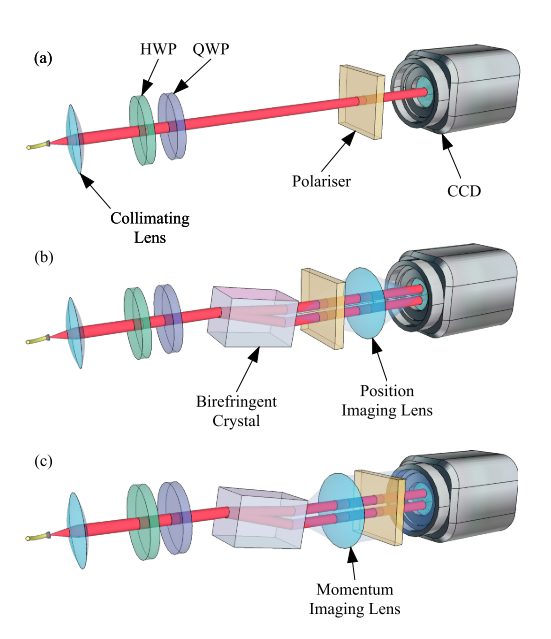

# Introduction

Quantum measurement is always one of the most fascinating questions in quantum mechanics. With the limitation caused by the uncertainty principle, how to find a way to perform a measurement but introduce as little disturbance as possible on the object attracts more and more people in recent years. The theory of weak measurement as a generalization of the ordinary measurement in quantum mechanics was born in such the atmosphere. And in 1988, [[Aharonov et al][3]] firstly found that using the weak measurement strategy together with the post-selection and ensemble average, one can obtain some much stranger "reading" than what appears in strong measurement. And such quantities are called "weak value". Nowadays, weak value and weak measurement have been more and more popular in the physics community, especially for quantum tomography and fundamental research for quantum mechanics.

Here, we will use a simple model to show the basic idea of weak measurement and give rise to the concept of weak value. A optical experimental realization for such measurement will be shown in the later of this article. Some typical applications are also covered.

# Weak Measurement: A Generalization of Strong Measurement

We start with the review of the ordinary theory of quantum mechanics (strong measurement) with collapse postulation. Then we define the weak measurement as a generalization of the strong measurement. With a simple but helpful model, we can easily see the similarities and differences between these two types of measurement. Some properties of the such defined weak measurement are discussed at last.

## Strong Quantum Measurement

In L.D.Landau's great book "Quantum Mechanics, Non-Relativistic Theory" he gave such a definition of the `measurement` in quantum mechanics: [[L.D.Landau][1]]

> The interaction between an `apparatus`, which is a physical objects which obey classical mechanics to a sufficient degree of accuracy, and a quantum object is spoken of as `measurement`
> ... ...
> The process of measurement consists in two parts, a classical apparatus and a quantum object, coming into interaction with each other, as a result of which the apparatus passes from its initial state into some other; from this change of state we draw conclusions concerning the state of the quantum object.

Here, we rewrite his discussion of the mathematical formalism of (strong) measurement in §7 of the book with Dirac notation so that we can get clear about the measurement process.

The states of apparatus are distinguished by the values of some physical quantity characterizing it: the reading of the the apparatus, with the symbol $\hat A$ denoting the observable of that quantity. And the eigenstate of eigenvalue $a$ should be $\ket{a}$: $\hat A\ket{a}=a\ket{a}$ . The `classical nature` of the apparatus appears in the disappearance of the phenomenon of superposition. That is to say, at any given instant the apparatus is in one of the eigenstate $\ket{a}$ with some definite value of the quantity $a$, which is ob course unjustified for a quantum system.

Let the $\ket{a_0}$ is the initial state of apparatus, and $\ket{\psi}$ is the initial state of the quantum object. The measurement process can be described by an evolution operator $\hat U$ on the direct product Hilbert space of the apparatus and quantum object:

$$\ket{a_0}\otimes \ket{\psi}\overset {\text{measurement}} \longrightarrow \hat U \ket{a_0}\otimes \ket{\psi} = \sum_a c_a \ket{a}\otimes \ket{\phi_a} $$

Where $\ket{\phi_a}$ are possible normalized states of the quantum object after the measurement, and the summation should be integral for continuous spectrum. Then the class nature of the apparatus, and <mark>the double role of classical mechanics as both the limiting case and the foundation of quantum mechanics</mark>, make their appearance. The apparatus cannot be in a superposition state means that the coefficient $c_a$ is some delta function.

The linearity of quantum mechanics requires the operator $\hat U$ should be a linear operator, and it may not a unitary operator because the object together with the apparatus is not a pure quantum system. And it induces a linear operator operating on $\ket{\psi}$ to describe the measurement:

$$c_a\ket{\phi_a}=\bra{a}\hat U\ket{a_0}\otimes \ket{\psi}\equiv \hat L(a,a_0)\ket{\psi}$$

The factor $c_a$ contains the information of the initial state of quantum object, so in generic case it is a function of $\ket{\psi}$ . But $\ket{\phi_a}$ and operator $\hat L(a,a_0)$ are independent of the initial state of quantum object $\ket{\psi}$ . So the generic form of the operator $\hat L(a,a_0)$ should be:

$$\hat L(a,a_0)=\ket{\phi_a}\bra{\Phi(a)} \ ; \ c_a = \bra{\Phi(a)}\psi\rangle$$

Where $\ket{\Phi(a)}$ is a certain functions depending on the process of measurement. And here we used an additional assumption: <mark>the initial state of apparatus should not have any influence on the result of measurement</mark>, so $\ket{\Phi(a)}$ is independent of $a_0$ .

The modulus square of $c_a$ is interpreted as the probability of we get the reading of $a$, and it is normalized:

$$\sum_a |c_a|^2 = \bra{\psi}\Big( \sum_a \ket{\Phi(a)}\bra{\Phi(a)}\Big)\ket{\psi} =1$$

In order that these equations should hold for an arbitrary normalized state $\ket{\psi}$ , it is necessary that $\{\ket{\Phi(a)}\}_a$ form a complete set of `normalized and orthogonal states`.



The orthonormality is not very obvious. One should notice that the expansion:

$$\ket{a_0}\otimes \ket{\psi}\overset {\text{measurement}} \longrightarrow \hat U \ket{a_0}\otimes \ket{\psi} = \sum_a c_a \ket{a}\otimes \ket{\phi_a} $$

of the state after the measurement does not come from any specific properties of evolution operator $\hat U$, but from the basic probability interpretation of quantum mechanics. The measurement yields a new state, which has the probability of $|c_a|^2$ to be at the state $\ket{a}\otimes \ket{\phi_a}$ .

So, if exist $a\neq a'$ so that $\bra{\Phi(a)}\Phi(a')\rangle \neq 0$ , one can imagine that the initial state of quantum object is $\ket{\Phi(a)}$. Then we have that $c_a,c_{a'}$ are not zero at the same time. This is contradict to the classical nature of the apparatus: coefficient $c_a$ should be some delta function.

In another word, if $\ket{\Phi(a)}$ are not orthogonal, then the state after measurement must be a superposition state.

So we prove that $\ket{\Phi(a)}$ are orthogonal. So let $\ket{\psi}=\ket{\Phi(a)}$ , with the normalization of $|c_a|^2$ we have:

$$|\bra{\Phi(a)}\Phi(a)\rangle|^2=1$$

That means $\ket{\Phi(a)}$ are also normalized.

q.e.d.



This property of the states $\ket{\Phi(a)}$ shows that they are the eigenstates of Hermitian operator, or some physical quantity (observable) which characterizes the quantum object, and the measurement concerned can be spoken of as a measurement of this quantity.

## "Apparatus" as Quantum Object

We have shown that all properties of strong quantum measurement come from the `classical nature` of the apparatus, including the information extraction and state disterbance. As a generalization of the theory of measurement, one can imagine that the apparatus may not a ideal classical object, but a quantum object. And with such "apparatus", one can expect that the measurement will gain less information and yield slighter disterbance. And in this case, we call it `weak measurement`.[[B.Tamir 2013][2]]

Here we introduce a simple model to show what happens in this procedure, and show some novel properties of weak measurement.

### Model setup

Let $S$ denote the quantum system to be measured, and our "apparatus" is another quantum system coupled with $S$ , denote it as $M$ called `Meter` to distinguish from `Apparatus` in strong measurement.

To simplify our discussion, we omit the Hamiltonian of $S,M$ . That means that the time evolution of the system is controlled by the interaction Hamiltonian. Let the $\hat A$ is an observable we care of the $S$ with the eigenstate of eigenvalue $a$ is $\ket{a}$. The state of $M$ is characterized by $q$ of the observable $\hat Q$ , and its conjugation variable is $\hat P$ : $[\hat Q,\hat P]=\ti\hbar$. They may not be the coordinate and momentum in general. At last, we assume the interaction between $S,M$ has a direct product form:

$$\hat H_{\text{int}}=g(t) \hat A \otimes \hat P$$

Where $g(t)$ is a sharp time-dependent function, to characterize the time interval of the measurement. As a good approximation, we let $g(t)=\gamma \delta(t)$ . Where $\gamma$ is the intensity of coupling.

The initial state of $S,M$ are expressed in the representation of $\hat A$ and $\hat Q$, assume the former has a discrete spectrum, and the later one has a continuous spectrum.

$$\begin{aligned}
\ket{\psi_S}&=\sum_i c_i \ket{a_i} \\
\ket{\psi_M}&= \int \td q \frac 1 {(2\pi\sigma^2)^{1/4}} e^{-q^2/{4\sigma^2}} \ket{q}
\end{aligned}$$

The wavefunction of meter is a Gaussian wave packet initially.

### The solution

We can write down the evolution operator of the measurement process:

$$\hat U=\exp\big(-\frac \ti \hbar \int \td t \ g(t) \hat A\otimes \hat P\big)=\exp \big(-\frac \ti \hbar \gamma \hat A\otimes \hat P\big)$$

Then the final state should be:

$$\begin{aligned}
\ket{\text{final}} &= \hat U \ket{\psi_S}\otimes \ket{\psi_M} \\
&= \sum_i \int \td q \frac 1 {(2\pi\sigma^2)^{1/4}} e^{-q^2/4\sigma^2} c_i \hat U \ket{a_i}\otimes \ket{q} \\
&= \sum_i \int \td q \frac 1 {(2\pi\sigma^2)^{1/4}} e^{-q^2/4\sigma^2} c_i \exp\big(-\frac \ti \hbar \gamma a_i \hat I \otimes \hat P\big) \ket{a_i}\otimes \ket{q} \\
&=\sum_i \int \td q \frac 1 {(2\pi\sigma^2)^{1/4}} e^{-q^2/4\sigma^2} c_i \ket{a_i}\otimes \ket{q+\gamma a_i} \\
\end{aligned}$$

Where we used the fact that:

$$[\hat Q, e^{-\ti x \hat P/\hbar}]=e^{-\ti x \hat P/\hbar} x\Rightarrow \hat Q e^{-\ti x\hat P/\hbar}\ket{q}=e^{-\ti x \hat P/\hbar}(x+q)\ket{q}\Rightarrow e^{-\ti x\hat P /\hbar}\ket{q}=\ket{q+x}$$

We can see the final state has been different from the case of strong measurement. Then we operate a strong measurement on the meter. We care the probability distribution of the meter's state, $q$, after the measurement. That is:

$$\mathbb{P}(q=x)=\text{Tr}\ket{\text{final}}\bra{\text{final}}x\rangle\bra{x}=\frac 1 {\sqrt{2\pi\sigma^2}}\sum_i |c_i|^2 \exp\big(-\frac {(x-\gamma a_i)^2} {2\sigma^2}\big)$$

### Discussion

If $\sigma$ is much smaller than the difference of the spectrum of $\hat A$ , or the interaction is sufficient large: $\gamma\cdot \min (a_i-a_j)\gg \sigma$ , then the distribution $\mathbb{P}(q=x)$ is a weighted summation of many Gaussian distributions localized at different centers which is proportional to the eigenvalue of the $\hat A$ . In this case, we find the weak measurement performs a resemble behavior as the strong measurement.

If $\sigma$ is much bigger than all $\gamma a_i$ , or the coupling is very weak. We can apply the following approximation:

$$\begin{aligned}
\mathbb{P}(q=x) &\approx \frac 1 {\sqrt{2\pi\sigma^2}} \sum_i |c_i|^2  \Big(1-\frac {(x-\gamma a_i)^2} {2\sigma^2}\Big) \\
&=\frac 1 {\sqrt{2\pi\sigma^2}} \Big(1-\frac {x^2 - 2x \gamma \sum_i a_i |c_i^2|+ \gamma^2 (\sum_i |c_i|^2 a_i)^2} {2\sigma^2}+\gamma^2\frac {(\sum_i |c_i|^2 a_i)^2-\sum_i |c_i|^2 a_i^2} {2\sigma^2}\Big) \\
&\approx \frac 1 {\sqrt{2\pi\sigma^2}} \exp\Big(-\frac {(x-\gamma \langle \hat A\rangle)^2} {2\sigma^2}\Big)
\end{aligned}$$

Where $\langle \hat A\rangle =\bra{\psi_S}\hat A\ket{\psi_S} = \sum_i |c_i|^2 a_i$ . It is a Gaussian distribution with the center is proportional to $\langle \hat A\rangle$ , the expected value on initial state. However, one measurement cannot give any information because $\sigma \gg \gamma \langle \hat A\rangle$, the spread of the distribution is too large for us to get an exact value of its center.[[Aharonov 1988][3]]

However, one can prepare a large number ($N$) of such system, and make this same measurement on each member of the ensemble. So:

$$\frac 1 N \sum_i q_i\sim \mathcal{N}(\gamma \langle \hat A\rangle , \frac {\sigma^2} {N})$$

We can make the measurement of $\langle \hat A\rangle$ with any desired precision.

And if the meter collapses into the state of $q=x$ , we have the $S$ is in the state:

$$\ket{\psi_S;x}=\frac 1 {(2\pi\sigma^2)^{1/4}}\sum_i \exp\big(-\frac {(x-\gamma a_i)^2} {4\sigma^2}\big) c_i \ket{a_i} $$

When $\sigma$ is sufficient large or $\gamma$ is sufficient small, with any finite $x$ , the state $\ket{\psi_S;x}$ can be close to initial state $\ket{\psi_S}$ with any precision. That is why we say the weak measurement introduces slighter disterbance than the strong measurement.

# Weak Measurement: Post-Selection

Now we will show that the above measurement (with large $\sigma$), when applied to preselected (prepared initial state) and postselected (select data according to the meter's reading) ensembles, may yield new values. Introducing post-selection into the theory of weak measurement results in many strange, interesting and sometimes puzzling phenomena such as obtaining huge(outside the interval $[\min a_i,\max a_i]$) and even complex weak values.

## Post-Selection and Weak Value

Let us begin with the definition of pre/post-selection ensemble:

_[Definition]_ : [[Kofman 2012][4]] Consider an ensemble of quantum systems prepared initially (`preselected`) in the same state $\ket{\psi_i}$ . Each member of the ensemble is subjected to a measurement of the quantity $\hat A$ (usually is performed on `system to be measured`) , `which may be strong or weak` . Then, at a later moment, a final projective measurement of a variable $\hat Q$(usually is performed on `meter` here). For the simplicity, we always assume that the spectrum of $\hat Q$ is nondegenerate. Then, the system is left in one of the orthogonal states $\{\ket{\psi_{f,j}}\}_f$, and the ensemble of the system can be broken into subensembles with different final(`post-selected`) states. Such a subensemble is called a `pre- and post-selected ensemble`.

Let us apply the model above onto a pre- and post-selected ensemble of the initial and final state of $S$ are $\ket{\psi_i},\ket{\psi_f}$, then approximately the final state of meter is:

$$ \ket{\phi_M} \approx \int \frac {\td q} {(2\pi\sigma^2)^{1/4}} \ket{q} \exp\Big(-\frac {(q-\gamma A_w)^2} {4\sigma^2}\Big)$$



$$\begin{aligned}
\ket{\phi_M}&= \bra{\psi_f}\hat U\ket{\psi_i}\otimes\ket{\psi_M}\\
&=\sum_m c_{m,f}^*\bra{a_m} \Big(\sum_n \int \td q \frac 1 {(2\pi\sigma^2)^{1/4}} e^{-q^2/4\sigma^2} c_{n,i} e^{-\ti \gamma a_i \hat I\otimes \hat P /\hbar}\ket{a_i}\otimes \ket{q}\Big)\\
&=\int \frac {\td q} {(2\pi\sigma^2)^{1/4}} e^{-q^2/4\sigma^2} \Big(\sum_n\big(\frac {-\ti \gamma} {\hbar}\big)^n \bra{\psi_f}\hat A^n\ket{\psi_i} \hat P^n\Big)\ket{q}\\
&=\int \frac {\td q} {(2\pi\sigma^2)^{1/4}} e^{-q^2/4\sigma^2} \Big(\sum_n\big(\frac {-\ti \gamma} {\hbar}\big)^n \bra{\psi_f}\hat A^n\ket{\psi_i} p^n \hbar^n\Big)\int \td p \ket{p}\bra{p}q\rangle \\
&=\int \td p \ket{p} \Big(\frac {2} {\pi \sigma^2}\Big)^{1/4} e^{-p^2 \sigma^2} \sum_n \big(-\ti \gamma\big)^n A_w^{(n)} p^n \bra{\psi_f}\psi_i\rangle\\
&\approx \int \td p \ket{p} \Big(\frac {2} {\pi \sigma^2}\Big)^{1/4} e^{-p^2 \sigma^2}  \exp\Big(-\ti \gamma A_w p\Big) \bra{\psi_f}\psi_i\rangle \\
&= \int \frac {\td q} {(2\pi\sigma^2)^{1/4}} \ket{q} \exp\Big(-\frac {(q-\gamma A_w)^2} {4\sigma^2}\Big)
\end{aligned}$$

The approximation is based on the fact that, the Gaussian wave packet: $e^{-p^2\sigma^2}$ ensures that $p$ can only be sufficient non zero at the level:

$$p\sim 1/\sigma$$

So the amplitude of the component of $p$ is controlled by the term:

$$e^{-p^2\sigma^2} \gamma^n A_w^n p^n \bra{\psi_f}\psi_i\rangle \sim \frac {\gamma^n A_w^n} {\sigma^n} \bra{\psi_f}\psi_i\rangle $$

When $\sigma$ is sufficiently large, only few terms is significantly non zero. Up to the first order one will have the result above.



In which the approximation is valid if the spread $\sigma^2$ is sufficiently large:

$$\sigma \gg \max_n \gamma^n A_w^{(n)} \bra{\psi_f}\psi_n\rangle $$

And $A_w^{(n)}$ is the n-th order weak value of $\hat A$ in the pre- and post-selected ensemble of $\ket{\psi_i}, \ket{\psi_f}$ :

$$A_w^{(n)} = \frac {\bra{\psi_f}\hat A^n\ket{\psi_i}} {\bra{\psi_f}\psi_i\rangle} \ ; \ A_w^{(1)}=A_w$$

Which induces a different distribution of the meter's reading:

$$\mathbb{P}(q=x)=\frac 1 {\sqrt{2\pi \sigma^2}} \exp\Big(-\frac {(x-\gamma A_w)^2} {2\sigma^2}\Big)$$

Which can be interpreted as probability distribution legally only when the weak value $A_w$ is a real number. But because of the value $A_w$ is not bounded by the minimal and the maximal eigenvalues of $\hat A$, we have shown that the posiselection will introduce some novel phenomena into the weak measurement.

## Complex Weak Value

In general, the weak value $A_w=\bra{\psi_f}\hat A\ket{\psi_i}/\bra{\psi_f}\psi_i\rangle$ is a matrix coefficient and could have complex values. The influence of the complex weak value on the meter's wave function is shown by the following theorem:

_[Theorem]_ : [[Jozsa 2007][5]] Let $A_w=a+\ti b$ , then after the interaction of $\hat U=e^{-\ti \gamma \hat A\otimes\hat P/\hbar}$ the meter is in the state:

$$\ket{\phi_M}=\bra{\psi_f}\psi_i\rangle e^{-\ti \gamma A_w \hat P/\hbar} \ket{\psi_M}$$

Let $\hat M$ is an arbitrary observable for meter, then:

$$\langle \hat M \rangle_f =\langle \hat M\rangle_i +\ti \frac {\gamma a} {\hbar} \langle [\hat P,\hat M]\rangle_i+ \frac {\gamma b} {\hbar} \Big(\langle \{\hat P,\hat M\}\rangle_i - 2\langle \hat P\rangle_i \langle \hat M\rangle_i\Big) +\mathcal{O}(\gamma^2)$$

where

$$\langle \cdots \rangle_{i} = \frac {\bra{\psi_M}\cdots \ket{\psi_M}} {\bra{\psi_M}\psi_M\rangle} \ ; \ \langle \cdots \rangle_f = \frac {\bra{\phi_M}\cdots \ket{\phi_M}} {\bra{\phi_M}\phi_M\rangle}$$



With the definition of final state $\ket{\phi_M}$  , we can easily compute, assuming $\bra{\psi_M}\psi_M\rangle=1$ :

$$\begin{aligned}
\langle \hat M\rangle_f &= \frac {\bra {\psi_M} e^{\ti \gamma A_w^* \hat P/\hbar} \hat M e^{-\ti \gamma A_w \hat P/\hbar}\ket{\psi_M}} {\bra {\psi_M} e^{\ti \gamma A_w^* \hat P/\hbar} e^{-\ti \gamma A_w \hat P/\hbar}\ket{\psi_M}} \\
&=\Big\{\bra{\psi_M}\Big(1+\frac \gamma \hbar(\ti A_w^* \hat P-\ti A_w \hat P)+\mathcal{O}(\gamma^2)\Big)\ket{\psi_M}\Big\}^{-1}\Big\{\bra{\psi_M}\Big(\hat M \\
&\indent +\frac \gamma \hbar \big(\ti A_w^* \hat P \hat M-\hat M \ti A_w \hat P\big)+\mathcal{O}(\gamma^2) \Big)\ket{\psi_M}\Big\}\\
&=\Big\{1-2 b \frac \gamma \hbar \langle \hat P\rangle_i+\mathcal{O}(\gamma^2)\Big\}\Big\{\langle \hat M\rangle_i +\ti a \frac \gamma \hbar \langle [\hat P,\hat M]\rangle_i+b\frac \gamma \hbar \langle\{\hat P,\hat M\}\rangle_i+\mathcal{O}(\gamma^2)\Big\}\\
&=\langle \hat M\rangle_i +\ti \frac {\gamma a} {\hbar} \langle [\hat P,\hat M]\rangle_i+ \frac {\gamma b} {\hbar} \Big(\langle \{\hat P,\hat M\}\rangle_i - 2\langle \hat P\rangle_i \langle \hat M\rangle_i\Big) +\mathcal{O}(\gamma^2)
\end{aligned}$$

q.e.d.



Then substitute $\hat P,\hat Q$ as $\hat M$ , the influence of real and imaginary part of the weak value on the expected value shift can be shown:

$$\begin{aligned}
\langle \hat P \rangle_f - \langle \hat P\rangle_i &= \frac {2\gamma} \hbar \text{Im} A_w \cdot (\Delta \hat P)_i^2 \\
\langle \hat Q \rangle_f - \langle \hat Q\rangle_f &= \gamma \cdot \text{Re} A_w
\end{aligned}$$

# How Does One Measure a Weak Value

Here, following the discussion in [[Dressel 2014][6]] , we show how to measure a weak value, in general case is a complex value, with an optical experimental example, which is a little different from the theory we developed above.

## Experimental Setup

The experiment can be illustrated by the following three pictures



The main experiment system is shown in figure a): A Gaussian beam from a single model fiber is collimated by a lens and prepared in an initial polarization state by a quarter-wave plate(QWP) and half-wave plate(HWP). A polarizer postselects the beam on a final polarization state. And a charge coupled device(CCD) measures the position-dependent beam intensity.

The collimated laser beam is prepared in an initial state as $\ket{i}\otimes \ket{\psi_i}$ . Where $\ket{i}$ is the initial polarization, and $\ket{\psi_i}$ is the `state of the transverse beam profile`: $|\bra{x,y}\psi_i\rangle|^2$ is proportional to the intensity density of the beam in the transverse plane $\{(x,y)\}$ which is vertical to the wave vector. Obviously, the whole system is indeed a 1-dimension system. So we will use $\ket{x}$ to denote the transverse state below. The initial beam is Gaussian, so we have:

$$\bra{x}\psi_i\rangle = \frac 1 {(2\pi\sigma^2)^{1/4}} \exp\Big(-\frac {x^2} {4\sigma^2}\Big)$$

Where $x=0$ is the center of the spot.

With the final polarizer and CCD, we can measure the intensity of the beam (or the probability of photon's collapse) at each pixel:

$$P= |\bra{f}i\rangle|^2 |\bra{\psi_f}\psi_i\rangle|^2$$

Where $\ket{f}\otimes \ket{\psi_f}$ is the final selected state. In the setup in figure a) we can select the final state of a specific transverse position, that is to say $\ket{\psi_f}=\ket{x}$ . But we can also add a `Fourier lens` so that we can select the final state of a specific momentum: $\ket{\psi_f}=\ket{p}$.

Now we introduce a birefringent crystal between the preparation wave plates and the postselection polarizer as shown in figure b). The crystal separates the beam into two beams with horizontal and vertical polarizations, and the displacement is depend on the `index of refraction` and the `length along the wave vector` of crystal. We can `tilt` the crystal so that we can adjust the displacement. Just like the magnetic field in Stern-Gerlach experiment, the evolution operator induced by the birefringent crystal is:

$$\hat U(\gamma)= \exp\Big(-\ti \gamma \hat S\otimes \hat p\Big)$$

Where $\gamma=\tau v$ , where $\tau$ is the time spend inside the crystal, and $v$ is the displacement speed. So $\gamma$ is the displacement caused by the crystal , which is an `adjustable quantity` in this experiment. $\hat S=\ket{H}\bra{H}-\ket{V}\bra{V}$ is the operator to distinguish two polarizations and $\hat p$ is the transverse momentum which generates translation in the transverse position $x$.

So with the crystal, we can measure a $\gamma$-dependent quantity (`perturbed probability`) with the CCD:

$$P(\gamma)=|\bra{f}\otimes \bra{\psi_f} \hat U(\gamma) \ket{i}\otimes \ket{\psi_i}|^2$$

## Measure the Weak Value

Our goal is to measure the weak value of $\hat S$ . Perform the Taylor expansion to $P(\gamma)$ with respect to $\gamma$ up to the first order:

$$\begin{aligned}
P(\gamma)&= \Big|\bra{\psi_f}\bra{f}\Big(1-\ti \gamma \hat S\otimes \hat p+\mathcal{O}(\gamma^2)\Big)\ket{i}\ket{\psi_i}\Big|^2\\
&=P\Big(1+\ti \gamma \big(S_w^* p_w^* - S_w p_w\big) +\mathcal{O}(\gamma^2)\Big)
\end{aligned}$$

When we directly measure with CCD, like figure b). We have that $\ket{\psi_f}=x$ . And:

$$p_w = \frac {\bra{x}\hat p \ket{\psi_i}} {\bra{x}\psi_i\rangle}=\frac {\ti \hbar x} {2\sigma^2}$$

And:

$$\frac {P(\gamma)} {P}-1\approx\gamma \frac {\hbar x} {\sigma^2} \text{Re} S_w$$

When we add the Fourier lens so that $\ket{\psi_f}=\ket{p}$ , then

$$p_w = \frac {\bra{p}\hat p\ket{\psi_i}} {\bra{p}\psi_i\rangle} = p$$

And:

$$\frac {P(\gamma)} {P}-1\approx 2\gamma p \text{Im} S_w$$

Then the real part and imaginary part of weak value $S_w$ can be obtained by compute the slope of $P(\gamma)/P$ in different setup. Usually we choose the slope at the point: $x,p=0$ for a higher accuracy.

Note that we can also measure the real and imaginary parts of $p_w$ in a similar manner through a judicious choice of polarization postselection states, because of the symmetry form of the $P(\gamma)$.

# Applications and Some Paradoxes

## Directly Measure the Wavefunction

It was firstly introduced by Jeff S. Lundeen and his collaborators in 2011 [[Lundeen 2011][7]]. They gave an experimental example by directly measuring the transverse spatial wavefunction of a single photon, and showed the method is universal and can be used to measure any quantum state. Their basic idea is to measure the weak value of position $\hat \pi_x=\ket{x}\bra{x}$ with the initial state is $\ket{\psi}$ and final state is an eigenstate of momentum:

$$\langle \hat \pi_x\rangle_w= \frac {\bra{p}x\rangle \bra{x}\psi\rangle} {\bra{p}\psi\rangle}$$

So in the case of $p=0$ , the weak value:

$$\langle \hat \pi_x\rangle_w = k \psi(x)$$

where $k$ contribute a overall complex factor which is important. (Can be eliminated by normalizing and the phase shift is meaningless).

## Determing the Trajectories in a Two-Slit Experiment

In text book of quantum mechanics, one may read the discussion about the two-slit experiment. Usually they say, it is impossible simultaneously to have an interference pattern on the screen and to decide through which slit the particle went. Because of the uncertainty principle: any measurement of position irrevocably disturbs the momentum, and vice versa. So one can also say, one may not discuss the path or "trajectory" that a quantum particle takes.

However, in the Sacha Kocsis' work in 2011 [[Sacha 2011][8]], they showed one can define a set of trajectories for an ensemble of quantum particles, with the weak measurement.

[1]:https://books.google.com/books/about/Quantum_Mechanics.html?id=SvdoN3k8EysC
[2]:http://quanta.ws/ojs/index.php/quanta/article/view/14
[3]:https://journals.aps.org/prl/abstract/10.1103/PhysRevLett.60.1351
[4]:http://dx.doi.org/10.1016/j.physrep.2012.07.001
[5]:https://journals.aps.org/pra/pdf/10.1103/PhysRevA.76.044103
[6]:https://journals.aps.org/rmp/abstract/10.1103/RevModPhys.86.307
[7]:http://dx.doi.org/10.1038/nature10120
[8]:http://science.sciencemag.org/content/332/6034/1170/tab-pdf
