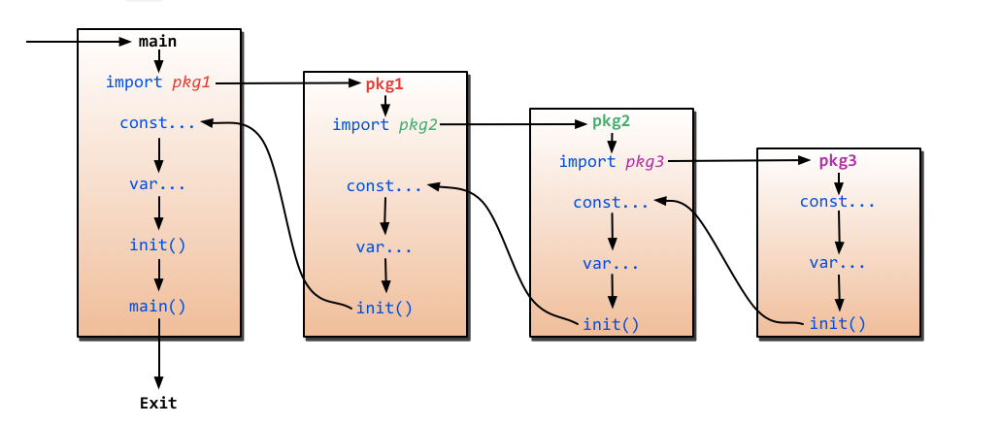

# Go 语言基础

Go 中共有 25 个保留关键字 (**keywords**) , 他们是:

```go
break    default      func    interface    select
case     defer        go      map          struct
chan     else         goto    package      switch
const    fallthrough  if      range        type
continue for          import  return       var
```

我们接下来将会解释其中的绝大部分

## 变量与内置变量类型

### 变量声明

Go 中的变量声明主要有如下若干形式:

```go
// Declare a variable named as `variableName` of type `type`
var variableName type

// Declare some variables of the same type
var var1, var2, var3, type

// Declare variables and initialize (automatically set type)
var var1, var2 type = val1, val2
var var1, var2 = val1, val2

// Declare a group of variables
var (
    var1 type = val1
    var2 type 
    ...
)

// Short declaration, can only used inside of a function
var1, var2 := val1, val2
```

Go 中有一个特殊的变量: `_`, 任何赋予给它的值都将会被丢弃. 同 `python` 类似, 但你无法调用 `_` 变量. 值得注意的是, <mark>在 Go 中的任何声明但未使用的变量将在编译阶段报错</mark>. 

在变量以外, Go 中允许声明常量, 这些常量在编译阶段就会确定下来值. ( 在函数中进行常量声明是合法的 ), 并且引入了一个枚举变量 `iota` 用来计数. `iota` 在第一次遇到常量声明时重置. 常量中的每一 **行** 声明都将使它 `+1`

```go
const (              // iota: initialized as 0
    c1 = 1           // iota: 1
    c2, c3 = 2, 3    // iota: 2
    c4 = 4           // iota: 3
)

const (              // iota: initialized as 0
    d1 = 1           // iota: 1
)
```

注意, 变量 `iota` 只能在一组常量声明中使用, 而无法使用在其他位置.

### 基础内置变量类型

1.  **Boolean**

    Go 中的 Bool 值变量类型为 `bool`, 其值域为 `true` 或 `false`, 默认值为 `false`

2.  **Integer**
    
    Go 中的整型变量如 `int`, 无符号 `uint`, 以及如 `int32`, `int64` 等给定长度的整型. 其中特殊的是 `rune` 是 `int32` 的别称, 而 `byte` 是 `int8` 的别称. 对 `rune` 和 `byte` 更详细的论述可以参考[文章](https://blog.golang.org/strings)

3.  **Float**

    浮点数类型有 `float32` 和 `float64`, 没有 `float` 类型. 默认值为 `float64`. 此外还有对应的复数类型(由两个实数组成), 为 `complex64` 和 `complex128`, 默认值为 `complex128`

4.  **String**

    Go 中的字符串由双引号 `"` 或反引号 ``(`)`` 来引入, 其中后者可以用于定义跨行的字符串如:

    ```go
    var s1 string = "this is a string"
    var s2 string = `this is a 
                        string with linebreak`
    ```

### 数组

在 Go 中使用如下语句定义并初始化数组 `array`, 数组的性质类似 C 的行为, 必须声明时指定尺寸等:

```go
var arr [len]type{arr[0], arr[1], ...}
```

其中中括号内的是指定的数组初始值, 其长度可以不等于给定的数组长度 `len`, 未指定元赋值为 `0`. 

同数组相关的概念是 `slice`, 一个 `slice` 变量是一个数组上一些元素的**引用**, 行为类似 `numpy` 中的数组. 其声明规则如下:

```go
var slc []type{initialization}

// Declare a slice with given array, 
// with arr being its based array, 
// length j-i, and left-close-right-open.
slc = arr[i:j]
```

同数组类似, 但不指定长度. 

此外还有键值对的字典, 其声明规则为:

```go
// Declare a map with key type as key and value type as val
var dict map[key]val
```

在 Go 中, 可以使用类似 `C++` 中的 `new` 关键字来分配内存生成对象. 也可以使用 `make` 来生成内建类型 (`map`, `slice`, and `channel`) 的实例. 其主要区别在于:

1.  `new(T)` 会分配类型 `T` 一个零值填充的内存空间, 返回指针
2.  `make(T, args)` 会返回初始值的 `T` 类型, 返回对象而不是指针.

## Go 中的函数与流程控制

### 流程控制

Go 中同样有着常用的面向过程编程的工具, 如:

1.  `if` 语句

    ```go
    // if statement
    if test {
        // operation if test is true
    } else {
        // operation otherwise
    }
    ```

2.  `for` 循环

    ```go
    // for statement
    for vari := ini; check-vari; iter-vari {
        // Operation with vari
    }

    // for with iterative built-in type
    for key, val := range mapData {
        // Operation with key, val
    }

    // for works like while
    for check {
        // Operation when check == true
    }

    // infinity for loop
    for {
        // Operation
    }
    ```

3.  `switch` 结构

    ```go
    // switch statement
    switch sExpr {
    case expr1:
        // Operations when sExpr is expr1
    case expr2:
        // Operations when sExpr is expr2
    default:
        // Operations otherwise
    }
    ```

### 函数定义与函数对象

Go 中使用 `func` 关键字来定义函数, 其原型写为:

```go
// Define a function with name funcName, and two inputs, two outputs
func funcName(input1 type1, input2 type2) (output1 type1, output2 type2){
    // Operations
    return val1, val2
}
```

Go 中的函数可以返回多个值, 而没有返回值的函数不需要写原型中的 `output1,...` 的括号. 函数的行为同 `C` 类似, 传入参数是形参, 对齐的操作不会影响对象的值. 若有对传入参数进行操作的需求需要传入指针变量. Go 中也有一种可变参数的函数写法:

```go
// Define a function with variate arguments
func printList(arg ...int) {
    for _, n := range arg {
        fmt.Printf("The number is %d \n", n)
    }
}
/*
printList(1,2,3,4) has the output of
The number is 1 
The number is 2 
The number is 3 
The number is 4
*/
```

在 Go 中可以声明函数类型, 同 `C` 类似, 来为其他函数传入一个函数入口:

```go
// Define a type named funcT as the function
// with single integer input and single boolean
// output
type funcT func(int) bool
```

### defer 语句

Go 中有着一个 `defer` 语句的设计, 在函数中给出的 `defer` 语句将会在函数将退出时按照逆序执行(后进先出). 一个例子为:

```go
func revPrint() {
    for i := 0; i < 5; i++ {
        defer fmt.Println("This is: ", i)
    }
}

/*
revPrint() has the output of
This is:  4
This is:  3
This is:  2
This is:  1
This is:  0
*/
```

`defer` 语句可以用在一切需要在函数生命周期结束时进行处理的需求上

## Go 的文件组织和模块

在用户的工作环境 `$GOPATH` 下(通常一个用户不需要对每个应用都建立一个工作空间与 `go env`, 只需要放在一起就可以), 一个典型的目录结构可能如下:

```bash
# $GOPATH
├── bin
├── pkg
└── src
    ├── blabla.com
    └── github.com
        └── user
            ├── app1
            │   ├── app1.go
            │   └── go.mod
            ├── app2
            │   ├── go.mod
            │   ├── pack1.go
            │   └── pack2.go
            └── app3
                ├── aaa.go
                ├── bbb.go
                └── go.mod
```

在 `$GOPATH/src` 下, Go 使用代码仓库的域名同名的文件夹下, 根据用户名文件夹分离, 其下不同的应用或模块对应不同的文件夹来放置源代码. Go 使用文件名来组织模块. 并且在每个叶文件夹中使用文件 `go.mod` 来定义模块信息. 可以使用命令 `go mod init` 来生成这个文件. <mark>同一个模块下的源文件互相不需要导入, 使用首字母大小写来区分变量是 `private` 还是 `public`. 在不同的模块中想要相互导入则需要使用 `import` 关键字.</mark> 

对于上面的这个文件结构, 如果想要在 `github.com/user/app1.go` 中调用作为模块的 `github.com/user/app2`, 就需要书写:

```go
import "github.com/user/app2"

// Other forms:
// Import as the name of pkg
// import pkg "github.com/user/app2"

// Import without name, like `import *` in python
// import . "github.com/user/app2"

// Import without function in module, just run init()
// import _ "github.com/user/app2"
```

默认情况它会从域名对应的代码仓库中拉取源文件, 如果需要使用本地调试则要将 `app1` 下的 `go.mod` 中加入:

```go
// gitub.com/user/app1/go.mod

replace github.com/user/app2 => ../app2
```

在源文件的开头, 我们需要指定包名如:

```go
package pkgName
```

只有对于 `pkgName` 为 `main` 的文件, 其中才能有 `main()` 函数来让 Go 编译为可执行文件作为入口. 其他的源文件中只能有 `init()` 函数. 在 Go 的 `import` 过程中, 执行顺序是如下的:

{}{}